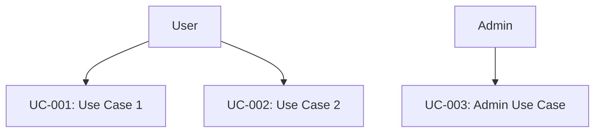

<!-- reference @.gaia/designs/design.md -->

[<< Back](./design.md)

# Use Cases

System requirements and user goals following design principles.

## Template Guidance

**Purpose**: Define what the system does and who uses it
**Focus**: User goals, business value, functional requirements  
**Avoid**: Technical details, implementation specifics

**Guidelines**: 5-15 use cases, 3-7 actors, clear user-focused language

## Business Context

**Problem**: [Current challenges]
**Solution**: [How system improves things]  
**Success Metrics**: [Measurable outcomes]
**Target Users**: [Primary and secondary user types]

## Requirements & Actors

**Functional Requirements**:
- FR-001: [Requirement description]
- FR-002: [Requirement description]

**Non-Functional Requirements**: 
- NFR-001: [Performance/Security/Scalability requirement]

**Actors**: 
- Primary: [Main users]
- Secondary: [External systems/admins]

## Use Case Overview

## Use Cases

### UC-001: [Use Case Name]
- **Actor**: [Primary Actor]
- **Trigger**: [What initiates this]
- **Business Value**: [Why this matters]
- **Frequency**: [Usage frequency]

**Flow**:
1. [Step 1]
2. [Step 2] 
3. [Step 3]

**Alternatives**: [Key variations]
**Exceptions**: [Error handling]
**Data**: Input/Output requirements
**Success**: [Completion criteria]

### UC-002: [Use Case Name]
[Follow same pattern]

## Sub-Use Cases & Prioritization

**When to create sub-use cases**: Parent has 8+ steps, multiple user goals, or different stakeholder concerns

**Format**: UC-[Parent].[Number]: [Specific Action]

**Priority Levels**:
- **High**: UC-001, UC-002 - [Business justification]
- **Medium**: UC-003 - [Business justification]  
- **Low**: UC-004 - [Business justification]

## Cross-Cutting Concerns

**UX**: Clear user flows, error prevention, accessibility
**Security**: Authentication, authorization, data protection
**Admin**: User management, system monitoring, data maintenance

## Acceptance Criteria

### UC-001 Criteria
- **Given** [Initial state] **When** [Action] **Then** [Outcome]

### UC-002 Criteria  
- **Given** [Initial state] **When** [Action] **Then** [Outcome]

**Instructions**: Replace placeholders with project-specific content. Focus on user goals over technical details.

[<< Back](./design.md)
