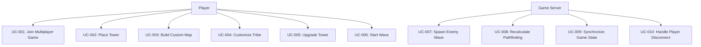

<!-- reference @.gaia/designs/design.md -->

[<< Back](./design.md)

# Use Cases

Isometric Tower Defense Game - User goals and functional requirements for multiplayer strategy gameplay.

## Template Guidance

**Purpose**: Define what the system does and who uses it
**Focus**: User goals, business value, functional requirements
**Avoid**: Technical details, implementation specifics

**Guidelines**: 5-15 use cases, 3-7 actors, clear user-focused language

## Business Context

**Problem**:
- Tower defense games lack truly strategic depth due to static enemy pathfinding
- Multiplayer tower defense is rare and poorly synchronized
- Map creation is either too simple or too complex for players

**Solution**:
- Dynamic A* pathfinding forces strategic tower/wall placement
- Real-time 4+ player co-op with <100ms synchronization
- Visual drag-and-drop map builder with terrain height system
- Tribe customization system for unique playstyles

**Success Metrics**:
- 60fps sustained gameplay on mid-range hardware
- < 100ms multiplayer action synchronization
- Pathfinding recalculation < 100ms for 50x50 grids
- 80% player retention after first session
- Average game session 20-45 minutes

**Target Users**:
- **Primary**: Strategy game enthusiasts (18-35), co-op multiplayer fans
- **Secondary**: Map creators, competitive players, casual tower defense fans

## Requirements & Actors

**Functional Requirements**:
- FR-001: Dynamic A* pathfinding recalculation when towers/walls placed
- FR-002: Enemies destroy towers when completely boxed in (no valid path)
- FR-003: Real-time multiplayer synchronization (4+ players)
- FR-004: Visual map builder with terrain heights (0-5) and 5 terrain types
- FR-005: Tribe customization (tower stats, abilities, visual themes)
- FR-006: Tower placement, upgrade, sell mechanics
- FR-007: Enemy wave spawning with difficulty scaling
- FR-008: Resource management (gold/currency for towers)
- FR-009: Player progression and unlockables
- FR-010: Map sharing and community maps

**Non-Functional Requirements**:
- NFR-001: 60fps game loop on mid-range hardware (GTX 1060 equivalent)
- NFR-002: < 100ms pathfinding recalculation for 50x50 grids
- NFR-003: < 100ms multiplayer latency for player actions
- NFR-004: < 2.5s initial load time (LCP)
- NFR-005: WebSocket reconnection under 5 seconds
- NFR-006: Support 10,000 concurrent users
- NFR-007: 99.9% uptime for game servers

**Actors**:
- **Primary**: Player (plays games, builds maps, customizes tribes)
- **Secondary**: Game Server (manages sessions, synchronizes state), Admin (moderates content, manages servers)

## Use Case Overview

## Use Cases

### UC-001: Join Multiplayer Game
- **Actor**: Player
- **Trigger**: Player clicks "Join Game" from lobby
- **Business Value**: Enable real-time co-op gameplay experience
- **Frequency**: Every game session start (100+ times/hour across all players)

**Flow**:
1. Player selects tribe and readies up in lobby
2. System validates lobby has 2-4 players ready
3. System creates game session with selected map
4. System loads map data and initializes game state
5. System establishes WebSocket connections for all players
6. System synchronizes initial game state (map, towers, resources)
7. Game countdown begins (3, 2, 1, Start!)

**Alternatives**:
- Solo play: Single player starts without lobby
- Quick match: Auto-match with random players

**Exceptions**:
- Lobby timeout (60s): Return to main menu
- WebSocket connection failure: Retry 3 times, then error message
- Map load failure: Fallback to default map

**Data**:
- Input: User ID, tribe selection, lobby ID
- Output: Game session ID, player spawn positions, initial resources

**Success**: Players enter synchronized game world, can see each other's cursors, game countdown completes

---

### UC-002: Place Tower
- **Actor**: Player
- **Trigger**: Player clicks tower icon and valid tile
- **Business Value**: Core gameplay mechanic, drives strategic decision-making
- **Frequency**: 50-200 times per game session per player

**Flow**:
1. Player selects tower type from sidebar (cost: 100 gold)
2. Player clicks valid empty tile on isometric grid
3. System validates sufficient resources and valid placement
4. System deducts tower cost from player resources
5. System places tower on tile, broadcasts to all players
6. System triggers pathfinding recalculation for all enemies
7. Enemies reroute to avoid new tower (if path exists)
8. Tower activates and begins targeting enemies in range

**Alternatives**:
- Place wall: Same flow but walls block pathing instead of attacking
- Invalid placement: Show red overlay, prevent placement

**Exceptions**:
- Insufficient resources: Show error message "Not enough gold"
- Invalid tile (occupied/out of bounds): Red overlay, cannot place
- Pathfinding fails (all enemies boxed in): Enemies destroy nearest tower

**Data**:
- Input: Tower type, grid coordinates (x, y), player ID
- Output: Tower instance, updated pathfinding grid, resource deduction

**Success**: Tower appears on all players' screens, enemies recalculate paths avoiding tower, player resources updated

---

### UC-003: Build Custom Map
- **Actor**: Player (Map Creator)
- **Trigger**: Player clicks "Create Map" from main menu
- **Business Value**: User-generated content, infinite replayability
- **Frequency**: 5-10 new maps created per day

**Flow**:
1. Player opens map builder interface
2. Player sets map dimensions (20x20 to 100x100 grid)
3. Player paints terrain types (grass, dirt, stone, water, lava)
4. Player adjusts terrain heights (0-5) with height brush
5. Player places spawn point (enemy entry) and goal (enemy target)
6. Player sets wave configuration (enemy types, counts, timing)
7. Player tests map in solo playtest mode
8. Player saves map with name and description
9. System validates map (valid path from spawn to goal)
10. Map published to community maps

**Alternatives**:
- Import existing map: Load and modify published map
- Randomize terrain: Auto-generate base terrain layout

**Exceptions**:
- Invalid map (no path from spawn to goal): Show error, prevent save
- Map dimensions too large: Warn about performance impact
- Inappropriate content: Admin moderation required

**Data**:
- Input: Map dimensions, terrain data, spawn/goal positions, wave config
- Output: Map ID, map metadata, terrain grid data

**Success**: Map saved successfully, playable in solo/multiplayer modes, appears in community map browser

---

### UC-004: Customize Tribe
- **Actor**: Player
- **Trigger**: Player clicks "Customize Tribe" from main menu
- **Business Value**: Player personalization, strategic variety
- **Frequency**: 2-5 times per player session

**Flow**:
1. Player selects tribe archetype (Aggressive, Defensive, Balanced, Support)
2. Player allocates tribe bonus points (10 points total)
3. Player adjusts tower damage (+0 to +50% per point)
4. Player adjusts tower attack speed (+0 to +30% per point)
5. Player adjusts tower range (+0 to +20% per point)
6. Player selects tribe color theme (8 color palettes)
7. Player names tribe (max 20 characters)
8. System saves tribe configuration
9. Tribe ready for use in games

**Alternatives**:
- Use preset tribe: Select pre-configured tribe archetype
- Reset to defaults: Clear all customizations

**Exceptions**:
- Invalid point allocation (exceeds 10): Show error, disable save
- Inappropriate tribe name: Filter profanity, require rename

**Data**:
- Input: Tribe name, bonus point allocation, color theme
- Output: Tribe ID, tribe stats, visual theme

**Success**: Tribe saved and available for selection in lobby, bonuses apply to placed towers

---

### UC-005: Upgrade Tower
- **Actor**: Player
- **Trigger**: Player clicks existing tower and selects "Upgrade"
- **Business Value**: Tower progression, strategic resource management
- **Frequency**: 20-50 times per game session

**Flow**:
1. Player clicks placed tower
2. System shows tower stats (damage, range, attack speed, level)
3. Player clicks "Upgrade" button (cost: level * 50 gold)
4. System validates sufficient resources
5. System deducts upgrade cost
6. Tower level increases (max level 5)
7. Tower stats improve (damage +20%, range +10%, attack speed +10%)
8. Visual upgrade effect plays (particles, color change)
9. Upgrade broadcast to all players

**Alternatives**:
- Sell tower: Refund 70% of total investment
- Change targeting mode: Prioritize nearest/strongest/weakest enemy

**Exceptions**:
- Insufficient resources: Show error "Not enough gold"
- Max level reached: Disable upgrade button

**Data**:
- Input: Tower ID, player ID
- Output: Updated tower level, updated stats, resource deduction

**Success**: Tower stats increased, visual upgrade visible to all players, resources updated

---

### UC-006: Start Wave
- **Actor**: Player (any player in multiplayer)
- **Trigger**: Player clicks "Start Wave" button
- **Business Value**: Player-controlled pacing, co-op coordination
- **Frequency**: 10-20 times per game session

**Flow**:
1. Player clicks "Start Wave" button
2. System validates all players are ready (or 10s auto-start timeout)
3. System increments wave number
4. System spawns enemies based on wave configuration
5. Enemies spawn at entry point with path to goal
6. Enemies follow pathfinding grid toward goal
7. Towers attack enemies in range
8. Players earn gold for each enemy killed
9. Wave completes when all enemies defeated or reached goal
10. System shows wave summary (enemies killed, gold earned, lives lost)

**Alternatives**:
- Auto-start wave: Timer expires, wave starts automatically
- Skip wave delay: Early start with bonus gold

**Exceptions**:
- All lives lost: Game over, show defeat screen
- All enemies defeated: Wave complete, proceed to next wave

**Data**:
- Input: Wave number, map configuration
- Output: Enemy spawn data, wave stats

**Success**: Wave starts, enemies spawn and path correctly, players can attack enemies, wave completes successfully

---

### UC-007: Spawn Enemy Wave
- **Actor**: Game Server
- **Trigger**: Wave start triggered by UC-006
- **Business Value**: Core game loop, difficulty progression
- **Frequency**: 10-20 times per game session

**Flow**:
1. Server reads wave configuration (wave number, enemy types, counts)
2. Server calculates difficulty scaling (wave number * 1.15)
3. Server spawns enemies in sequence (0.5s interval)
4. Each enemy assigned: Type, health, speed, gold reward
5. Server initializes pathfinding for each enemy
6. Server broadcasts enemy spawn to all clients
7. Clients render enemies on spawn point
8. Enemies begin moving along calculated path

**Alternatives**:
- Boss wave (every 10 waves): Spawn single powerful boss enemy
- Rush wave: Spawn all enemies simultaneously

**Exceptions**:
- No valid path: Enemies wait at spawn, show path warning
- Server lag: Queue enemy spawns, process when possible

**Data**:
- Input: Wave number, map enemy configuration
- Output: Enemy instances, pathfinding data

**Success**: Enemies spawn correctly, visible to all players, pathfinding calculated, enemies move toward goal

---

### UC-008: Recalculate Pathfinding
- **Actor**: Game Server (PathfindingEngine)
- **Trigger**: Tower/wall placed (UC-002) or tower destroyed
- **Business Value**: Core unique mechanic, strategic depth
- **Frequency**: 50-200 times per game session

**Flow**:
1. Server detects grid change (tower placed at x, y)
2. Server marks tile as blocked in pathfinding grid
3. Server identifies all active enemies on map
4. Server runs A* pathfinding for each enemy from current position to goal
5. Server calculates path cost (distance + terrain modifiers)
6. If path exists: Enemy updates route, continues moving
7. If no path: Enemy targets nearest tower, attempts to destroy it
8. Server broadcasts updated paths to all clients (< 100ms)
9. Clients smooth path transitions (lerp enemy movement)

**Alternatives**:
- Partial reroute: Only recalculate for enemies near placement
- Path caching: Reuse paths for enemies far from change

**Exceptions**:
- All enemies boxed in: Enemies destroy nearest tower, recalculate
- Pathfinding timeout (> 100ms): Use previous path, queue recalculation

**Data**:
- Input: Grid changes, enemy positions, goal position
- Output: Updated pathfinding grid, enemy path arrays

**Success**: All enemies have valid paths or target towers, pathfinding completes < 100ms, smooth movement on clients

---

### UC-009: Synchronize Game State
- **Actor**: Game Server
- **Trigger**: Game state change (tower placement, enemy spawn, player action)
- **Business Value**: Real-time multiplayer synchronization
- **Frequency**: 100+ times per second during active gameplay

**Flow**:
1. Server receives state change (e.g., tower placed)
2. Server validates state change (anti-cheat, resources)
3. Server applies state change to authoritative game state
4. Server creates state delta message (only changed data)
5. Server broadcasts delta to all connected clients via WebSocket
6. Clients receive delta (< 100ms latency)
7. Clients apply delta to local game state
8. Clients interpolate changes for smooth rendering

**Alternatives**:
- Full state sync: Send complete state every 10 seconds (fallback)
- Priority channels: Critical updates (tower placement) use high-priority

**Exceptions**:
- Client disconnect: Remove from session, redistribute resources
- State desync: Full state resync from server

**Data**:
- Input: State changes (towers, enemies, resources, players)
- Output: State delta messages (WebSocket events)

**Success**: All clients show identical game state (±50ms), smooth gameplay with no visible desync

---

### UC-010: Handle Player Disconnect
- **Actor**: Game Server
- **Trigger**: Player WebSocket connection lost
- **Business Value**: Graceful degradation, fair gameplay
- **Frequency**: 1-5 times per 100 game sessions

**Flow**:
1. Server detects WebSocket disconnection
2. Server starts 30-second reconnection timer
3. Server pauses player's resource generation
4. Server keeps player's towers active (no AI control)
5. If player reconnects within 30s: Resume normal gameplay
6. If player doesn't reconnect: Remove player from session
7. Server redistributes player's remaining resources to team
8. Server broadcasts player disconnect to remaining players
9. Game continues with remaining players

**Alternatives**:
- Solo play: Pause game until reconnection
- Competitive mode: Player forfeit after 10s disconnect

**Exceptions**:
- All players disconnect: End game session, no rewards
- Disconnect during wave: Wait for wave completion before removal

**Data**:
- Input: Player ID, disconnect timestamp
- Output: Updated player list, resource redistribution

**Success**: Game continues smoothly for remaining players, reconnected player rejoins seamlessly

---

## Sub-Use Cases & Prioritization

**Sub-Use Cases**:
- **UC-002.1**: Validate Tower Placement (checks tile availability, resources)
- **UC-002.2**: Broadcast Tower Placement (WebSocket synchronization)
- **UC-008.1**: A* Pathfinding Algorithm (core pathfinding logic)
- **UC-008.2**: Detect Boxed Enemies (no valid path detection)

**Priority Levels**:
- **High**: UC-001 (Join Game), UC-002 (Place Tower), UC-006 (Start Wave), UC-007 (Spawn Enemies), UC-008 (Pathfinding), UC-009 (Sync State)
  - **Justification**: Core game loop, MVP required functionality

- **Medium**: UC-003 (Map Builder), UC-004 (Customize Tribe), UC-005 (Upgrade Tower), UC-010 (Handle Disconnect)
  - **Justification**: Important features, enhance experience but not MVP critical

- **Low**: Advanced features (leaderboards, achievements, replays)
  - **Justification**: Post-launch content, not required for core gameplay

## Cross-Cutting Concerns

**UX**:
- Responsive isometric controls (camera pan, zoom)
- Clear visual feedback (tower range circles, path preview)
- Accessibility (colorblind modes, UI scaling)
- Tutorial system for new players

**Security**:
- JWT authentication for WebSocket connections
- Server-authoritative game state (prevent cheating)
- Rate limiting on API and WebSocket events
- Input validation on all client actions

**Admin**:
- Map moderation (flag inappropriate content)
- Server monitoring (active sessions, player counts)
- Database backups (user data, maps, tribes)
- Performance analytics (pathfinding times, frame rates)

## Acceptance Criteria

### UC-001 Criteria
- **Given** player in lobby with 3 other ready players **When** host clicks "Start Game" **Then** all players enter game world within 3 seconds with synchronized state

### UC-002 Criteria
- **Given** player has 100 gold **When** player places tower costing 100 gold **Then** tower appears on all clients, gold reduced to 0, pathfinding recalculates < 100ms

### UC-003 Criteria
- **Given** player in map builder **When** player creates valid map and clicks "Save" **Then** map saved, playable in solo/multiplayer, appears in community browser

### UC-004 Criteria
- **Given** player customizing tribe **When** player allocates 10 bonus points **Then** tribe saved with correct stats, bonuses apply to towers in-game

### UC-006 Criteria
- **Given** players in game between waves **When** any player clicks "Start Wave" **Then** enemies spawn, follow valid paths, players can attack enemies

### UC-008 Criteria
- **Given** enemy pathfinding to goal **When** player places tower blocking path **Then** enemy recalculates path < 100ms, follows new path or targets tower if blocked

### UC-009 Criteria
- **Given** 4 players in game **When** any player places tower **Then** all other players see tower within 100ms in synchronized position

**Instructions**: This use case document defines all core gameplay mechanics, multiplayer synchronization, map building, and tribe customization. All use cases are testable and map directly to implementation tasks.

[<< Back](./design.md)
