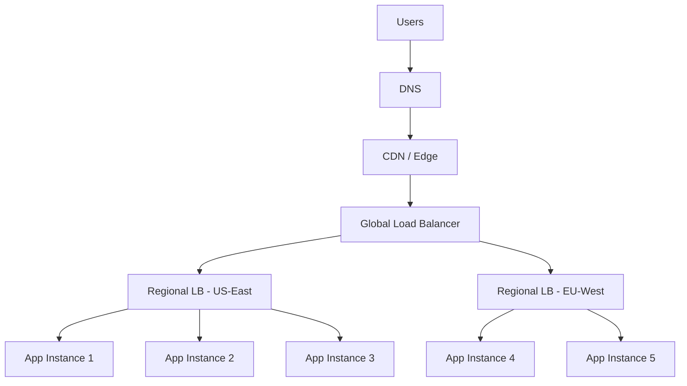
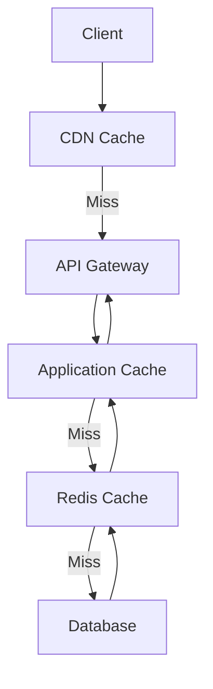
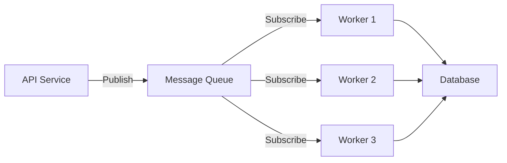
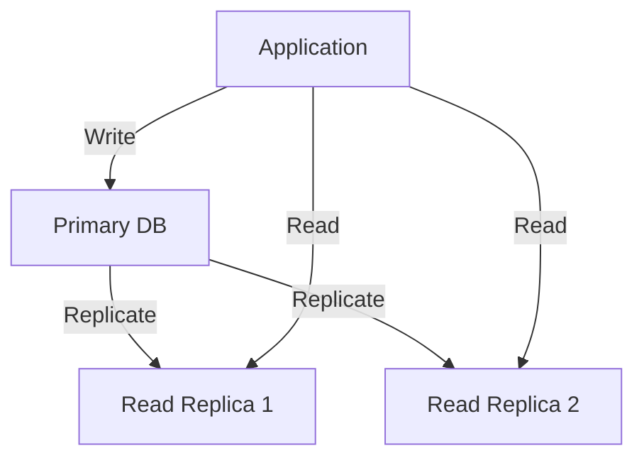

````markdown
<!-- reference @.gaia/designs/design.md -->
<!-- reference @.gaia/designs/7-infrastructure.md -->
<!-- reference @.gaia/designs/8-data.md -->

[<< Back](./design.md)

# Scalability & Performance

Complete scalability architecture and performance optimization strategies.

## Template Guidance

**Purpose**: Define scalability strategies, performance optimization, and capacity planning
**Focus**: Horizontal/vertical scaling, load balancing, caching, async processing, performance benchmarks
**Avoid**: Implementation code, specific tool configurations, premature optimization

**Guidelines**: Measure first, scale horizontally, design for distributed systems, optimize bottlenecks

## Scalability Overview

**Scalability Philosophy**: [Horizontal-First / Vertical-First / Hybrid]
**Target Scale**: [Expected users, requests/sec, data volume]
**Growth Rate**: [Expected annual growth percentage]

**Scalability Principles**:
- **Horizontal Scaling**: Add more instances rather than bigger instances
- **Stateless Services**: No server-side session state (enables easy scaling)
- **Distributed Systems**: Design for eventual consistency
- **Asynchronous Processing**: Decouple long-running operations
- **Data Partitioning**: Shard data across multiple databases

## Horizontal Scaling

### Stateless Application Design

**Requirements for Horizontal Scaling**:
- **No Local State**: Session data in distributed cache (Redis)
- **Shared Storage**: Files in object storage (S3), not local disk
- **Configuration Externalization**: Environment variables, config service
- **Load Balancer Awareness**: Health checks, graceful shutdown

**Session Management**:
```
User Request → Load Balancer → App Instance (any) → Redis (shared session)
```

**Benefits**:
- Add/remove instances dynamically
- Zero-downtime deployments
- Cost-effective (horizontal scales cheaper than vertical)
- Fault tolerance (instance failure doesn't lose all state)

### Auto-Scaling Strategy

**Scaling Metrics**:
- **CPU Utilization**: Scale when avg CPU > 70% for 5 minutes
- **Memory Utilization**: Scale when avg memory > 80% for 5 minutes
- **Request Rate**: Scale when requests/sec > threshold
- **Response Time**: Scale when p95 latency > target SLA

**Auto-Scaling Configuration**:
```yaml
# Kubernetes HPA example
apiVersion: autoscaling/v2
kind: HorizontalPodAutoscaler
metadata:
  name: api-service
spec:
  scaleTargetRef:
    apiVersion: apps/v1
    kind: Deployment
    name: api-service
  minReplicas: 3
  maxReplicas: 20
  metrics:
  - type: Resource
    resource:
      name: cpu
      target:
        type: Utilization
        averageUtilization: 70
  - type: Resource
    resource:
      name: memory
      target:
        type: Utilization
        averageUtilization: 80
  behavior:
    scaleUp:
      stabilizationWindowSeconds: 60
      policies:
      - type: Percent
        value: 50
        periodSeconds: 60
    scaleDown:
      stabilizationWindowSeconds: 300
      policies:
      - type: Percent
        value: 25
        periodSeconds: 60
```

**Scaling Policies**:
- **Scale Up**: Aggressive (50% increase, 1-minute stabilization)
- **Scale Down**: Conservative (25% decrease, 5-minute stabilization)
- **Minimum Replicas**: 3 (high availability across AZs)
- **Maximum Replicas**: 20 (cost control, prevent runaway scaling)

## Load Balancing

### Load Balancer Architecture



### Load Balancing Algorithms

**Round Robin**:
- Simple, even distribution
- Best for: Homogeneous instances, similar request complexity

**Least Connections**:
- Route to instance with fewest active connections
- Best for: Long-lived connections, varied request complexity

**Weighted Round Robin**:
- Distribute traffic based on instance capacity weights
- Best for: Mixed instance sizes, gradual rollouts (canary)

**IP Hash**:
- Route same client IP to same instance (sticky sessions)
- Best for: Stateful applications (avoid if possible)

### Health Checks

**Load Balancer Health Checks**:
```
Endpoint: GET /health/ready
Interval: 10 seconds
Timeout: 5 seconds
Healthy Threshold: 2 consecutive successes
Unhealthy Threshold: 3 consecutive failures
```

**Health Check Response**:
```json
{
  "status": "healthy",
  "checks": {
    "database": "ok",
    "cache": "ok",
    "externalApi": "ok"
  }
}
```

**Graceful Shutdown**:
1. Instance receives termination signal
2. Remove from load balancer (fail health checks)
3. Drain existing connections (30-60 second grace period)
4. Complete in-flight requests
5. Shutdown application

## Caching Architecture

### Multi-Layer Caching



**Cache Layers**:
1. **CDN Cache**: Static assets, public API responses (edge caching)
2. **API Gateway Cache**: Cacheable API responses
3. **Application Cache**: In-memory cache (process-local, minimal)
4. **Distributed Cache**: Redis for session data, frequently accessed data
5. **Database Cache**: Query result cache, materialized views

### Cache Strategies

**Cache-Aside (Lazy Loading)**:
```python
def get_user(user_id):
    # Check cache first
    user = redis.get(f"user:{user_id}")
    if user:
        return user

    # Cache miss - query database
    user = database.query("SELECT * FROM users WHERE id = ?", user_id)

    # Store in cache with TTL
    redis.setex(f"user:{user_id}", 3600, user)  # 1 hour TTL

    return user
```

**Write-Through**:
```python
def update_user(user_id, data):
    # Update database
    database.update("UPDATE users SET ... WHERE id = ?", user_id)

    # Update cache immediately
    user = database.query("SELECT * FROM users WHERE id = ?", user_id)
    redis.setex(f"user:{user_id}", 3600, user)

    return user
```

**Write-Behind (Write-Back)**:
```python
def create_order(order_data):
    # Write to cache immediately (fast response)
    redis.lpush("order_queue", order_data)

    # Return success to user
    return {"status": "accepted", "orderId": order_data['id']}

    # Background worker persists to database (async)
    # Worker polls order_queue and batch-inserts to database
```

### Cache Invalidation

**TTL-Based Expiration**:
- **Short TTL**: 30s-5min for frequently changing data
- **Medium TTL**: 15min-1hr for semi-static data
- **Long TTL**: 1hr-24hr for rarely changing data

**Event-Based Invalidation**:
```python
# When user profile updated
def update_user_profile(user_id, data):
    database.update(...)

    # Invalidate related cache keys
    redis.delete(f"user:{user_id}:profile")
    redis.delete(f"user:{user_id}:orders")
    redis.delete(f"user:{user_id}:preferences")
```

**Cache Stampede Prevention**:
```python
import threading

lock = threading.Lock()

def get_with_lock(key):
    value = redis.get(key)
    if value:
        return value

    # Only one thread fetches from DB
    with lock:
        # Double-check cache (another thread may have populated)
        value = redis.get(key)
        if value:
            return value

        # Fetch from database
        value = expensive_database_query()
        redis.setex(key, ttl, value)
        return value
```

## Asynchronous Processing

### Queue-Based Architecture



**Use Cases for Async Processing**:
- **Email Sending**: Decouple from API request
- **Image Processing**: Resize, optimize images
- **Report Generation**: Long-running computations
- **Data Export**: Large file generation
- **Webhook Delivery**: External HTTP calls
- **Batch Operations**: Bulk updates, imports

### Message Queue Patterns

**Work Queue** (Single Queue, Multiple Workers):
```
Producer → Queue → Worker 1
                 → Worker 2
                 → Worker 3
```
**Use Case**: Distribute tasks evenly across workers

**Pub/Sub** (One Message, Multiple Subscribers):
```
Publisher → Topic → Subscriber A
                  → Subscriber B
                  → Subscriber C
```
**Use Case**: Event broadcasting (user registered → welcome email + analytics + CRM)

**Priority Queue**:
```
High Priority Queue → Dedicated Workers (fast)
Normal Priority Queue → Standard Workers
Low Priority Queue → Background Workers
```
**Use Case**: Critical tasks processed first (payment > email)

### Task Processing

**Job Structure**:
```json
{
  "jobId": "uuid",
  "type": "send_email",
  "priority": "high",
  "data": {
    "to": "user@example.com",
    "template": "welcome_email",
    "params": {...}
  },
  "retries": 0,
  "maxRetries": 3,
  "createdAt": "2025-11-20T10:30:00Z"
}
```

**Retry Strategy**:
- **Exponential Backoff**: 1s, 2s, 4s, 8s, 16s
- **Max Retries**: 3 attempts
- **Dead Letter Queue**: Failed jobs after max retries
- **Idempotency**: Safe to retry (no duplicate side effects)

**Worker Scaling**:
- Monitor queue depth (messages waiting)
- Scale workers when queue > threshold
- Auto-scale based on message rate

## Database Scalability

### Read Scaling

**Read Replicas**:


**Read/Write Splitting**:
```python
# Route writes to primary
def create_user(data):
    primary_db.execute("INSERT INTO users ...")

# Route reads to replicas (load balanced)
def get_user(user_id):
    replica_db.query("SELECT * FROM users WHERE id = ?", user_id)
```

**Replication Lag**:
- Typically < 1 second
- Use primary for read-after-write consistency
- Use replicas for analytics, reporting (eventual consistency OK)

### Write Scaling

**Database Sharding**:
```
Shard 1: Users A-M
Shard 2: Users N-Z

Route user "Alice" → Shard 1
Route user "Zoe" → Shard 2
```

**Sharding Strategies**:
- **Range-Based**: Shard by ID range (1-1M, 1M-2M)
- **Hash-Based**: Hash user ID, modulo shard count
- **Geographic**: Shard by region (US, EU, APAC)

**Sharding Challenges**:
- **Cross-Shard Queries**: Avoid or use distributed query engine
- **Shard Rebalancing**: Complex when adding new shards
- **Distributed Transactions**: Use saga pattern or avoid

### Connection Pooling

**Connection Pool Configuration**:
```python
pool = ConnectionPool(
    host="db.example.com",
    port=5432,
    min_size=5,      # Minimum connections
    max_size=20,     # Maximum connections
    max_overflow=10, # Burst capacity
    timeout=30,      # Connection timeout
    recycle=3600     # Recycle connections hourly
)
```

**Pool Sizing**:
```
Optimal Pool Size = (Core Count * 2) + Effective Spindle Count
Example: 4 cores, SSD → (4 * 2) + 1 = 9 connections per instance
```

## Performance Optimization

### API Performance Targets

**Latency Targets**:
- **p50 (median)**: < 100ms
- **p95**: < 200ms
- **p99**: < 500ms
- **p99.9**: < 1000ms

**Throughput Targets**:
- **Peak Load**: 10,000 requests/second
- **Sustained Load**: 5,000 requests/second
- **Database Queries**: < 50ms (p95)
- **External API Calls**: < 500ms (p95)

### Performance Optimization Techniques

**N+1 Query Problem**:
```sql
-- BAD: N+1 queries (1 + N)
SELECT * FROM users;  -- 1 query
-- Then for each user:
SELECT * FROM orders WHERE user_id = ?;  -- N queries

-- GOOD: Single query with JOIN
SELECT u.*, o.*
FROM users u
LEFT JOIN orders o ON u.id = o.user_id;
```

**Pagination**:
```sql
-- Limit results to prevent memory exhaustion
SELECT * FROM products
ORDER BY created_at DESC
LIMIT 20 OFFSET 0;  -- First page
```

**Selective Field Projection**:
```sql
-- Only query needed fields
SELECT id, name, price FROM products;  -- Not SELECT *
```

**Index Optimization**:
```sql
-- Ensure queries use indexes (check with EXPLAIN)
EXPLAIN ANALYZE SELECT * FROM orders WHERE user_id = '123';

-- Create covering index for query
CREATE INDEX idx_orders_user_created ON orders(user_id, created_at);
```

**Batch Operations**:
```python
# BAD: N database calls
for user_id in user_ids:
    database.update("UPDATE users SET active = true WHERE id = ?", user_id)

# GOOD: Single batch update
database.execute(
    "UPDATE users SET active = true WHERE id IN (?)",
    user_ids
)
```

### Frontend Performance

**Asset Optimization**:
- **Code Splitting**: Load only necessary JavaScript
- **Lazy Loading**: Load images/components on demand
- **Minification**: Reduce file sizes (uglify, terser)
- **Compression**: Gzip/Brotli compression

**Core Web Vitals Targets**:
- **LCP (Largest Contentful Paint)**: < 2.5s
- **FID (First Input Delay)**: < 100ms
- **CLS (Cumulative Layout Shift)**: < 0.1

**Caching Headers**:
```
# Static assets (long cache)
Cache-Control: public, max-age=31536000, immutable

# API responses (short cache)
Cache-Control: public, max-age=300

# No cache (sensitive data)
Cache-Control: no-store, no-cache, must-revalidate
```

## Capacity Planning

### Resource Estimation

**CPU Requirements**:
```
Expected Requests/Second: 5,000
CPU per Request: 10ms
Total CPU: 5,000 * 0.01s = 50 CPU-seconds/second = 50 cores

With 70% target utilization: 50 / 0.7 = 72 cores
With HA (3 AZ): 72 * 1.5 = 108 cores total
```

**Memory Requirements**:
```
Average Request Memory: 10 MB
Concurrent Requests per Instance: 100
Memory per Instance: 100 * 10 MB = 1 GB

Plus base overhead (OS, runtime): +2 GB = 3 GB per instance
```

**Storage Growth**:
```
Current Data: 500 GB
Monthly Growth: 50 GB
Projected 12-month: 500 + (50 * 12) = 1,100 GB

With backups (30-day retention): 1,100 * 2 = 2,200 GB
With replication (3x): 2,200 * 3 = 6,600 GB total
```

### Growth Planning

**Traffic Projections**:
- **Current**: 1,000 req/sec peak
- **6-month**: 2,500 req/sec (2.5x growth)
- **12-month**: 5,000 req/sec (5x growth)
- **18-month**: 10,000 req/sec (10x growth)

**Infrastructure Scaling Plan**:
```
Month 0-6:  Current infrastructure sufficient
Month 6-12: Add read replicas, increase cache capacity
Month 12-18: Implement database sharding, scale compute 2x
Month 18+:  Multi-region deployment, CDN expansion
```

## Performance Benchmarking

### Load Testing

**Load Test Scenarios**:
1. **Baseline**: Normal traffic (1,000 req/sec)
2. **Peak Load**: Expected peak (5,000 req/sec)
3. **Stress Test**: 2x peak load (10,000 req/sec)
4. **Spike Test**: Sudden traffic burst (0 → 5,000 req/sec in 10s)
5. **Endurance Test**: Sustained peak load for 2+ hours

**Load Testing Tools**: [JMeter / Gatling / k6 / Locust]

**Load Test Metrics**:
- Response time (p50, p95, p99)
- Throughput (requests/second)
- Error rate (% failed requests)
- Resource utilization (CPU, memory, disk, network)

### Performance Profiling

**Profiling Tools**:
- **Application Profiling**: py-spy (Python), Node Clinic (Node.js)
- **Database Profiling**: pg_stat_statements (PostgreSQL), slow query log (MySQL)
- **APM Tools**: New Relic, Datadog APM, Dynatrace

**Profiling Focus**:
- Identify slow endpoints (> 200ms)
- Find CPU-intensive operations
- Detect memory leaks
- Optimize database queries

## Validation Checklist

**Horizontal Scaling**:
- [ ] Stateless application design (no local state)
- [ ] Auto-scaling configured with appropriate metrics
- [ ] Minimum replicas for high availability (3+)
- [ ] Graceful shutdown implemented

**Load Balancing**:
- [ ] Load balancer algorithm selected
- [ ] Health checks configured (endpoint, interval, thresholds)
- [ ] Multi-region load balancing (if applicable)
- [ ] Sticky sessions avoided (or justified)

**Caching**:
- [ ] Multi-layer caching strategy defined
- [ ] Cache invalidation strategy implemented
- [ ] TTL values appropriate for data volatility
- [ ] Cache stampede prevention

**Async Processing**:
- [ ] Message queue selected and configured
- [ ] Async use cases identified (email, reports, etc.)
- [ ] Retry strategy with exponential backoff
- [ ] Worker auto-scaling based on queue depth

**Database Scalability**:
- [ ] Read replicas for read-heavy workloads
- [ ] Connection pooling configured
- [ ] Sharding strategy defined (if needed)
- [ ] Query optimization and indexing

**Performance**:
- [ ] Performance targets defined (latency, throughput)
- [ ] N+1 query problems eliminated
- [ ] Database indexes optimized
- [ ] Frontend asset optimization (code splitting, lazy loading)

**Capacity Planning**:
- [ ] Resource estimation (CPU, memory, storage)
- [ ] Traffic projections for 6, 12, 18 months
- [ ] Infrastructure scaling plan documented
- [ ] Load testing scenarios defined and executed

**Instructions**:
1. Design stateless application for horizontal scaling
2. Configure auto-scaling with appropriate metrics and policies
3. Implement multi-layer caching with invalidation strategy
4. Set up async processing with message queues for long-running tasks
5. Scale database with read replicas and connection pooling
6. Optimize query performance and eliminate N+1 problems
7. Define performance targets and conduct load testing
8. Plan capacity growth with resource projections

[<< Back](./design.md)

````
