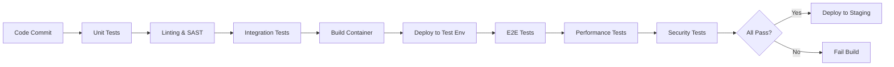

````markdown
<!-- reference @.gaia/designs/design.md -->
<!-- reference @.gaia/designs/1-use-cases.md -->
<!-- reference @.gaia/designs/4-frontend.md -->

[<< Back](./design.md)

# Testing Strategy

Comprehensive testing approach ensuring quality, reliability, and regression prevention.

## Template Guidance

**Purpose**: Define testing strategy, test pyramid, automation approach, and quality gates
**Focus**: Unit, integration, E2E, regression, performance testing strategies
**Avoid**: Implementation code, specific framework details, test data specifics

**Guidelines**: Test pyramid, automation-first, fast feedback, 100% coverage mandate, regression prevention

## Testing Philosophy

**Quality Principles**:
- **Test Pyramid**: More unit tests, fewer integration tests, minimal E2E tests
- **Fast Feedback**: Tests run quickly, fail fast
- **Automation-First**: Automate all repetitive testing
- **Shift-Left**: Test early in development cycle
- **Continuous Testing**: Tests run on every commit
- **100% Coverage Mandate**: All code paths tested

**Testing Objectives**:
- **Correctness**: Software behaves as designed
- **Reliability**: Software works consistently
- **Regression Prevention**: Existing features don't break when new features added
- **Performance**: Software meets performance requirements
- **Security**: Software is secure from vulnerabilities

## Test Pyramid

```
           /\
          /  \
         / E2E\           < 5% - Full user journeys
        /______\
       /        \
      /Integration\       < 20% - Service interactions
     /____________\
    /              \
   /   Unit Tests   \     < 75% - Individual components
  /__________________\
```

**Distribution**:
- **Unit Tests**: 75% - Fast, isolated, extensive coverage
- **Integration Tests**: 20% - Service interactions, API contracts
- **E2E Tests**: 5% - Critical user flows, full system validation

## Unit Testing

### Unit Test Strategy

**Scope**: Individual functions, methods, classes in isolation

**Characteristics**:
- **Fast**: < 100ms per test
- **Isolated**: No external dependencies (database, network, filesystem)
- **Deterministic**: Same input always produces same output
- **Independent**: Tests don't depend on each other

**Coverage Requirements**:
- **Line Coverage**: 100% of executable lines
- **Branch Coverage**: 100% of conditional branches
- **Function Coverage**: 100% of functions/methods
- **Edge Cases**: All error paths, boundary conditions

### Unit Test Examples

**Testing Pure Functions**:
```typescript
// Function to test
function calculateDiscount(price: number, discountPercent: number): number {
  if (price < 0 || discountPercent < 0 || discountPercent > 100) {
    throw new Error("Invalid input");
  }
  return price * (1 - discountPercent / 100);
}

// Unit tests
describe('calculateDiscount', () => {
  it('should calculate 10% discount correctly', () => {
    expect(calculateDiscount(100, 10)).toBe(90);
  });

  it('should calculate 0% discount correctly', () => {
    expect(calculateDiscount(100, 0)).toBe(100);
  });

  it('should throw error for negative price', () => {
    expect(() => calculateDiscount(-100, 10)).toThrow("Invalid input");
  });

  it('should throw error for discount > 100%', () => {
    expect(() => calculateDiscount(100, 150)).toThrow("Invalid input");
  });
});
```

**Testing with Mocks**:
```typescript
// Service to test
class UserService {
  constructor(private userRepository: IUserRepository) {}

  async createUser(email: string, name: string): Promise<User> {
    const existingUser = await this.userRepository.findByEmail(email);
    if (existingUser) {
      throw new Error("User already exists");
    }
    return this.userRepository.create({ email, name });
  }
}

// Unit test with mock repository
describe('UserService.createUser', () => {
  it('should create user when email is unique', async () => {
    const mockRepo = {
      findByEmail: jest.fn().mockResolvedValue(null),
      create: jest.fn().mockResolvedValue({ id: '123', email: 'test@example.com', name: 'Test' })
    };
    const service = new UserService(mockRepo);

    const user = await service.createUser('test@example.com', 'Test');

    expect(user.id).toBe('123');
    expect(mockRepo.findByEmail).toHaveBeenCalledWith('test@example.com');
    expect(mockRepo.create).toHaveBeenCalled();
  });

  it('should throw error when email already exists', async () => {
    const mockRepo = {
      findByEmail: jest.fn().mockResolvedValue({ id: '123', email: 'test@example.com' }),
      create: jest.fn()
    };
    const service = new UserService(mockRepo);

    await expect(service.createUser('test@example.com', 'Test'))
      .rejects.toThrow("User already exists");
    expect(mockRepo.create).not.toHaveBeenCalled();
  });
});
```

### Test Organization

**File Structure**:
```
src/
├── services/
│   ├── userService.ts
│   └── userService.test.ts          # Co-located with source
├── utils/
│   ├── validation.ts
│   └── validation.test.ts
└── models/
    ├── user.ts
    └── user.test.ts
```

**Test Naming Convention**:
```typescript
describe('[ClassName/FunctionName]', () => {
  describe('[methodName]', () => {
    it('should [expected behavior] when [condition]', () => {
      // Arrange
      // Act
      // Assert
    });
  });
});
```

## Integration Testing

### Integration Test Strategy

**Scope**: Interactions between components, services, and external dependencies

**Test Scenarios**:
- **API Integration**: HTTP endpoints with real controllers and services
- **Database Integration**: Repository layer with real database (test DB)
- **External Services**: Integration with third-party APIs (mocked or sandbox)
- **Message Queues**: Publishing and consuming messages

**Characteristics**:
- **Slower**: < 1s per test (database/network involved)
- **Real Dependencies**: Test database, message queue (Docker containers)
- **Transactional**: Rollback database changes after each test
- **Isolated**: Each test independent, clean state

### API Integration Tests

**Testing REST Endpoints**:
```typescript
describe('User API Integration Tests', () => {
  let app: Express;
  let testDb: Database;

  beforeAll(async () => {
    testDb = await createTestDatabase();
    app = createApp(testDb);
  });

  afterAll(async () => {
    await testDb.close();
  });

  afterEach(async () => {
    await testDb.clearAllTables();
  });

  describe('POST /api/users', () => {
    it('should create user with valid data', async () => {
      const response = await request(app)
        .post('/api/users')
        .send({ email: 'test@example.com', name: 'Test User' })
        .expect(201);

      expect(response.body).toMatchObject({
        id: expect.any(String),
        email: 'test@example.com',
        name: 'Test User'
      });

      // Verify database state
      const user = await testDb.users.findById(response.body.id);
      expect(user).toBeTruthy();
    });

    it('should return 400 for invalid email', async () => {
      const response = await request(app)
        .post('/api/users')
        .send({ email: 'invalid-email', name: 'Test User' })
        .expect(400);

      expect(response.body.error.code).toBe('VALIDATION_ERROR');
    });

    it('should return 409 for duplicate email', async () => {
      // Create initial user
      await testDb.users.create({ email: 'test@example.com', name: 'First' });

      // Attempt duplicate
      await request(app)
        .post('/api/users')
        .send({ email: 'test@example.com', name: 'Second' })
        .expect(409);
    });
  });
});
```

### Database Integration Tests

**Testing Repository Layer**:
```typescript
describe('UserRepository Integration Tests', () => {
  let repository: UserRepository;
  let testDb: Database;

  beforeAll(async () => {
    testDb = await createTestDatabase();
    repository = new UserRepository(testDb);
  });

  afterEach(async () => {
    await testDb.clearAllTables();
  });

  it('should find user by email', async () => {
    await testDb.users.create({ email: 'test@example.com', name: 'Test' });

    const user = await repository.findByEmail('test@example.com');

    expect(user).toMatchObject({
      email: 'test@example.com',
      name: 'Test'
    });
  });

  it('should return null for non-existent email', async () => {
    const user = await repository.findByEmail('nonexistent@example.com');
    expect(user).toBeNull();
  });
});
```

## End-to-End (E2E) Testing

### E2E Test Strategy

**Scope**: Complete user journeys through the entire system

**Test Scenarios**:
- **Critical User Flows**: Registration, login, purchase, checkout
- **Multi-Step Workflows**: Complete business processes end-to-end
- **Cross-Service Integration**: Frontend → API → Database → External Services

**Characteristics**:
- **Slowest**: 5-30s per test
- **Real Environment**: Staging environment with production-like setup
- **Real User Simulation**: Browser automation (Playwright, Cypress)
- **Complete Stack**: Frontend, backend, database, external services (mocked/sandbox)

### E2E Test Examples

**User Registration Flow**:
```typescript
import { test, expect } from '@playwright/test';

test.describe('User Registration E2E', () => {
  test('should complete registration flow successfully', async ({ page }) => {
    // Navigate to registration page
    await page.goto('/register');

    // Fill registration form
    await page.fill('[data-testid="email-input"]', 'newuser@example.com');
    await page.fill('[data-testid="password-input"]', 'SecurePassword123!');
    await page.fill('[data-testid="name-input"]', 'New User');

    // Submit form
    await page.click('[data-testid="register-button"]');

    // Verify redirect to welcome page
    await expect(page).toHaveURL('/welcome');
    await expect(page.locator('[data-testid="welcome-message"]'))
      .toContainText('Welcome, New User!');

    // Verify email sent (check test email service)
    const emails = await testEmailService.getEmails('newuser@example.com');
    expect(emails).toHaveLength(1);
    expect(emails[0].subject).toBe('Welcome to Our Platform');
  });

  test('should show validation error for invalid email', async ({ page }) => {
    await page.goto('/register');

    await page.fill('[data-testid="email-input"]', 'invalid-email');
    await page.click('[data-testid="register-button"]');

    await expect(page.locator('[data-testid="email-error"]'))
      .toContainText('Invalid email format');
  });
});
```

**E2E Purchase Flow**:
```typescript
test('should complete purchase flow', async ({ page }) => {
  // Login
  await loginAsTestUser(page);

  // Browse products
  await page.goto('/products');
  await page.click('[data-testid="product-card-123"]');

  // Add to cart
  await page.click('[data-testid="add-to-cart"]');
  await expect(page.locator('[data-testid="cart-count"]')).toContainText('1');

  // Proceed to checkout
  await page.click('[data-testid="cart-icon"]');
  await page.click('[data-testid="checkout-button"]');

  // Fill shipping info
  await page.fill('[data-testid="address-input"]', '123 Test St');
  await page.fill('[data-testid="city-input"]', 'Test City');

  // Enter payment (test mode)
  await page.fill('[data-testid="card-number"]', '4242424242424242');
  await page.fill('[data-testid="card-expiry"]', '12/25');
  await page.fill('[data-testid="card-cvc"]', '123');

  // Complete purchase
  await page.click('[data-testid="complete-purchase"]');

  // Verify order confirmation
  await expect(page).toHaveURL(/\/orders\/[a-z0-9-]+/);
  await expect(page.locator('[data-testid="order-status"]'))
    .toContainText('Order Confirmed');
});
```

## Regression Testing (MANDATORY)

### Regression Test Strategy

**Critical Requirement**: All existing features must continue working when new features are added.

**Regression Test Scope**:
- **Existing Feature Test Suite**: Complete re-run of all tests for existing features
- **Integration Points**: Verify new features don't interfere with existing integrations
- **Shared Resources**: Validate state management, database, cache integrity
- **Performance Baseline**: Ensure new features don't degrade existing performance

**Regression Prevention Checklist**:
- [ ] All existing unit tests pass (100%)
- [ ] All existing integration tests pass (100%)
- [ ] All existing E2E tests pass (100%)
- [ ] Visual regression tests pass (screenshot comparison)
- [ ] Performance regression tests pass (baseline ± 5%)
- [ ] No new errors in production logs for existing features

### Visual Regression Testing

**Screenshot Comparison Strategy**:
```typescript
import { test, expect } from '@playwright/test';

test.describe('Visual Regression Tests', () => {
  test('should match homepage screenshot', async ({ page }) => {
    await page.goto('/');
    await expect(page).toHaveScreenshot('homepage.png', {
      maxDiffPixels: 100  // Allow minor differences
    });
  });

  test('should match product page across breakpoints', async ({ page }) => {
    await page.goto('/products/123');

    // Desktop
    await page.setViewportSize({ width: 1920, height: 1080 });
    await expect(page).toHaveScreenshot('product-desktop.png');

    // Tablet
    await page.setViewportSize({ width: 768, height: 1024 });
    await expect(page).toHaveScreenshot('product-tablet.png');

    // Mobile
    await page.setViewportSize({ width: 375, height: 667 });
    await expect(page).toHaveScreenshot('product-mobile.png');
  });
});
```

**Visual Regression Process**:
1. **Baseline Capture**: Capture screenshots before adding new feature
2. **Feature Development**: Implement new feature
3. **Comparison**: Capture new screenshots, compare with baseline
4. **Review Differences**: Manually review any visual changes
5. **Approve/Reject**: Approve intentional changes, reject unintended changes
6. **Update Baseline**: Update baseline screenshots for approved changes

### Performance Regression Testing

**Performance Baseline Tests**:
```typescript
test('should not degrade homepage load time', async ({ page }) => {
  await page.goto('/');

  const navigationTiming = await page.evaluate(() => {
    return JSON.parse(JSON.stringify(performance.timing));
  });

  const loadTime = navigationTiming.loadEventEnd - navigationTiming.navigationStart;

  // Load time should be < 2 seconds (regression if slower)
  expect(loadTime).toBeLessThan(2000);
});

test('should not degrade API response time', async ({ request }) => {
  const start = Date.now();
  const response = await request.get('/api/products');
  const duration = Date.now() - start;

  expect(response.status()).toBe(200);
  // API response should be < 200ms (regression if slower)
  expect(duration).toBeLessThan(200);
});
```

## Performance Testing

### Load Testing Strategy

**Load Test Types**:
- **Smoke Test**: Minimal load (1 user) to verify basic functionality
- **Load Test**: Expected normal load (1,000 users)
- **Stress Test**: Peak load (5,000 users) to find breaking point
- **Spike Test**: Sudden traffic burst (0 → 5,000 users in 10s)
- **Endurance Test**: Sustained load (1,000 users for 2+ hours) to detect memory leaks

**Performance Test Scenarios**:
```javascript
// k6 load test example
import http from 'k6/http';
import { check, sleep } from 'k6';

export let options = {
  stages: [
    { duration: '2m', target: 100 },   // Ramp up to 100 users
    { duration: '5m', target: 100 },   // Stay at 100 users
    { duration: '2m', target: 0 },     // Ramp down to 0 users
  ],
  thresholds: {
    http_req_duration: ['p(95)<200'],  // 95% of requests < 200ms
    http_req_failed: ['rate<0.01'],    // Error rate < 1%
  },
};

export default function () {
  const response = http.get('https://api.example.com/products');

  check(response, {
    'status is 200': (r) => r.status === 200,
    'response time < 200ms': (r) => r.timings.duration < 200,
  });

  sleep(1);
}
```

### Performance Metrics

**Key Performance Indicators**:
- **Response Time**: p50, p95, p99 latency
- **Throughput**: Requests per second
- **Error Rate**: % of failed requests
- **Resource Utilization**: CPU, memory, disk, network

**Performance Targets** (Example):
```
Endpoint: GET /api/products
- p50: < 50ms
- p95: < 100ms
- p99: < 200ms
- Error Rate: < 0.1%
- Throughput: 1,000 req/s minimum

Endpoint: POST /api/orders
- p50: < 100ms
- p95: < 200ms
- p99: < 500ms
- Error Rate: < 0.5%
- Throughput: 500 req/s minimum
```

## Security Testing

### Security Test Strategy

**Automated Security Testing**:
- **SAST (Static Analysis)**: Code scanning for vulnerabilities (SonarQube, Snyk)
- **DAST (Dynamic Analysis)**: Runtime vulnerability scanning (OWASP ZAP)
- **Dependency Scanning**: Vulnerable dependency detection (npm audit, Snyk)
- **Secret Detection**: Hardcoded credential scanning (git-secrets, TruffleHog)

**Manual Security Testing**:
- **Penetration Testing**: Annual third-party penetration test
- **Security Code Review**: Manual review of critical security code

**Security Test Scenarios**:
```typescript
describe('Security Tests', () => {
  it('should reject SQL injection attempts', async () => {
    const response = await request(app)
      .get('/api/users?email=test@example.com\' OR \'1\'=\'1')
      .expect(400);
  });

  it('should reject XSS attempts', async () => {
    const response = await request(app)
      .post('/api/comments')
      .send({ content: '<script>alert("XSS")</script>' })
      .expect(400);
  });

  it('should require authentication for protected endpoints', async () => {
    await request(app)
      .get('/api/users/me')
      .expect(401);
  });

  it('should enforce rate limiting', async () => {
    // Make 100 requests rapidly
    const promises = Array(100).fill(null).map(() =>
      request(app).get('/api/products')
    );
    const responses = await Promise.all(promises);

    // Some requests should be rate-limited (429)
    const rateLimited = responses.filter(r => r.status === 429);
    expect(rateLimited.length).toBeGreaterThan(0);
  });
});
```

## Test Automation & CI/CD Integration

### CI/CD Test Pipeline



**Test Execution Strategy**:
- **On Every Commit**: Unit tests, linting, SAST
- **On Pull Request**: Unit + integration tests, code coverage
- **On Merge to Main**: Full test suite (unit + integration + E2E)
- **Nightly**: Performance tests, security scans, visual regression
- **Weekly**: Extended regression suite, load tests

**Quality Gates**:
- **Code Coverage**: ≥ 80% (fail build if below)
- **Test Pass Rate**: 100% (no failing tests allowed)
- **Linting**: Zero errors (warnings allowed)
- **Security**: No high/critical vulnerabilities
- **Performance**: No regression > 10% slowdown

## Test Data Management

### Test Data Strategy

**Test Data Sources**:
- **Fixtures**: Hardcoded test data in test files
- **Factories**: Programmatic test data generation
- **Seeding**: Pre-populate test database with known data
- **Anonymized Production Data**: Sanitized production data for realistic testing

**Test Data Example**:
```typescript
// Test fixture
const TEST_USERS = {
  admin: {
    email: 'admin@example.com',
    password: 'admin123',
    role: 'admin'
  },
  user: {
    email: 'user@example.com',
    password: 'user123',
    role: 'user'
  }
};

// Test factory
function createTestUser(overrides = {}) {
  return {
    id: uuidv4(),
    email: `test-${Date.now()}@example.com`,
    name: 'Test User',
    createdAt: new Date(),
    ...overrides
  };
}

// Usage
const user1 = createTestUser({ email: 'specific@example.com' });
const user2 = createTestUser({ role: 'admin' });
```

### Test Environment Cleanup

**Cleanup Strategies**:
- **Transactional Rollback**: Database changes rolled back after each test
- **Explicit Cleanup**: Delete test data in `afterEach` hooks
- **Isolated Test Database**: Fresh database for each test run
- **Test User Prefix**: Identify and purge test users (email starts with `test-`)

## Test Documentation

### Test Plan Documentation

**Test Plan Contents**:
1. **Scope**: Features/modules covered by tests
2. **Test Types**: Unit, integration, E2E, performance, security
3. **Test Environment**: Test database, mock services, test data
4. **Coverage Goals**: 80% minimum, 100% for critical paths
5. **Execution Schedule**: When tests run (commit, PR, nightly)
6. **Responsibilities**: Who maintains which test suites

### Test Case Documentation

**Test Case Template**:
```markdown
### Test Case: TC-001 - User Registration Success

**Objective**: Verify successful user registration with valid data

**Preconditions**:
- User email does not exist in database
- Registration endpoint is accessible

**Test Steps**:
1. Navigate to /register
2. Enter valid email: newuser@example.com
3. Enter valid password: SecurePass123!
4. Click "Register" button

**Expected Results**:
- HTTP 201 Created response
- User record created in database
- Welcome email sent to user
- User redirected to /welcome page

**Test Data**:
- Email: newuser@example.com
- Password: SecurePass123!
- Name: New User

**Postconditions**:
- User account exists and is active
- User can login with provided credentials
```

## Validation Checklist

**Unit Testing**:
- [ ] 100% code coverage (lines, branches, functions)
- [ ] All edge cases and error paths tested
- [ ] Tests isolated with mocks/stubs for dependencies
- [ ] Tests run fast (< 100ms per test)

**Integration Testing**:
- [ ] API endpoints tested with real database
- [ ] Database integration tested (repository layer)
- [ ] External service integration tested (mocked/sandbox)
- [ ] Test data cleanup after each test

**E2E Testing**:
- [ ] Critical user flows tested end-to-end
- [ ] Tests run in production-like environment (staging)
- [ ] Browser automation for UI testing (Playwright/Cypress)
- [ ] Tests independent and can run in parallel

**Regression Testing (MANDATORY)**:
- [ ] Full existing test suite runs on every change
- [ ] Visual regression tests capture UI changes
- [ ] Performance regression tests detect slowdowns
- [ ] Zero tolerance for breaking existing features

**Performance Testing**:
- [ ] Load tests for expected and peak traffic
- [ ] Performance targets defined and validated
- [ ] Resource utilization monitored during tests
- [ ] Results tracked over time (detect degradation)

**Security Testing**:
- [ ] Automated SAST/DAST integrated into CI/CD
- [ ] Dependency scanning for vulnerabilities
- [ ] Manual penetration testing scheduled
- [ ] Security test cases for common vulnerabilities (SQL injection, XSS)

**Test Automation**:
- [ ] Tests run automatically on every commit
- [ ] Quality gates enforce test pass requirements
- [ ] Test results visible in CI/CD dashboard
- [ ] Flaky tests identified and fixed

**Instructions**:
1. Implement test pyramid (75% unit, 20% integration, 5% E2E)
2. Achieve 100% code coverage with comprehensive unit tests
3. Test all API endpoints with integration tests
4. Automate critical user flows with E2E tests
5. Implement mandatory regression test suite (visual + functional + performance)
6. Integrate performance and security testing into CI/CD
7. Define and enforce quality gates (coverage, pass rate, vulnerabilities)
8. Document test plan and maintain test documentation

[<< Back](./design.md)

````
