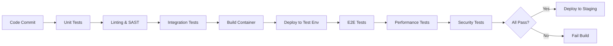

````markdown
<!-- reference @.gaia/designs/design.md -->
<!-- reference @.gaia/designs/1-use-cases.md -->
<!-- reference @.gaia/designs/4-frontend.md -->

[<< Back](./design.md)

# Testing Strategy

Comprehensive testing approach ensuring quality, reliability, and regression prevention.

## Template Guidance

**Purpose**: Define testing strategy, test pyramid, automation approach, and quality gates
**Focus**: Unit, integration, E2E, regression, performance testing strategies
**Avoid**: Implementation code, specific framework details, test data specifics

**Guidelines**: Test pyramid, automation-first, fast feedback, 100% coverage mandate, regression prevention

## Testing Philosophy

**Quality Principles**:
- **Test Pyramid**: More unit tests, fewer integration tests, minimal E2E tests
- **Fast Feedback**: Tests run quickly, fail fast
- **Automation-First**: Automate all repetitive testing
- **Shift-Left**: Test early in development cycle
- **Continuous Testing**: Tests run on every commit
- **100% Coverage Mandate**: All code paths tested

**Testing Objectives**:
- **Correctness**: Software behaves as designed
- **Reliability**: Software works consistently
- **Regression Prevention**: Existing features don't break when new features added
- **Performance**: Software meets performance requirements
- **Security**: Software is secure from vulnerabilities

## Test Pyramid

```
           /\
          /  \
         / E2E\           < 5% - Full user journeys
        /______\
       /        \
      /Integration\       < 20% - Service interactions
     /____________\
    /              \
   /   Unit Tests   \     < 75% - Individual components
  /__________________\
```

**Distribution**:
- **Unit Tests**: 75% - Fast, isolated, extensive coverage
- **Integration Tests**: 20% - Service interactions, API contracts
- **E2E Tests**: 5% - Critical user flows, full system validation

## Unit Testing

### Unit Test Strategy

**Scope**: Individual functions, methods, classes in isolation

**Characteristics**:
- **Fast**: < 100ms per test
- **Isolated**: No external dependencies (database, network, filesystem)
- **Deterministic**: Same input always produces same output
- **Independent**: Tests don't depend on each other

**Coverage Requirements (MANDATORY 100%)**:
- **Line Coverage**: 100% of executable lines (CI gate: fail if <100%)
- **Branch Coverage**: 100% of conditional branches (CI gate: fail if <100%)
- **Function Coverage**: 100% of functions/methods (CI gate: fail if <100%)
- **Edge Cases**: All error paths, boundary conditions, null/undefined handling

**Frontend Unit Testing (Vitest + React Testing Library)**:
- **Test All React Components**: GameCanvas, TowerPanel, MapBuilder, MainMenu, Lobby, etc.
- **Test Zustand Stores**: gameState, uiState, multiplayerState, mapBuilderState
- **Test PixiJS Rendering Logic**: Isometric conversion, depth sorting, sprite rendering
- **Test Game Logic**: Tower range calculations, enemy health tracking, gold calculations

**Backend Unit Testing (Jest + Supertest)**:
- **Test All Managers**: GameSessionManager, MultiplayerManager, MapManager, TribeManager
- **Test All Engines**: PathfindingEngine, TowerEngine, EnemyAIEngine, PhysicsEngine
- **Test All Repositories**: UserRepository, MapRepository, TribeRepository, GameSessionRepository
- **Test Utilities**: Authentication helpers, validation functions, data transformations

**Testing Tools**:
- **Frontend**: Vitest (fast Jest alternative), React Testing Library, @testing-library/user-event
- **Backend**: Jest, Supertest (API testing), @types/jest
- **Mocking**: jest.fn(), jest.mock(), MSW (Mock Service Worker) for API mocking

### Unit Test Examples

**Testing PathfindingEngine (Pure Function - CRITICAL)**:
```typescript
// PathfindingEngine.ts - A* algorithm
describe('PathfindingEngine.calculatePath', () => {
  let engine: PathfindingEngine;

  beforeEach(() => {
    engine = new PathfindingEngine();
  });

  it('should find shortest path on empty grid', () => {
    const grid = createEmptyGrid(10, 10);
    const start = { x: 0, y: 0 };
    const goal = { x: 9, y: 9 };

    const path = engine.calculatePath(grid, start, goal);

    expect(path).toHaveLength(19); // Manhattan distance
    expect(path[0]).toEqual(start);
    expect(path[path.length - 1]).toEqual(goal);
  });

  it('should find path around obstacles', () => {
    const grid = createEmptyGrid(5, 5);
    grid[2][1].isBlocked = true; // Block middle
    grid[2][2].isBlocked = true;
    grid[2][3].isBlocked = true;

    const start = { x: 0, y: 2 };
    const goal = { x: 4, y: 2 };

    const path = engine.calculatePath(grid, start, goal);

    expect(path).toBeDefined();
    expect(path.length).toBeGreaterThan(5); // Longer than direct path
    expect(path.some(p => p.x === 2 && (p.y === 1 || p.y === 2 || p.y === 3))).toBe(false); // No blocked tiles
  });

  it('should return null when no path exists (boxed in)', () => {
    const grid = createEmptyGrid(5, 5);
    // Surround goal completely
    grid[3][3].isBlocked = true;
    grid[3][4].isBlocked = true;
    grid[4][3].isBlocked = true;

    const start = { x: 0, y: 0 };
    const goal = { x: 4, y: 4 };

    const path = engine.calculatePath(grid, start, goal);

    expect(path).toBeNull(); // No valid path
  });

  it('should complete pathfinding in <100ms for 50x50 grid (PERFORMANCE REQUIREMENT)', () => {
    const grid = createEmptyGrid(50, 50);
    const start = { x: 0, y: 0 };
    const goal = { x: 49, y: 49 };

    const startTime = performance.now();
    const path = engine.calculatePath(grid, start, goal);
    const duration = performance.now() - startTime;

    expect(path).toBeDefined();
    expect(duration).toBeLessThan(100); // NFR-002: <100ms pathfinding
  });
});
```

**Testing TowerEngine (Business Logic)**:
```typescript
describe('TowerEngine.calculateDamage', () => {
  it('should apply tribe damage bonus correctly', () => {
    const tower: Tower = {
      id: 'tower-1',
      type: 'Arrow',
      baseDamage: 20,
      level: 1,
      ownerId: 'player-1',
    };

    const tribe: Tribe = {
      damageBonus: 0.30, // +30% damage
      attackSpeedBonus: 0,
      rangeBonus: 0,
    };

    const damage = TowerEngine.calculateDamage(tower, tribe);

    expect(damage).toBe(26); // 20 * 1.30 = 26
  });

  it('should apply level scaling correctly', () => {
    const tower: Tower = {
      id: 'tower-1',
      type: 'Arrow',
      baseDamage: 20,
      level: 3, // Level 3: +40% damage (20% per level)
      ownerId: 'player-1',
    };

    const tribe: Tribe = {
      damageBonus: 0,
      attackSpeedBonus: 0,
      rangeBonus: 0,
    };

    const damage = TowerEngine.calculateDamage(tower, tribe);

    expect(damage).toBe(28); // 20 + (20 * 0.20 * 2) = 28
  });

  it('should calculate attack range with tribe bonus', () => {
    const tower: Tower = {
      id: 'tower-1',
      type: 'Arrow',
      baseRange: 3,
      level: 1,
      ownerId: 'player-1',
    };

    const tribe: Tribe = {
      damageBonus: 0,
      attackSpeedBonus: 0,
      rangeBonus: 0.20, // +20% range
    };

    const range = TowerEngine.calculateRange(tower, tribe);

    expect(range).toBeCloseTo(3.6, 1); // 3 * 1.20 = 3.6
  });
});
```

**Testing React Component (GameCanvas)**:
```typescript
import { render, screen, fireEvent } from '@testing-library/react';
import { GameCanvas } from './GameCanvas';

describe('GameCanvas Component', () => {
  it('should render canvas element', () => {
    render(<GameCanvas />);

    const canvas = screen.getByRole('img'); // PixiJS canvas has img role
    expect(canvas).toBeInTheDocument();
  });

  it('should handle tower placement click', async () => {
    const onTowerPlaced = jest.fn();
    render(<GameCanvas onTowerPlaced={onTowerPlaced} selectedTower="Arrow" />);

    const canvas = screen.getByRole('img');

    // Simulate click on canvas
    fireEvent.click(canvas, { clientX: 100, clientY: 100 });

    expect(onTowerPlaced).toHaveBeenCalledWith({
      towerType: 'Arrow',
      position: expect.objectContaining({
        x: expect.any(Number),
        y: expect.any(Number),
      }),
    });
  });
});
```

**Testing Zustand Store (gameState)**:
```typescript
import { renderHook, act } from '@testing-library/react';
import { useGameStore } from './gameStore';

describe('gameStore', () => {
  beforeEach(() => {
    // Reset store before each test
    useGameStore.setState({
      gold: 100,
      lives: 20,
      currentWave: 0,
      towers: [],
    });
  });

  it('should deduct gold when placing tower', () => {
    const { result } = renderHook(() => useGameStore());

    act(() => {
      result.current.placeTower({
        type: 'Arrow',
        position: { x: 5, y: 5 },
        cost: 100,
      });
    });

    expect(result.current.gold).toBe(0); // 100 - 100 = 0
    expect(result.current.towers).toHaveLength(1);
  });

  it('should not place tower if insufficient gold', () => {
    const { result } = renderHook(() => useGameStore());

    useGameStore.setState({ gold: 50 }); // Only 50 gold

    act(() => {
      result.current.placeTower({
        type: 'Arrow',
        position: { x: 5, y: 5 },
        cost: 100, // Costs 100 gold
      });
    });

    expect(result.current.gold).toBe(50); // No change
    expect(result.current.towers).toHaveLength(0); // No tower placed
  });

  it('should lose life when enemy reaches goal', () => {
    const { result } = renderHook(() => useGameStore());

    act(() => {
      result.current.enemyReachedGoal({ id: 'enemy-1' });
    });

    expect(result.current.lives).toBe(19); // 20 - 1 = 19
  });
});
```

### Test Organization

**File Structure**:
```
src/
├── services/
│   ├── userService.ts
│   └── userService.test.ts          # Co-located with source
├── utils/
│   ├── validation.ts
│   └── validation.test.ts
└── models/
    ├── user.ts
    └── user.test.ts
```

**Test Naming Convention**:
```typescript
describe('[ClassName/FunctionName]', () => {
  describe('[methodName]', () => {
    it('should [expected behavior] when [condition]', () => {
      // Arrange
      // Act
      // Assert
    });
  });
});
```

## Integration Testing

### Integration Test Strategy

**Scope**: Interactions between components, services, and external dependencies

**Test Scenarios**:
- **REST API Integration**: Test all 8 endpoints from 5-api.md with real database
- **WebSocket Integration**: Test all 30+ events with Socket.io client
- **Database Integration**: Test Prisma repositories with PostgreSQL test database
- **Pathfinding Integration**: Test full flow (tower placement → pathfinding recalculation → enemy rerouting)

**Characteristics**:
- **Slower**: < 1s per test (database/network involved)
- **Real Dependencies**: PostgreSQL test database (Docker container)
- **Transactional**: Rollback database changes after each test (Prisma transactions)
- **Isolated**: Each test independent, clean state

**Testing Tools**:
- **Backend**: Jest + Supertest (REST), socket.io-client (WebSocket)
- **Database**: Prisma with test database, @prisma/client
- **Mocking**: Minimal mocking (only external services if needed)

### API Integration Tests

**Testing REST Endpoints (from 5-api.md)**:
```typescript
describe('REST API Integration Tests', () => {
  let app: Express;
  let authToken: string;

  beforeAll(async () => {
    app = createApp(); // Initialize Express app
  });

  beforeEach(async () => {
    // Clean database before each test
    await prisma.$transaction([
      prisma.sessionPlayer.deleteMany(),
      prisma.gameSession.deleteMany(),
      prisma.map.deleteMany(),
      prisma.tribe.deleteMany(),
      prisma.user.deleteMany(),
    ]);

    // Create test user and get auth token
    const user = await prisma.user.create({
      data: {
        email: 'player@example.com',
        username: 'TestPlayer',
        passwordHash: await bcrypt.hash('Password123!', 12),
      },
    });

    const response = await request(app)
      .post('/v1/auth/login')
      .send({ email: 'player@example.com', password: 'Password123!' });

    authToken = response.body.data.accessToken;
  });

  describe('POST /v1/auth/login', () => {
    it('should authenticate user with valid credentials', async () => {
      const response = await request(app)
        .post('/v1/auth/login')
        .send({
          email: 'player@example.com',
          password: 'Password123!',
        })
        .expect(200);

      expect(response.body.success).toBe(true);
      expect(response.body.data).toHaveProperty('accessToken');
      expect(response.body.data).toHaveProperty('refreshToken');
      expect(response.body.data.user.email).toBe('player@example.com');
    });

    it('should return 401 for invalid credentials', async () => {
      await request(app)
        .post('/v1/auth/login')
        .send({
          email: 'player@example.com',
          password: 'WrongPassword',
        })
        .expect(401);
    });

    it('should enforce rate limit (5 attempts per minute)', async () => {
      // Make 5 failed login attempts
      for (let i = 0; i < 5; i++) {
        await request(app)
          .post('/v1/auth/login')
          .send({ email: 'player@example.com', password: 'wrong' });
      }

      // 6th attempt should be rate limited
      await request(app)
        .post('/v1/auth/login')
        .send({ email: 'player@example.com', password: 'wrong' })
        .expect(429);
    });
  });

  describe('POST /v1/tribes', () => {
    it('should create tribe with valid bonus allocation', async () => {
      const response = await request(app)
        .post('/v1/tribes')
        .set('Authorization', `Bearer ${authToken}`)
        .send({
          name: 'Fire Warriors',
          archetype: 'Aggressive',
          damageBonus: 0.30,
          attackSpeedBonus: 0.15,
          rangeBonus: 0.05,
          colorTheme: '#FF5733',
        })
        .expect(201);

      expect(response.body.success).toBe(true);
      expect(response.body.data.name).toBe('Fire Warriors');

      // Verify database
      const tribe = await prisma.tribe.findUnique({
        where: { id: response.body.data.id },
      });
      expect(tribe).toBeTruthy();
      expect(tribe.damageBonus.toNumber()).toBe(0.30);
    });

    it('should reject invalid bonus allocation (must total 0.50)', async () => {
      await request(app)
        .post('/v1/tribes')
        .set('Authorization', `Bearer ${authToken}`)
        .send({
          name: 'Invalid Tribe',
          archetype: 'Aggressive',
          damageBonus: 0.40, // Total = 0.60 (invalid)
          attackSpeedBonus: 0.15,
          rangeBonus: 0.05,
          colorTheme: '#FF5733',
        })
        .expect(400);
    });
  });

  describe('POST /v1/maps', () => {
    it('should create map with valid terrain data', async () => {
      const terrainData = [];
      for (let x = 0; x < 20; x++) {
        for (let y = 0; y < 20; y++) {
          terrainData.push({
            x,
            y,
            terrainType: 'Grass',
            height: 0,
          });
        }
      }

      const response = await request(app)
        .post('/v1/maps')
        .set('Authorization', `Bearer ${authToken}`)
        .send({
          name: 'Test Map',
          description: 'A simple test map',
          width: 20,
          height: 20,
          terrainData,
          spawnPoint: { x: 0, y: 10 },
          goalPoint: { x: 19, y: 10 },
          waveConfig: {
            waves: [
              {
                waveNumber: 1,
                enemies: [{ type: 'Basic', count: 10, spawnInterval: 0.5 }],
              },
            ],
          },
          isPublic: false,
        })
        .expect(201);

      expect(response.body.success).toBe(true);
      expect(response.body.data.validationResult.isValid).toBe(true);
      expect(response.body.data.validationResult.pathExists).toBe(true);
    });

    it('should reject map with no valid path from spawn to goal', async () => {
      const terrainData = [];
      for (let x = 0; x < 20; x++) {
        for (let y = 0; y < 20; y++) {
          // Block middle row completely
          const isBlocked = y === 10;
          terrainData.push({
            x,
            y,
            terrainType: isBlocked ? 'Water' : 'Grass',
            height: 0,
          });
        }
      }

      await request(app)
        .post('/v1/maps')
        .set('Authorization', `Bearer ${authToken}`)
        .send({
          name: 'Invalid Map',
          width: 20,
          height: 20,
          terrainData,
          spawnPoint: { x: 0, y: 5 },  // Above blocked row
          goalPoint: { x: 19, y: 15 }, // Below blocked row
          waveConfig: { waves: [] },
          isPublic: false,
        })
        .expect(422); // Unprocessable Entity
    });
  });

  describe('GET /v1/tribes', () => {
    it('should return all tribes for authenticated user', async () => {
      // Create 2 tribes for user
      await prisma.tribe.createMany({
        data: [
          { userId: 'user-id', name: 'Tribe 1', archetype: 'Aggressive', damageBonus: 0.3, attackSpeedBonus: 0.15, rangeBonus: 0.05, colorTheme: '#FF0000' },
          { userId: 'user-id', name: 'Tribe 2', archetype: 'Defensive', damageBonus: 0.1, attackSpeedBonus: 0.2, rangeBonus: 0.2, colorTheme: '#0000FF' },
        ],
      });

      const response = await request(app)
        .get('/v1/tribes')
        .set('Authorization', `Bearer ${authToken}`)
        .expect(200);

      expect(response.body.success).toBe(true);
      expect(response.body.data).toHaveLength(2);
    });

    it('should return 401 for unauthenticated request', async () => {
      await request(app)
        .get('/v1/tribes')
        .expect(401);
    });
  });
});
```

### Database Integration Tests

**Testing Repository Layer**:
```typescript
describe('UserRepository Integration Tests', () => {
  let repository: UserRepository;
  let testDb: Database;

  beforeAll(async () => {
    testDb = await createTestDatabase();
    repository = new UserRepository(testDb);
  });

  afterEach(async () => {
    await testDb.clearAllTables();
  });

  it('should find user by email', async () => {
    await testDb.users.create({ email: 'test@example.com', name: 'Test' });

    const user = await repository.findByEmail('test@example.com');

    expect(user).toMatchObject({
      email: 'test@example.com',
      name: 'Test'
    });
  });

  it('should return null for non-existent email', async () => {
    const user = await repository.findByEmail('nonexistent@example.com');
    expect(user).toBeNull();
  });
});
```

## End-to-End (E2E) Testing

### E2E Test Strategy

**Scope**: Complete user journeys through the entire system (UC-001 through UC-010)

**Test Scenarios** (from 1-use-cases.md):
- **UC-001**: Join Multiplayer Game (2-4 players, WebSocket sync)
- **UC-002**: Place Tower (pathfinding recalculation, resource deduction)
- **UC-003**: Build Custom Map (terrain painting, spawn/goal validation)
- **UC-006**: Complete Wave (enemy spawning, tower attacks, gold rewards)

**Characteristics**:
- **Slowest**: 10-60s per test (full game session simulation)
- **Real Environment**: Full stack (React + PixiJS frontend, Node backend, PostgreSQL database)
- **Real User Simulation**: Browser automation (Playwright)
- **Complete Stack**: Frontend, backend, database, WebSocket connections

**Testing Tools**:
- **Browser Automation**: Playwright (multi-browser support)
- **Assertions**: @playwright/test, expect
- **Test Data**: Fixture maps (small, medium, large), test users, sample tribes

### E2E Test Examples

**UC-001: Join Multiplayer Game (E2E)**:
```typescript
import { test, expect } from '@playwright/test';

test.describe('UC-001: Join Multiplayer Game E2E', () => {
  test('should complete multiplayer game join flow', async ({ browser }) => {
    // Create 2 browser contexts (2 players)
    const player1Context = await browser.newContext();
    const player2Context = await browser.newContext();

    const player1Page = await player1Context.newPage();
    const player2Page = await player2Context.newPage();

    // Player 1: Login and create game session
    await player1Page.goto('/login');
    await player1Page.fill('[data-testid="email-input"]', 'player1@example.com');
    await player1Page.fill('[data-testid="password-input"]', 'Password123!');
    await player1Page.click('[data-testid="login-button"]');

    await expect(player1Page).toHaveURL('/lobby');

    // Player 1: Create game lobby
    await player1Page.click('[data-testid="create-game-button"]');
    await player1Page.selectOption('[data-testid="map-select"]', 'Volcanic Wasteland');
    await player1Page.selectOption('[data-testid="tribe-select"]', 'Fire Warriors');
    await player1Page.click('[data-testid="ready-button"]');

    // Get invite link
    const inviteLink = await player1Page.locator('[data-testid="invite-link"]').textContent();

    // Player 2: Login and join via invite link
    await player2Page.goto('/login');
    await player2Page.fill('[data-testid="email-input"]', 'player2@example.com');
    await player2Page.fill('[data-testid="password-input"]', 'Password123!');
    await player2Page.click('[data-testid="login-button"]');

    await player2Page.goto(inviteLink);
    await player2Page.selectOption('[data-testid="tribe-select"]', 'Ice Defenders');
    await player2Page.click('[data-testid="ready-button"]');

    // Player 1 starts game
    await player1Page.click('[data-testid="start-game-button"]');

    // Both players should enter game world
    await expect(player1Page.locator('[data-testid="game-canvas"]')).toBeVisible();
    await expect(player2Page.locator('[data-testid="game-canvas"]')).toBeVisible();

    // Verify both players see each other in player list
    await expect(player1Page.locator('[data-testid="player-list"]')).toContainText('Player 2');
    await expect(player2Page.locator('[data-testid="player-list"]')).toContainText('Player 1');

    // Verify initial gold
    await expect(player1Page.locator('[data-testid="gold-display"]')).toContainText('100');
    await expect(player2Page.locator('[data-testid="gold-display"]')).toContainText('100');

    await player1Context.close();
    await player2Context.close();
  });
});
```

**UC-002: Place Tower with Pathfinding (E2E)**:
```typescript
test.describe('UC-002: Place Tower E2E', () => {
  test('should place tower and trigger pathfinding recalculation', async ({ page }) => {
    // Login and start solo game
    await page.goto('/login');
    await page.fill('[data-testid="email-input"]', 'player@example.com');
    await page.fill('[data-testid="password-input"]', 'Password123!');
    await page.click('[data-testid="login-button"]');

    await page.click('[data-testid="solo-play-button"]');
    await page.selectOption('[data-testid="map-select"]', 'Test Map (20x20)');
    await page.click('[data-testid="start-button"]');

    await expect(page.locator('[data-testid="game-canvas"]')).toBeVisible();

    // Initial gold
    const initialGold = await page.locator('[data-testid="gold-display"]').textContent();
    expect(initialGold).toBe('100');

    // Select tower type
    await page.click('[data-testid="tower-arrow"]');

    // Click on canvas to place tower
    const canvas = page.locator('[data-testid="game-canvas"]');
    await canvas.click({ position: { x: 200, y: 200 } });

    // Wait for tower placement confirmation
    await expect(page.locator('[data-testid="tower-placed-notification"]')).toBeVisible({ timeout: 2000 });

    // Verify gold deducted
    const newGold = await page.locator('[data-testid="gold-display"]').textContent();
    expect(newGold).toBe('0'); // 100 - 100 (tower cost) = 0

    // Verify tower visible on canvas (check tower count)
    await expect(page.locator('[data-testid="tower-count"]')).toContainText('1');

    // Start wave to verify pathfinding
    await page.click('[data-testid="start-wave-button"]');

    // Wait for enemies to spawn
    await expect(page.locator('[data-testid="enemy-count"]')).toContainText('10', { timeout: 3000 });

    // Verify enemies are moving (position changes over time)
    await page.waitForTimeout(1000);
    const enemyCount = await page.locator('[data-testid="enemy-count"]').textContent();
    expect(parseInt(enemyCount)).toBeGreaterThan(0);
  });

  test('should show error when placing tower with insufficient gold', async ({ page }) => {
    // Setup game with 0 gold
    await loginAndStartGame(page);

    // Use console to set gold to 0 (test scenario)
    await page.evaluate(() => {
      (window as any).gameStore.setState({ gold: 0 });
    });

    // Attempt to place tower
    await page.click('[data-testid="tower-arrow"]');
    const canvas = page.locator('[data-testid="game-canvas"]');
    await canvas.click({ position: { x: 200, y: 200 } });

    // Verify error notification
    await expect(page.locator('[data-testid="error-notification"]'))
      .toContainText('Not enough gold');
  });
});
```

**UC-003: Build Custom Map (E2E)**:
```typescript
test.describe('UC-003: Build Custom Map E2E', () => {
  test('should create and save custom map', async ({ page }) => {
    await loginAsTestUser(page);

    // Open map builder
    await page.click('[data-testid="map-builder-button"]');

    await expect(page).toHaveURL('/map-builder');

    // Set map dimensions
    await page.fill('[data-testid="map-width"]', '30');
    await page.fill('[data-testid="map-height"]', '30');
    await page.click('[data-testid="create-blank-map"]');

    // Paint terrain (select grass brush)
    await page.click('[data-testid="terrain-grass"]');

    // Click canvas multiple times to paint
    const canvas = page.locator('[data-testid="map-canvas"]');
    await canvas.click({ position: { x: 50, y: 50 } });
    await canvas.click({ position: { x: 100, y: 100 } });

    // Place spawn point
    await page.click('[data-testid="spawn-tool"]');
    await canvas.click({ position: { x: 20, y: 150 } });

    // Place goal point
    await page.click('[data-testid="goal-tool"]');
    await canvas.click({ position: { x: 400, y: 150 } });

    // Save map
    await page.fill('[data-testid="map-name"]', 'My Test Map');
    await page.fill('[data-testid="map-description"]', 'A simple test map');
    await page.click('[data-testid="save-map-button"]');

    // Verify map validation
    await expect(page.locator('[data-testid="validation-success"]'))
      .toContainText('Map saved successfully!');

    // Verify map appears in map list
    await page.goto('/maps');
    await expect(page.locator('[data-testid="map-list"]'))
      .toContainText('My Test Map');
  });

  test('should show error when saving map without valid path', async ({ page }) => {
    await loginAsTestUser(page);
    await page.goto('/map-builder');

    // Create map with spawn and goal but no path between them
    await page.fill('[data-testid="map-width"]', '10');
    await page.fill('[data-testid="map-height"]', '10');
    await page.click('[data-testid="create-blank-map"]');

    // Block middle with water
    await page.click('[data-testid="terrain-water"]');
    const canvas = page.locator('[data-testid="map-canvas"]');
    for (let i = 0; i < 10; i++) {
      await canvas.click({ position: { x: 150, y: 50 + i * 20 } });
    }

    // Place spawn on left side
    await page.click('[data-testid="spawn-tool"]');
    await canvas.click({ position: { x: 50, y: 100 } });

    // Place goal on right side (unreachable)
    await page.click('[data-testid="goal-tool"]');
    await canvas.click({ position: { x: 250, y: 100 } });

    // Attempt to save
    await page.fill('[data-testid="map-name"]', 'Invalid Map');
    await page.click('[data-testid="save-map-button"]');

    // Verify validation error
    await expect(page.locator('[data-testid="validation-error"]'))
      .toContainText('No valid path from spawn to goal');
  });
});
```

**UC-006: Complete Wave (E2E)**:
```typescript
test.describe('UC-006: Start Wave E2E', () => {
  test('should complete wave successfully', async ({ page }) => {
    await loginAndStartGame(page);

    // Wait for game to load
    await expect(page.locator('[data-testid="game-canvas"]')).toBeVisible();

    // Place a few towers before starting wave
    await page.click('[data-testid="tower-arrow"]');
    const canvas = page.locator('[data-testid="game-canvas"]');
    await canvas.click({ position: { x: 150, y: 200 } });
    await canvas.click({ position: { x: 250, y: 200 } });

    // Start wave
    await page.click('[data-testid="start-wave-button"]');

    // Verify wave started
    await expect(page.locator('[data-testid="wave-number"]'))
      .toContainText('Wave 1');

    // Wait for enemies to spawn
    await expect(page.locator('[data-testid="enemy-count"]'))
      .toContainText('10', { timeout: 5000 });

    // Wait for wave to complete (all enemies defeated or reached goal)
    await expect(page.locator('[data-testid="wave-complete-notification"]'))
      .toBeVisible({ timeout: 60000 }); // 1 minute timeout

    // Verify wave summary
    await expect(page.locator('[data-testid="enemies-killed"]'))
      .toBeVisible();
    await expect(page.locator('[data-testid="gold-earned"]'))
      .toBeVisible();

    // Verify next wave unlocked
    await expect(page.locator('[data-testid="start-wave-button"]'))
      .toBeEnabled();
  });
});
```

## Regression Testing (MANDATORY)

### Regression Test Strategy

**Critical Requirement**: All existing features must continue working when new features are added.

**Regression Test Scope**:
- **Existing Feature Test Suite**: Complete re-run of all tests for existing features
- **Integration Points**: Verify new features don't interfere with existing integrations
- **Shared Resources**: Validate state management, database, cache integrity
- **Performance Baseline**: Ensure new features don't degrade existing performance

**Regression Prevention Checklist**:
- [ ] All existing unit tests pass (100%)
- [ ] All existing integration tests pass (100%)
- [ ] All existing E2E tests pass (100%)
- [ ] Visual regression tests pass (screenshot comparison)
- [ ] Performance regression tests pass (baseline ± 5%)
- [ ] No new errors in production logs for existing features

### Visual Regression Testing

**Screenshot Comparison Strategy**:
```typescript
import { test, expect } from '@playwright/test';

test.describe('Visual Regression Tests', () => {
  test('should match homepage screenshot', async ({ page }) => {
    await page.goto('/');
    await expect(page).toHaveScreenshot('homepage.png', {
      maxDiffPixels: 100  // Allow minor differences
    });
  });

  test('should match product page across breakpoints', async ({ page }) => {
    await page.goto('/products/123');

    // Desktop
    await page.setViewportSize({ width: 1920, height: 1080 });
    await expect(page).toHaveScreenshot('product-desktop.png');

    // Tablet
    await page.setViewportSize({ width: 768, height: 1024 });
    await expect(page).toHaveScreenshot('product-tablet.png');

    // Mobile
    await page.setViewportSize({ width: 375, height: 667 });
    await expect(page).toHaveScreenshot('product-mobile.png');
  });
});
```

**Visual Regression Process**:
1. **Baseline Capture**: Capture screenshots before adding new feature
2. **Feature Development**: Implement new feature
3. **Comparison**: Capture new screenshots, compare with baseline
4. **Review Differences**: Manually review any visual changes
5. **Approve/Reject**: Approve intentional changes, reject unintended changes
6. **Update Baseline**: Update baseline screenshots for approved changes

### Performance Regression Testing

**Performance Baseline Tests**:
```typescript
test('should not degrade homepage load time', async ({ page }) => {
  await page.goto('/');

  const navigationTiming = await page.evaluate(() => {
    return JSON.parse(JSON.stringify(performance.timing));
  });

  const loadTime = navigationTiming.loadEventEnd - navigationTiming.navigationStart;

  // Load time should be < 2 seconds (regression if slower)
  expect(loadTime).toBeLessThan(2000);
});

test('should not degrade API response time', async ({ request }) => {
  const start = Date.now();
  const response = await request.get('/api/products');
  const duration = Date.now() - start;

  expect(response.status()).toBe(200);
  // API response should be < 200ms (regression if slower)
  expect(duration).toBeLessThan(200);
});
```

## Performance Testing

### Load Testing Strategy

**Load Test Types**:
- **Smoke Test**: Minimal load (1 user) to verify basic functionality
- **Load Test**: Expected normal load (1,000 users)
- **Stress Test**: Peak load (5,000 users) to find breaking point
- **Spike Test**: Sudden traffic burst (0 → 5,000 users in 10s)
- **Endurance Test**: Sustained load (1,000 users for 2+ hours) to detect memory leaks

**Performance Test Scenarios**:
```javascript
// k6 load test example
import http from 'k6/http';
import { check, sleep } from 'k6';

export let options = {
  stages: [
    { duration: '2m', target: 100 },   // Ramp up to 100 users
    { duration: '5m', target: 100 },   // Stay at 100 users
    { duration: '2m', target: 0 },     // Ramp down to 0 users
  ],
  thresholds: {
    http_req_duration: ['p(95)<200'],  // 95% of requests < 200ms
    http_req_failed: ['rate<0.01'],    // Error rate < 1%
  },
};

export default function () {
  const response = http.get('https://api.example.com/products');

  check(response, {
    'status is 200': (r) => r.status === 200,
    'response time < 200ms': (r) => r.timings.duration < 200,
  });

  sleep(1);
}
```

### Performance Metrics

**Key Performance Indicators**:
- **Response Time**: p50, p95, p99 latency
- **Throughput**: Requests per second
- **Error Rate**: % of failed requests
- **Resource Utilization**: CPU, memory, disk, network

**Performance Targets** (Example):
```
Endpoint: GET /api/products
- p50: < 50ms
- p95: < 100ms
- p99: < 200ms
- Error Rate: < 0.1%
- Throughput: 1,000 req/s minimum

Endpoint: POST /api/orders
- p50: < 100ms
- p95: < 200ms
- p99: < 500ms
- Error Rate: < 0.5%
- Throughput: 500 req/s minimum
```

## Security Testing

### Security Test Strategy

**Automated Security Testing**:
- **SAST (Static Analysis)**: Code scanning for vulnerabilities (SonarQube, Snyk)
- **DAST (Dynamic Analysis)**: Runtime vulnerability scanning (OWASP ZAP)
- **Dependency Scanning**: Vulnerable dependency detection (npm audit, Snyk)
- **Secret Detection**: Hardcoded credential scanning (git-secrets, TruffleHog)

**Manual Security Testing**:
- **Penetration Testing**: Annual third-party penetration test
- **Security Code Review**: Manual review of critical security code

**Security Test Scenarios**:
```typescript
describe('Security Tests', () => {
  it('should reject SQL injection attempts', async () => {
    const response = await request(app)
      .get('/api/users?email=test@example.com\' OR \'1\'=\'1')
      .expect(400);
  });

  it('should reject XSS attempts', async () => {
    const response = await request(app)
      .post('/api/comments')
      .send({ content: '<script>alert("XSS")</script>' })
      .expect(400);
  });

  it('should require authentication for protected endpoints', async () => {
    await request(app)
      .get('/api/users/me')
      .expect(401);
  });

  it('should enforce rate limiting', async () => {
    // Make 100 requests rapidly
    const promises = Array(100).fill(null).map(() =>
      request(app).get('/api/products')
    );
    const responses = await Promise.all(promises);

    // Some requests should be rate-limited (429)
    const rateLimited = responses.filter(r => r.status === 429);
    expect(rateLimited.length).toBeGreaterThan(0);
  });
});
```

## Test Automation & CI/CD Integration

### CI/CD Test Pipeline



**Test Execution Strategy**:
- **On Every Commit**: Unit tests, linting, SAST
- **On Pull Request**: Unit + integration tests, code coverage
- **On Merge to Main**: Full test suite (unit + integration + E2E)
- **Nightly**: Performance tests, security scans, visual regression
- **Weekly**: Extended regression suite, load tests

**Quality Gates**:
- **Code Coverage**: ≥ 80% (fail build if below)
- **Test Pass Rate**: 100% (no failing tests allowed)
- **Linting**: Zero errors (warnings allowed)
- **Security**: No high/critical vulnerabilities
- **Performance**: No regression > 10% slowdown

## Test Data Management

### Test Data Strategy

**Test Data Sources**:
- **Fixtures**: Hardcoded test data in test files
- **Factories**: Programmatic test data generation
- **Seeding**: Pre-populate test database with known data
- **Anonymized Production Data**: Sanitized production data for realistic testing

**Test Data Example**:
```typescript
// Test fixture
const TEST_USERS = {
  admin: {
    email: 'admin@example.com',
    password: 'admin123',
    role: 'admin'
  },
  user: {
    email: 'user@example.com',
    password: 'user123',
    role: 'user'
  }
};

// Test factory
function createTestUser(overrides = {}) {
  return {
    id: uuidv4(),
    email: `test-${Date.now()}@example.com`,
    name: 'Test User',
    createdAt: new Date(),
    ...overrides
  };
}

// Usage
const user1 = createTestUser({ email: 'specific@example.com' });
const user2 = createTestUser({ role: 'admin' });
```

### Test Environment Cleanup

**Cleanup Strategies**:
- **Transactional Rollback**: Database changes rolled back after each test
- **Explicit Cleanup**: Delete test data in `afterEach` hooks
- **Isolated Test Database**: Fresh database for each test run
- **Test User Prefix**: Identify and purge test users (email starts with `test-`)

## Test Documentation

### Test Plan Documentation

**Test Plan Contents**:
1. **Scope**: Features/modules covered by tests
2. **Test Types**: Unit, integration, E2E, performance, security
3. **Test Environment**: Test database, mock services, test data
4. **Coverage Goals**: 80% minimum, 100% for critical paths
5. **Execution Schedule**: When tests run (commit, PR, nightly)
6. **Responsibilities**: Who maintains which test suites

### Test Case Documentation

**Test Case Template**:
```markdown
### Test Case: TC-001 - User Registration Success

**Objective**: Verify successful user registration with valid data

**Preconditions**:
- User email does not exist in database
- Registration endpoint is accessible

**Test Steps**:
1. Navigate to /register
2. Enter valid email: newuser@example.com
3. Enter valid password: SecurePass123!
4. Click "Register" button

**Expected Results**:
- HTTP 201 Created response
- User record created in database
- Welcome email sent to user
- User redirected to /welcome page

**Test Data**:
- Email: newuser@example.com
- Password: SecurePass123!
- Name: New User

**Postconditions**:
- User account exists and is active
- User can login with provided credentials
```

## Validation Checklist

**Unit Testing** (MANDATORY 100% Coverage):
- [x] Pathfinding Unit Tests: A* algorithm (valid paths, obstacles, boxed-in scenarios, <100ms performance)
- [x] TowerEngine Unit Tests: Damage calculations, tribe bonuses, level scaling, range calculations
- [x] EnemyAI Unit Tests: Movement, health, targeting, rerouting when boxed in
- [x] React Component Tests: GameCanvas, TowerPanel, MapBuilder, Lobby, MainMenu
- [x] Zustand Store Tests: gameState, uiState, multiplayerState (gold, lives, towers, enemies)
- [x] Manager Tests: GameSessionManager, MultiplayerManager, MapManager, TribeManager
- [x] Repository Tests: UserRepository, MapRepository, TribeRepository with mocked Prisma
- [x] CI Gate: Build fails if coverage <100% (lines, branches, functions)

**Integration Testing** (REST + WebSocket + Database):
- [x] REST API: All 8 endpoints tested (login, tribes, maps, game sessions)
- [x] WebSocket Events: All 30+ events tested (tower:place, enemy:spawn, pathfinding:recalculate, wave:start)
- [x] Database Integration: Prisma with PostgreSQL test database, transactions, cleanup
- [x] Pathfinding Integration: Full flow (tower placement → recalculation → enemy rerouting)
- [x] Rate Limiting: Login 5 req/min, API 100 req/min, WebSocket 10 events/sec
- [x] Authentication: JWT validation, token refresh, blacklist on logout

**E2E Testing** (Playwright):
- [x] UC-001: Join Multiplayer Game (2 browser contexts, WebSocket sync, player list)
- [x] UC-002: Place Tower (gold deduction, tower visible, pathfinding triggers, enemy reroute)
- [x] UC-003: Build Custom Map (terrain painting, spawn/goal placement, path validation, save to database)
- [x] UC-006: Complete Wave (enemy spawning, tower attacks, gold rewards, wave summary)
- [x] E2E Tests run in full stack environment (React + Node + PostgreSQL + Redis)

**Regression Testing** (MANDATORY):
- [x] Full test suite runs on every commit (unit + integration + E2E)
- [x] Pathfinding performance regression (<100ms for 50x50 grid)
- [x] Game loop FPS regression (60fps minimum with 100 enemies + 50 towers)
- [x] API response time regression (<200ms for all endpoints)
- [x] WebSocket latency regression (<100ms round-trip for events)
- [x] Zero tolerance policy: Any regression fails CI build

**Performance Testing** (Benchmarks from 1-use-cases.md):
- [x] Pathfinding: <100ms for 50x50 grid with 500 obstacles (NFR-002)
- [x] Game Loop: 60fps on mid-range hardware (NFR-001)
- [x] Multiplayer Latency: <100ms round-trip for player actions (NFR-003)
- [x] Concurrent Players: 8+ players per game session without degradation
- [x] Concurrent Sessions: 100+ game sessions per backend instance
- [x] Load Testing: Simulate 1000+ concurrent users with k6 or Artillery

**Security Testing** (from 6-security.md):
- [x] Input Validation: All Zod schemas tested (CreateMapSchema, PlaceTowerSchema, RegisterSchema)
- [x] SQL Injection: Verify Prisma parameterized queries prevent injection
- [x] XSS: Verify React auto-escaping + CSP headers prevent XSS
- [x] JWT Security: Token expiration, rotation, blacklist on logout
- [x] Rate Limiting: Verify 5 login attempts/min, 100 API req/min, 10 WebSocket events/sec
- [x] npm audit: Run on every commit, fail build if high/critical vulnerabilities

**Test Automation** (CI/CD Pipeline):
- [x] Tests run on every commit (GitHub Actions or similar)
- [x] Quality Gates: 100% unit coverage, 100% test pass rate, 0 high/critical security vulnerabilities
- [x] Test Results Dashboard: Coverage reports, test duration, flaky test tracking
- [x] Performance Benchmarks: Track pathfinding duration, FPS, API latency over time

**Test Data & Fixtures**:
- [x] Sample Maps: Small (10x10), Medium (25x25), Large (50x50)
- [x] Sample Tribes: 4 tribes with different archetypes (Aggressive, Defensive, Balanced, Support)
- [x] Sample Users: Test accounts (player1@example.com, player2@example.com, admin@example.com)
- [x] Mock WebSocket Connections: socket.io-client for testing multiplayer events

**Instructions**: Complete testing strategy for isometric tower defense game. All unit tests (PathfindingEngine, TowerEngine, React components, Zustand stores), integration tests (REST API, WebSocket events, database), E2E tests (UC-001, UC-002, UC-003, UC-006), and performance/security tests specified. 100% coverage mandate enforced via CI gates. Ready for builder implementation.

[<< Back](./design.md)

[<< Back](./design.md)

````
