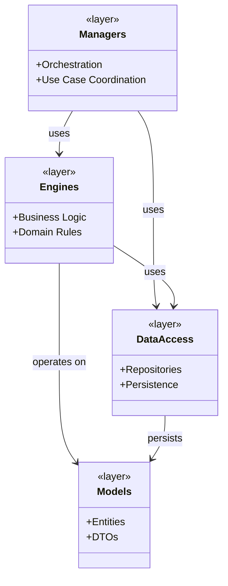
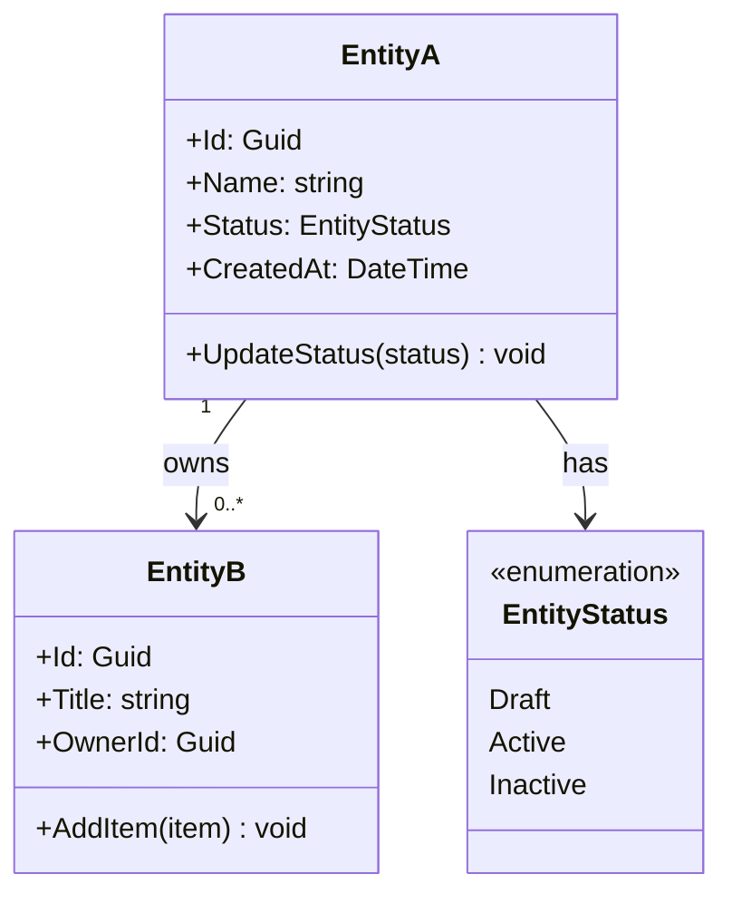
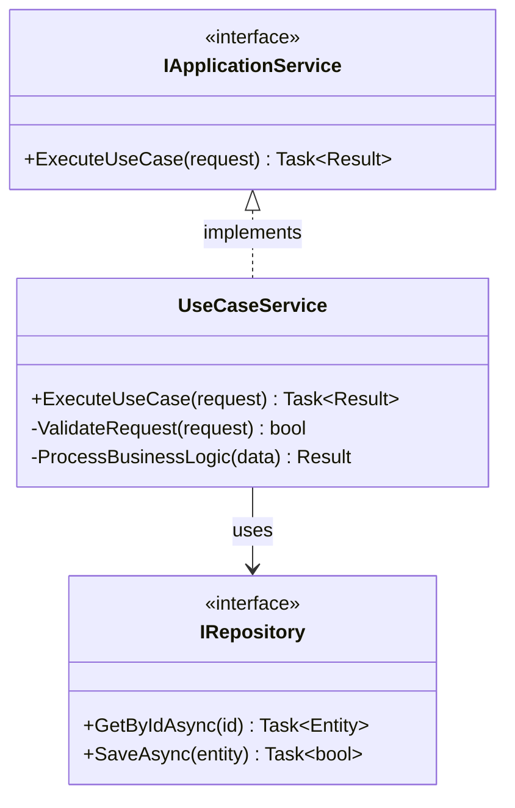
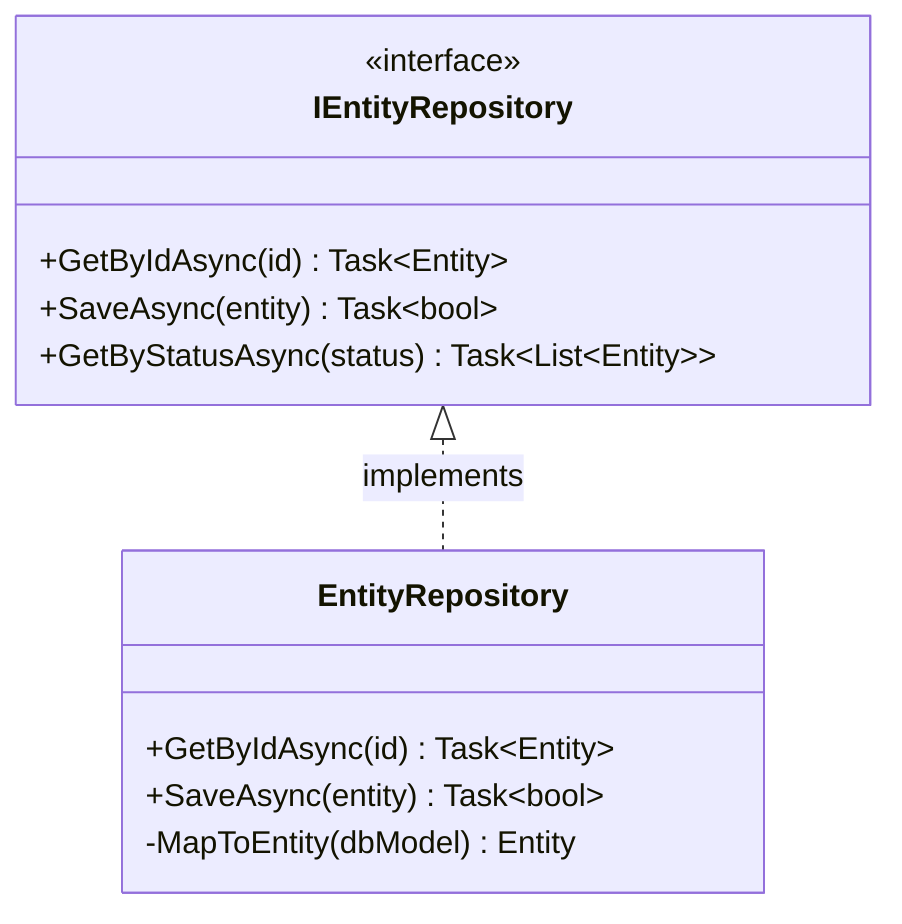
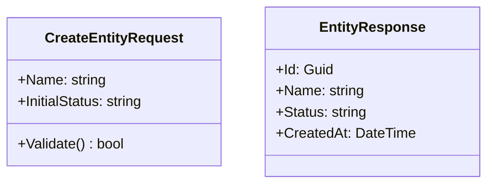
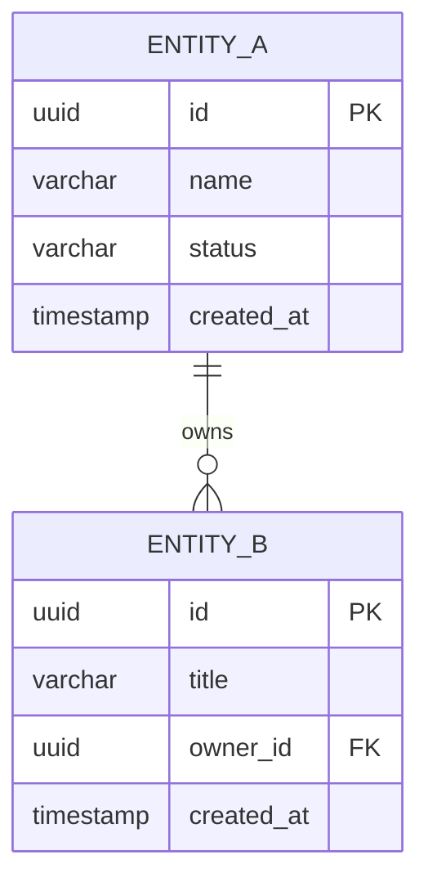

<!-- reference @.gaia/designs/design.md -->
<!-- reference @.gaia/designs/1-use-cases.md -->

[<< Back](./design.md)

# Class Diagrams & Data Models

System structural design bridging use cases to implementation.

## Template Guidance

**Purpose**: Define classes, relationships, and data flow
**Focus**: Domain entities, interfaces, data structure
**Avoid**: Implementation details, database optimization

**Guidelines**: Domain-driven design, interface-focused, clear relationships

## System Architecture

## Domain Model

## Service Layer

## Data Layer

## DTOs & Database

## Validation Checklist

**Domain Model**: 
- [ ] Entities map to business concepts from use cases
- [ ] Relationships reflect business rules

**Service Design**: 
- [ ] Services coordinate use cases
- [ ] Interfaces define clear contracts
- [ ] Dependencies flow inward

**Data Design**: 
- [ ] Repositories abstract persistence
- [ ] DTOs provide clean API contracts

**Instructions**: Replace entities with actual business concepts from use cases. Ensure all classes support identified use cases.

[<< Back](./design.md)
