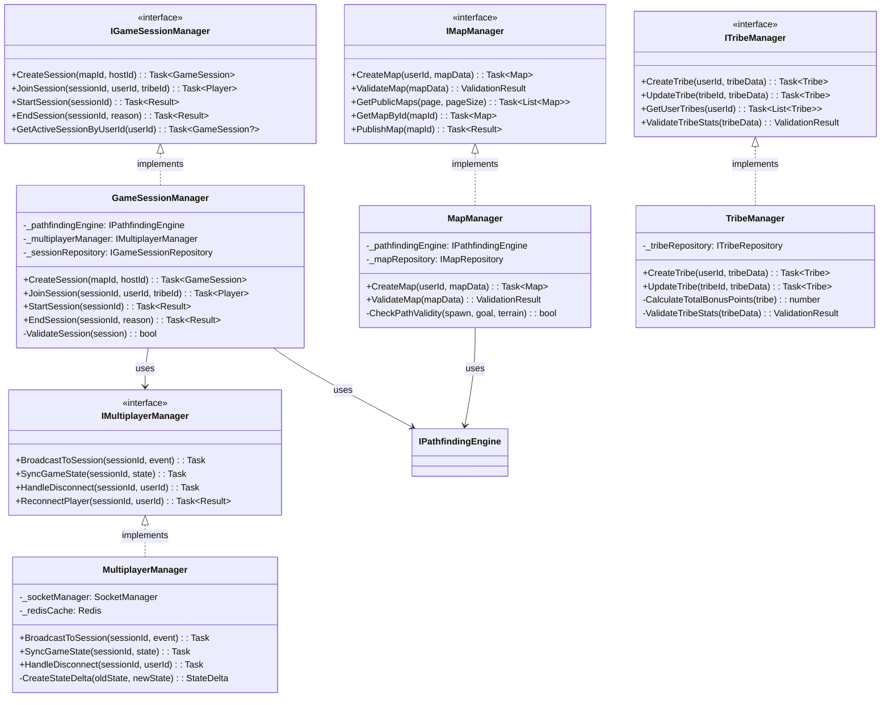
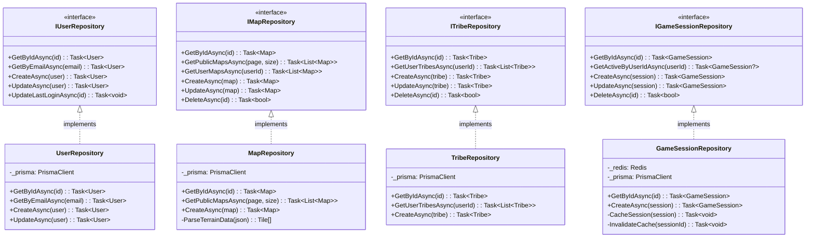

<!-- reference @.gaia/designs/design.md -->
<!-- reference @.gaia/designs/1-use-cases.md -->

[<< Back](./design.md)

# Class Diagrams & Data Models

Isometric Tower Defense Game - Domain models, service layers, and data architecture following iDesign principles.

## Template Guidance

**Purpose**: Define classes, relationships, and data flow
**Focus**: Domain entities, interfaces, data structure
**Avoid**: Implementation details, database optimization

**Guidelines**: Domain-driven design, interface-focused, clear relationships

## System Architecture

## Domain Model

## Service Layer (Managers)

## Engine Layer (Business Logic)

## Data Layer (Repositories)

## DTOs & API Contracts

```mermaid
classDiagram
    class CreateUserRequest {
        +Email: string
        +Username: string
        +Password: string
        +Validate(): ValidationResult
    }

    class UserResponse {
        +Id: UUID
        +Email: string
        +Username: string
        +Level: number
        +CreatedAt: DateTime
    }

    class CreateTribeRequest {
        +Name: string
        +Archetype: TribeArchetype
        +DamageBonus: number
        +AttackSpeedBonus: number
        +RangeBonus: number
        +ColorTheme: string
        +Validate(): ValidationResult
    }

    class TribeResponse {
        +Id: UUID
        +Name: string
        +Archetype: TribeArchetype
        +Bonuses: BonusStats
        +ColorTheme: string
    }

    class CreateMapRequest {
        +Name: string
        +Description: string
        +Width: number
        +Height: number
        +TerrainData: Tile[]
        +SpawnPoint: Point
        +GoalPoint: Point
        +WaveConfig: WaveConfiguration
        +Validate(): ValidationResult
    }

    class MapResponse {
        +Id: UUID
        +Name: string
        +Description: string
        +Dimensions: Dimensions
        +Author: string
        +PlayCount: number
        +Rating: number
        +CreatedAt: DateTime
    }

    class JoinSessionRequest {
        +SessionId: UUID
        +TribeId: UUID
    }

    class GameSessionResponse {
        +Id: UUID
        +MapId: UUID
        +MapName: string
        +Players: PlayerInfo[]
        +Status: SessionStatus
        +CurrentWave: number
        +SharedLives: number
    }

    class PlaceTowerRequest {
        +TowerType: TowerType
        +Position: Point
    }

    class TowerResponse {
        +Id: UUID
        +Type: TowerType
        +Position: Point
        +Level: number
        +Stats: TowerStats
        +OwnerId: UUID
    }
```

## Database ERD

## iDesign Layer Mapping

**Managers (🟢 Orchestration Layer)**:
- `GameSessionManager`: Coordinates game session lifecycle, validates player joins
- `MultiplayerManager`: Handles WebSocket synchronization, state broadcasting
- `MapManager`: Orchestrates map creation, validation, publishing
- `TribeManager`: Manages tribe CRUD operations, validates stats

**Engines (🟠 Business Logic Layer)**:
- `PathfindingEngine`: A* pathfinding, path validation, recalculation logic
- `TowerEngine`: Tower placement validation, attack processing, stat calculations
- `EnemyAIEngine`: Enemy spawning, movement, tower targeting behavior
- `PhysicsEngine`: Position updates, collision detection, grid transformations

**Data Access (⚫ Persistence Layer)**:
- `UserRepository`: User CRUD with Prisma ORM
- `MapRepository`: Map storage, terrain data serialization
- `TribeRepository`: Tribe persistence
- `GameSessionRepository`: Session state (Redis hot cache + PostgreSQL persistence)

**Models (🟣 Data Contracts)**:
- Domain Entities: `User`, `Tribe`, `Map`, `Tower`, `Enemy`, `GameSession`
- DTOs: `CreateUserRequest`, `TribeResponse`, `GameSessionResponse`
- Enums: `TowerType`, `EnemyType`, `TerrainType`, `SessionStatus`

## Validation Checklist

**Domain Model**:
- [x] Entities map to business concepts from use cases
- [x] Relationships reflect business rules (User owns Tribes, Map contains Tiles)
- [x] Enums define valid states (TowerType, SessionStatus, TerrainType)

**Service Design**:
- [x] Managers coordinate use cases (GameSessionManager orchestrates UC-001)
- [x] Interfaces define clear contracts (IPathfindingEngine, ITowerEngine)
- [x] Dependencies flow inward (Managers → Engines → Data Access)

**Data Design**:
- [x] Repositories abstract persistence (Prisma + Redis)
- [x] DTOs provide clean API contracts (CreateTribeRequest, TowerResponse)
- [x] ERD supports all use cases with proper foreign keys

**Instructions**: All classes support identified use cases. Pathfinding, tower placement, multiplayer sync, map building, and tribe customization fully modeled. Ready for implementation.

[<< Back](./design.md)
