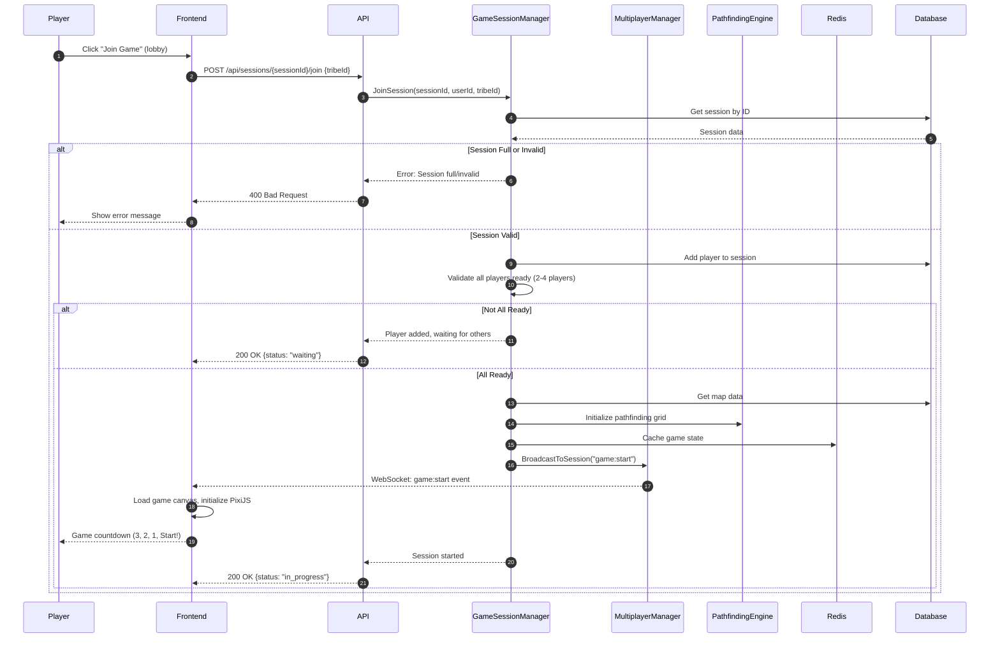
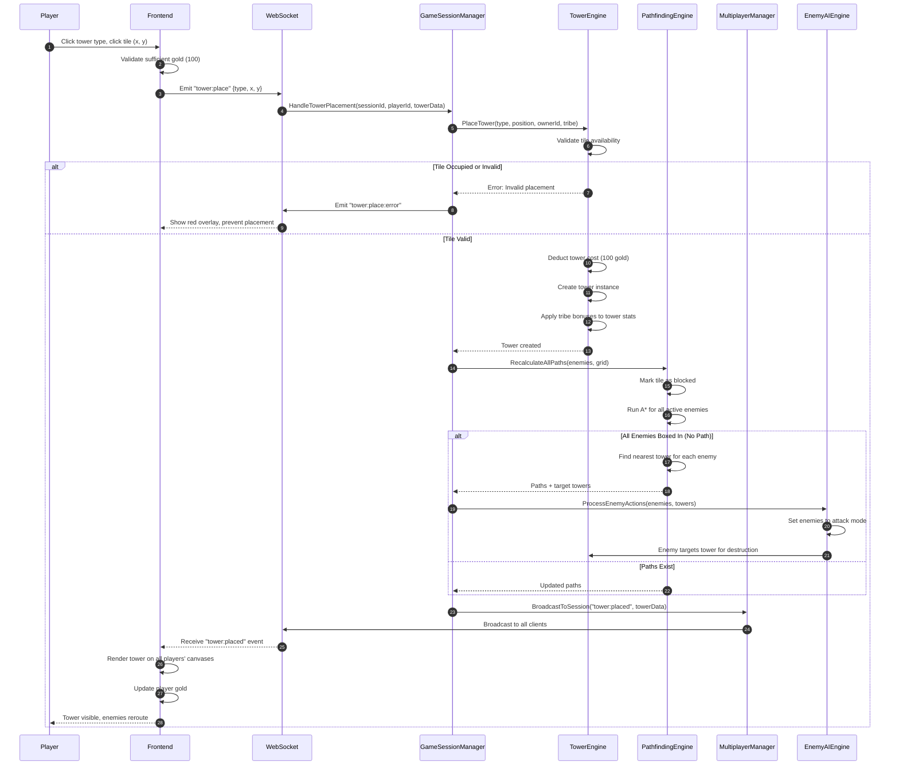
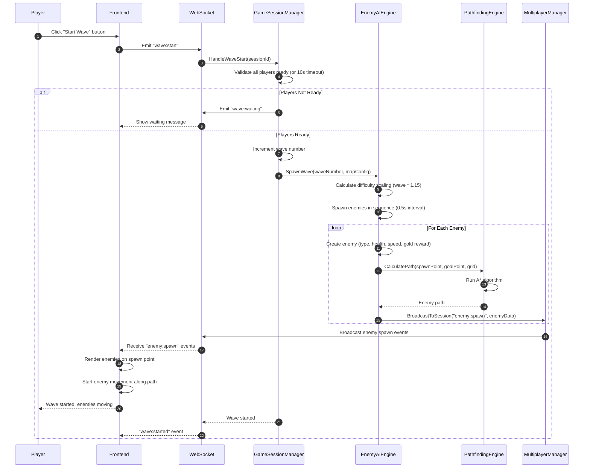
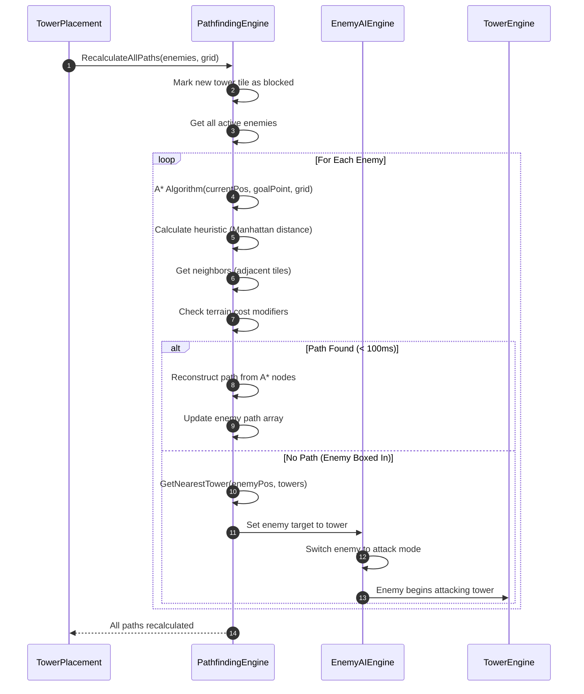
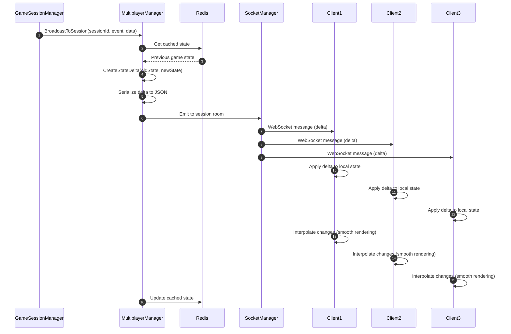
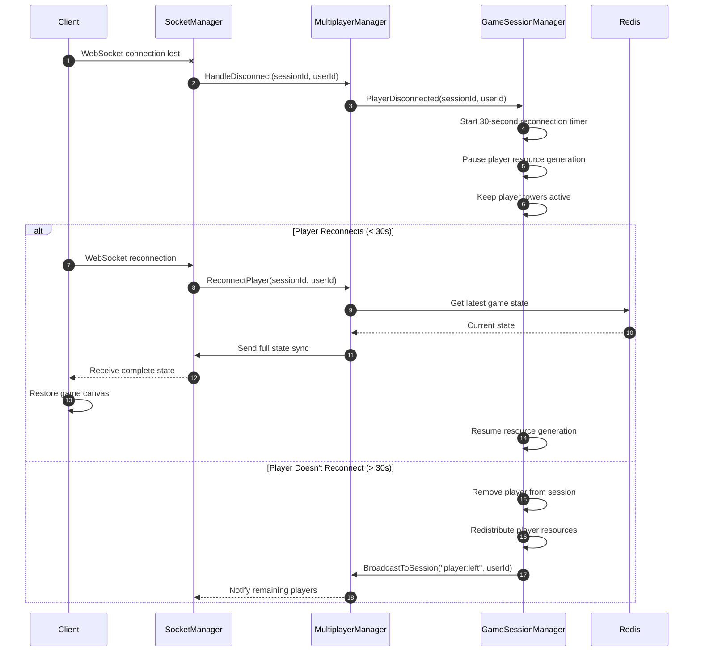
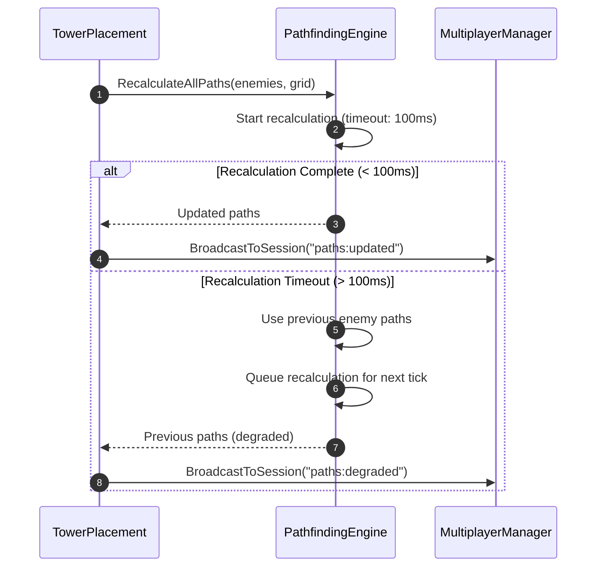
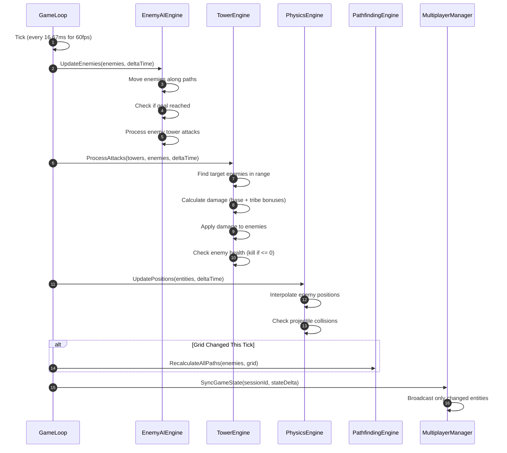

<!-- reference @.gaia/designs/design.md -->
<!-- reference @.gaia/designs/1-use-cases.md -->
<!-- reference @.gaia/designs/2-class.md -->

[<< Back](./design.md)

# Sequence Diagrams

Use case execution flows showing class collaboration over time.

## Template Guidance

**Purpose**: Show how system executes use cases through object interactions
**Focus**: Use case flows, object collaboration, interaction patterns
**Avoid**: Implementation details, infrastructure concerns

**Guidelines**: Use case driven, appropriate abstraction, include error scenarios

## Primary Use Case Flows

### UC-001: Join Multiplayer Game

### UC-002: Place Tower (with Pathfinding Recalculation)

### UC-006: Start Wave (Enemy Spawning)

### UC-008: Recalculate Pathfinding (A* Algorithm)

### UC-009: Synchronize Game State (WebSocket Broadcasting)

## Error Handling & Integration Patterns

### WebSocket Disconnection Handling

### Pathfinding Timeout Handling

## Complex Business Process

### Complete Game Loop (60fps Tick)

## Mapping Guidelines

**Simple Use Cases**: UC-003 (Build Map), UC-004 (Customize Tribe) - Single sequence with validation
**Complex Use Cases**: UC-001 (Join Game), UC-002 (Place Tower), UC-006 (Start Wave) - Multi-step orchestration
**Real-Time Game Logic**: UC-008 (Pathfinding), UC-009 (State Sync) - Performance-critical flows with sub-100ms requirements

**Sequence Diagram Coverage**:
- UC-001: Join Multiplayer Game - Full multiplayer session initialization
- UC-002: Place Tower - Tower placement with pathfinding recalculation
- UC-006: Start Wave - Enemy spawning with A* pathfinding
- UC-008: Recalculate Pathfinding - A* algorithm execution with timeout handling
- UC-009: Synchronize Game State - WebSocket state delta broadcasting
- Error Handling: WebSocket disconnection, pathfinding timeout, reconnection flows
- Game Loop: 60fps tick with physics, enemy AI, tower attacks, state sync

**Performance Constraints**:
- Pathfinding recalculation: < 100ms for 50x50 grid with active enemies
- WebSocket state synchronization: < 100ms latency player-to-player
- Game loop tick: 16.67ms (60fps sustained)
- A* algorithm: Early termination if exceeding 100ms budget

**Instructions**: All critical game flows documented with actors from class diagrams (GameSessionManager, PathfindingEngine, TowerEngine, EnemyAIEngine, MultiplayerManager). Error scenarios include WebSocket disconnects, pathfinding timeouts, and player reconnection. Real-time multiplayer synchronization uses state delta broadcasting for performance.

[<< Back](./design.md)
