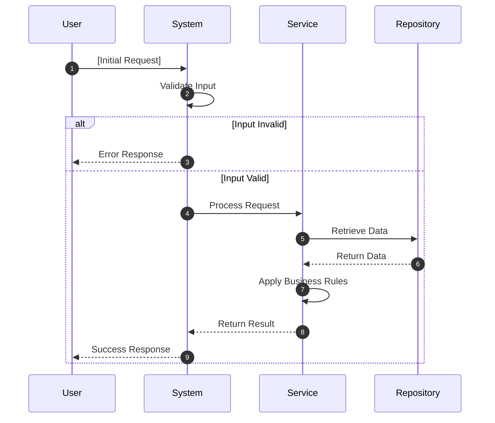
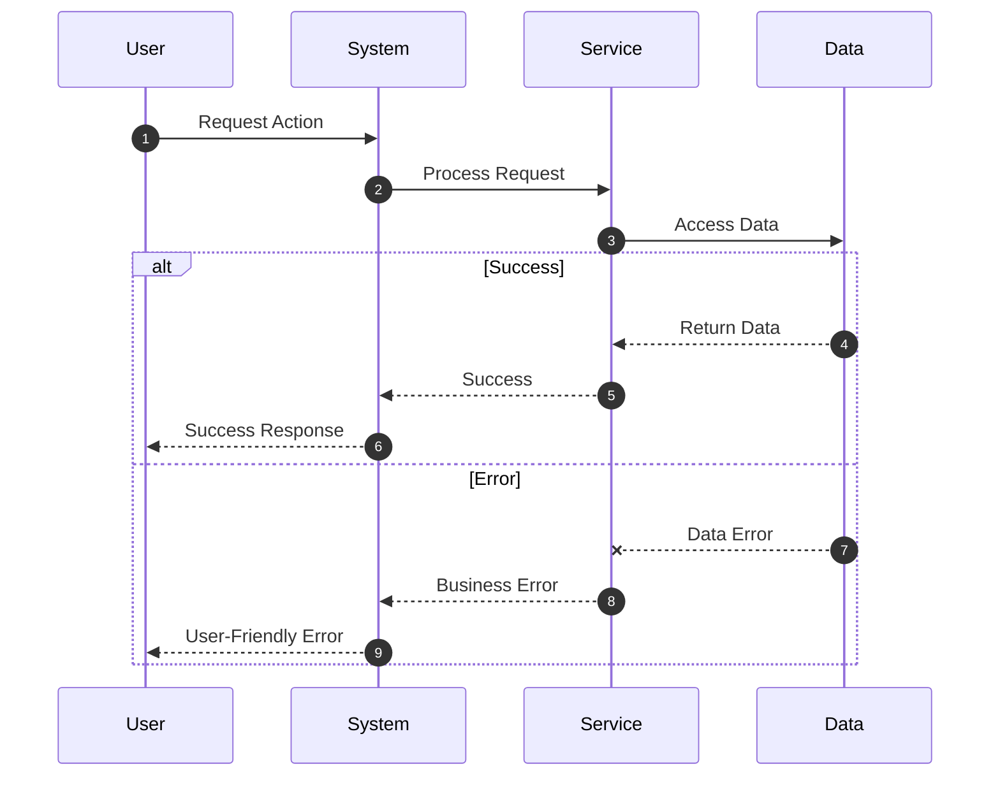
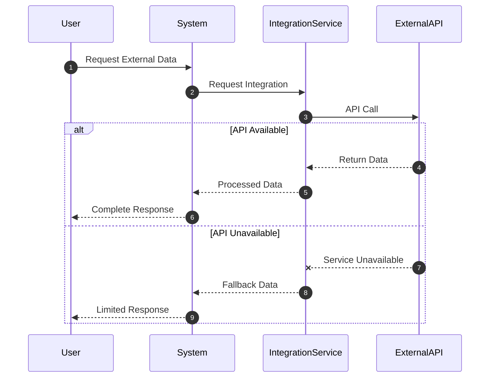
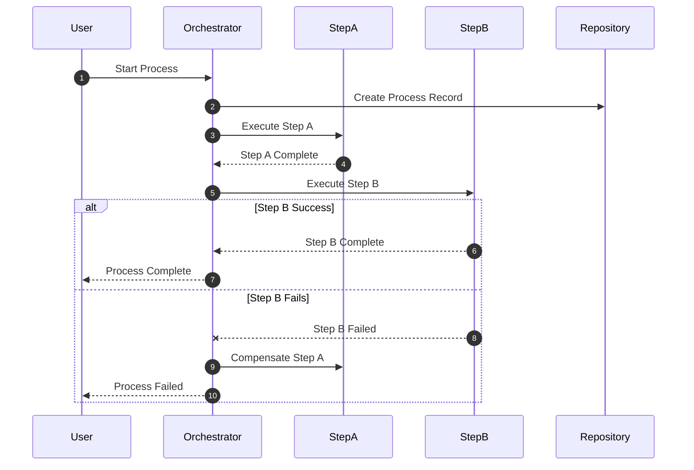

<!-- reference @.gaia/designs/design.md -->
<!-- reference @.gaia/designs/1-use-cases.md -->
<!-- reference @.gaia/designs/2-class.md -->

[<< Back](./design.md)

# Sequence Diagrams

Use case execution flows showing class collaboration over time.

## Template Guidance

**Purpose**: Show how system executes use cases through object interactions
**Focus**: Use case flows, object collaboration, interaction patterns  
**Avoid**: Implementation details, infrastructure concerns

**Guidelines**: Use case driven, appropriate abstraction, include error scenarios

## Primary Use Case Flows

### UC-001: [Use Case Name]



### UC-002: [Another Use Case]

```mermaid
sequenceDiagram
    autonumber
    participant Actor
    participant Interface
    participant ServiceA
    participant ServiceB
    participant Storage

    Actor->>Interface: Trigger Action
    Interface->>ServiceA: Process
    ServiceA->>ServiceB: Delegate Logic
    ServiceB-->>ServiceA: Return Result
    ServiceA->>Storage: Persist Changes
    ServiceA-->>Interface: Return Result
    Interface-->>Actor: Present Outcome
```

## Error Handling & Integration Patterns

### Standard Error Pattern


### External Service Integration


## Complex Business Process

### Multi-Step Process Flow


## Mapping Guidelines

**Simple Use Cases**: Single sequence with happy path + validation errors
**Complex Use Cases**: Primary sequence + separate alternative flows
**Integration-Heavy**: Focus on external interactions + fallback patterns

**Instructions**: 
1. Replace placeholders with actual actors/services from class diagrams
2. Map each diagram to specific use cases
3. Show business value achievement through interactions
4. Include realistic error scenarios

[<< Back](./design.md)
