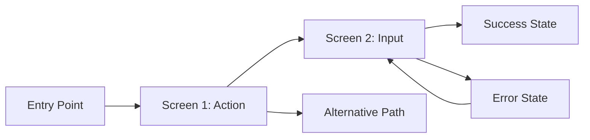

<!-- reference @.gaia/designs/design.md -->
<!-- reference @.gaia/designs/1-use-cases.md -->
<!-- reference @.gaia/designs/2-class.md -->
<!-- reference @.gaia/designs/3-sequence.md -->

[<< Back](./design.md)

# Frontend Design Specification

Complete frontend user experience translating use cases into visual design.

## Template Guidance

**Purpose**: Define user interface interactions and visual design  
**Focus**: User flows, design language, component specifications, responsive behavior
**Avoid**: Implementation code, technical architecture, deployment details

**Guidelines**: User-centered, consistent, accessible, responsive, modern patterns

## User Flow Mapping

### UC-001: [User Journey Name]
**Goal**: [What users accomplish]
**Entry**: [How users start]

**Flow Steps**:
1. [Screen/Action]: User sees [interface] and performs [action]
2. [Screen/Action]: System shows [response], user does [next action]
3. [Success]: User reaches [goal] with [confirmation]

**UI Requirements**: Navigation, feedback, error handling, accessibility

### UC-002: [Another Journey]
[Follow same pattern]

## Visual Design Language

**Design Philosophy**: [Modern/Minimal/Bold - based on target audience]
**Target Audience**: [Primary users and preferences]

**Colors**:
- Primary: `#[HEX]` - CTAs and navigation
- Secondary: `#[HEX]` - Accents and highlights  
- Background: `#[HEX]` - Main backgrounds
- Text: `#[HEX]` - Primary text
- Error/Success/Warning: `#[HEX]` colors for states

**Typography**:
- Primary Font: [Font Family] for headers
- Body Font: [Font Family] for content
- Sizes: H1 [size], H2 [size], Body [size]

**Spacing**: 8px base unit (8px, 16px, 24px, 32px...)
**Border Radius**: [value]px for components
**Shadows**: [Light/medium/heavy shadow definitions]
- **Success**: `#10B981` - Success states and positive actions
- **Warning**: `#F59E0B` - Warnings and caution states
- **Error**: `#EF4444` - Errors and destructive actions
- **Info**: `#3B82F6` - Information and neutral states

### Typography System

**Font Family**: [Primary font choice based on brand personality]
**Hierarchy**:
- **Display**: 2.5rem (40px) - Hero headlines
- **H1**: 2rem (32px) - Page titles  
- **H2**: 1.5rem (24px) - Section headers
- **H3**: 1.25rem (20px) - Subsection headers
- **Body**: 1rem (16px) - Standard content
- **Small**: 0.875rem (14px) - Captions and metadata

**Text Styles**:
- **Emphasis**: Bold weight for important content
- **Subtle**: Reduced opacity for secondary information
- **Links**: Underlined with primary color
- **Code**: Monospace font for technical content

### Spacing & Layout

**Spacing Scale** (8px base unit):
- **XS**: 4px - Tight element spacing
- **SM**: 8px - Small component padding
- **MD**: 16px - Standard element spacing
- **LG**: 24px - Section spacing
- **XL**: 32px - Large layout divisions
- **2XL**: 48px - Major page sections

**Layout Grid**:
- **Container**: Max-width with centered content
## Responsive Design & Components

**Breakpoints**: Mobile (375-767px), Tablet (768-1023px), Desktop (1024px+)
**Approach**: Mobile-first with progressive enhancement
**Touch Targets**: Minimum 44px for accessibility

**Core Components**:
- Navigation: Primary nav, breadcrumbs, pagination
- Data Display: Cards, tables, lists  
- Input: Forms, buttons, search with validation
- Feedback: Notifications, loading states, empty states
- Overlays: Modals, tooltips, dropdowns

**Component States**: Default, hover, focus, active, disabled, loading, error

## Information Architecture

**Page Templates**: Landing, dashboard, detail pages, forms, lists
**Navigation**: Primary (main sections), secondary (sub-sections), contextual (page actions)
**Content Hierarchy**: Priority placement, visual weight, scanning patterns

## Accessibility & Performance

**WCAG AA**: 4.5:1 color contrast, keyboard navigation, screen reader support
**Performance**: FCP < 1.5s, LCP < 2.5s, Lighthouse 90+
**Quality**: Cross-browser testing, responsive validation, error testing

**Instructions**: 
1. Map use cases to user flows with interface requirements
2. Define consistent design language for target audience  
3. Specify component requirements for all UI elements
4. Include responsive behavior for all device types
5. Plan accessibility from design stage

[<< Back](./design.md)
- **Screen Reader Support**: Proper ARIA labels and semantic HTML
- **Focus Management**: Clear focus indicators and logical tab order

### Inclusive Design Practices
- **Alternative Text**: Descriptive alt text for all images
- **Form Labels**: Clear, descriptive labels for all inputs
- **Error Messages**: Specific, actionable error descriptions
- **Content Structure**: Proper heading hierarchy and landmarks

## 🔄 User Feedback & States

### Notification System
**Toast Notifications**:
- **Success**: Confirm successful actions (green)
- **Error**: Alert users to problems (red) 
- **Warning**: Caution about potential issues (amber)
- **Info**: Provide helpful information (blue)

**Inline Feedback**:
- **Form Validation**: Real-time field validation
- **Loading Indicators**: Progress feedback for actions
- **Status Updates**: System state communications

### Animation & Micro-interactions
**Purposeful Animations**:
- **Transitions**: Smooth page and state changes (250ms)
- **Hover Effects**: Subtle interactive feedback
- **Loading States**: Engaging wait experiences
- **Success Confirmation**: Delightful action completion

**Performance Guidelines**:
- **60fps Target**: Smooth animation performance
- **Reduced Motion**: Respect user accessibility preferences

## 📊 Performance & Quality Standards

### Performance Targets
- **First Contentful Paint**: < 1.5s
- **Largest Contentful Paint**: < 2.5s
- **Lighthouse Score**: 90+ across all categories

### Quality Assurance
**Visual Testing Requirements**:
- **Screenshot Tests**: All major pages at mobile/tablet/desktop
- **Component Testing**: All states and variations
- **Accessibility Testing**: Keyboard navigation and screen reader testing
- **Cross-browser Testing**: Chrome, Firefox, Safari, Edge

**Testing Strategy**:
- **Responsive Testing**: All breakpoints function correctly
- **Interactive Testing**: All user flows work as designed
- **Error Testing**: Error states display appropriately
- **Performance Testing**: Page load times meet targets

**Template Instructions**:
1. **Map all use cases** to user flows with specific interface requirements
2. **Define consistent design language** that serves your target audience
3. **Specify component requirements** for all UI elements mentioned in flows
4. **Include responsive behavior** for mobile, tablet, and desktop experiences
5. **Plan accessibility** from the design stage, not as an afterthought

[<< Back](./design.md)
