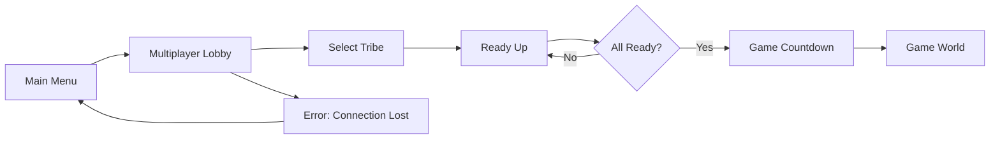
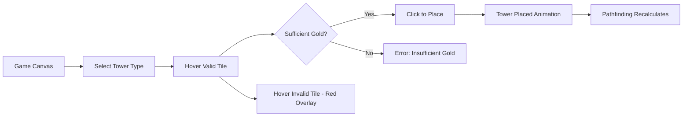
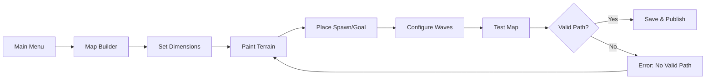
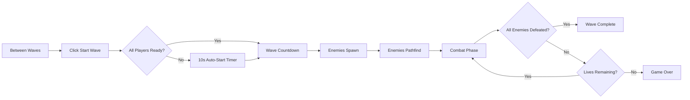

<!-- reference @.gaia/designs/design.md -->
<!-- reference @.gaia/designs/1-use-cases.md -->
<!-- reference @.gaia/designs/2-class.md -->
<!-- reference @.gaia/designs/3-sequence.md -->

[<< Back](./design.md)

# Frontend Design Specification

Complete frontend user experience translating use cases into visual design.

## Template Guidance

**Purpose**: Define user interface interactions and visual design
**Focus**: User flows, design language, component specifications, responsive behavior
**Avoid**: Implementation code, technical architecture, deployment details

**Guidelines**: User-centered, consistent, accessible, responsive, modern patterns

## User Flow Mapping

### UC-001: Join Multiplayer Game
**Goal**: Player enters synchronized multiplayer game world
**Entry**: Main menu "Join Game" button



**Flow Steps**:
1. **Main Menu**: User clicks "Join Game" → Navigate to multiplayer lobby
2. **Lobby Screen**: User sees available players, selects tribe from dropdown → Click "Ready"
3. **Countdown**: All players ready → 3-2-1 countdown animation
4. **Game World**: Countdown complete → Transition to isometric game canvas

**UI Requirements**:
- Lobby player list with tribe indicators
- Ready status checkmarks for each player
- Countdown timer with visual feedback
- Loading spinner during WebSocket connection
- Error toast for connection failures

---

### UC-002: Place Tower
**Goal**: Player places tower on isometric grid, triggers pathfinding recalculation
**Entry**: Click tower icon in sidebar



**Flow Steps**:
1. **Tower Selection**: User clicks arrow tower icon (sidebar) → Cursor shows tower preview sprite
2. **Tile Hover**: User hovers over grid tiles → Valid tiles show green outline, invalid show red
3. **Placement**: User clicks valid tile → Tower placement animation, gold deducted, pathfinding recalculates <100ms
4. **Feedback**: Tower appears on all players' screens, enemy paths update smoothly

**UI Requirements**:
- Tower sidebar with costs and stats
- Tile hover feedback (green/red outlines)
- Ghost tower preview on cursor
- Gold display updates immediately
- Range circle preview on hover

---

### UC-003: Build Custom Map
**Goal**: Player creates and publishes custom map
**Entry**: Main menu "Map Builder" button



**Flow Steps**:
1. **Map Builder**: User clicks "Create Map" → Map builder interface loads
2. **Dimension Setup**: User sets grid size (20x20 to 100x100 slider) → Empty grid appears
3. **Terrain Painting**: User selects terrain type (grass/dirt/stone/water/lava) → Click/drag to paint tiles
4. **Height Editing**: User selects height brush (0-5 levels) → Click/drag to adjust tile heights
5. **Spawn/Goal Placement**: User places spawn point (red marker) and goal point (green marker)
6. **Wave Configuration**: User configures enemy waves (type, count, timing) → Wave preview panel
7. **Testing**: User clicks "Test Map" → Playtest in solo mode, validates path exists
8. **Publishing**: Path valid → User names map, adds description → Click "Publish" → Map appears in community browser

**UI Requirements**:
- Terrain palette (5 terrain types with icons)
- Height brush with 0-5 level selector
- Spawn/goal marker placement tools
- Wave configuration modal
- Validation indicator (path exists: green checkmark, no path: red X)
- Save/publish button with confirmation modal

---

### UC-006: Start Wave
**Goal**: Player initiates enemy wave, enemies spawn and pathfind
**Entry**: Click "Start Wave" button in game UI



**Flow Steps**:
1. **Ready State**: User clicks "Start Wave" button → Wave number increments, countdown begins
2. **Countdown**: 3-2-1 countdown timer → Visual wave banner animation
3. **Enemy Spawning**: Enemies spawn at spawn point (0.5s intervals) → Health bars appear
4. **Pathfinding**: Enemies calculate paths to goal → Move along path (smooth interpolation)
5. **Combat**: Towers attack enemies in range → Damage numbers float up
6. **Wave Complete**: All enemies defeated → Wave summary modal (gold earned, lives lost)

**UI Requirements**:
- "Start Wave" button (glowing when available)
- Countdown timer (large center screen)
- Enemy wave indicator (wave number, total enemies)
- Live enemy count tracker
- Wave summary modal with stats
- Auto-start timer for multiplayer coordination

## Visual Design Language

**Design Philosophy**: Isometric fantasy strategy game with vibrant colors, clear visual feedback, and accessible UI
**Target Audience**: Strategy game enthusiasts (18-35), co-op multiplayer fans, tower defense players

**Art Style**:
- **Isometric Grid**: 45-degree camera angle, sprite-based rendering
- **Vibrant Colors**: High contrast for readability during fast gameplay
- **Fantasy Theme**: Medieval fantasy aesthetic (castles, archers, magic)
- **Smooth Animations**: 60fps game loop with particle effects

**Color Palette**:
- **Primary (Gold)**: `#FFD700` - Gold currency, selected towers, highlights
- **Secondary (Blue)**: `#4169E1` - Player UI elements, friendly indicators
- **Enemy (Red)**: `#DC143C` - Enemy health bars, danger zones
- **Success (Green)**: `#32CD32` - Valid placement, wave complete, health
- **Warning (Orange)**: `#FF8C00` - Low resources, path blocked warnings
- **Background (Dark Slate)**: `#2C3E50` - UI panel backgrounds
- **Text (White)**: `#FFFFFF` - Primary text on dark backgrounds
- **Text (Dark)**: `#2C3E50` - Text on light backgrounds

**Terrain Colors**:
- **Grass**: `#7CB342` - Default walkable terrain
- **Dirt**: `#8D6E63` - Alternative walkable terrain
- **Stone**: `#757575` - Slower movement terrain
- **Water**: `#29B6F6` - Impassable terrain
- **Lava**: `#FF5722` - Impassable, animated terrain

### Typography System

**Font Family**: "Inter" (sans-serif) for UI, "Press Start 2P" (pixel font) for game accents
**Hierarchy**:
- **Display**: 2.5rem (40px) - Main menu title "Tower Defense"
- **H1**: 2rem (32px) - Screen titles (Map Builder, Lobby)
- **H2**: 1.5rem (24px) - Section headers (Tower Info, Wave Stats)
- **H3**: 1.25rem (20px) - Panel titles (Resources, Players)
- **Body**: 1rem (16px) - Standard UI text
- **Small**: 0.875rem (14px) - Tooltips, metadata
- **Tiny**: 0.75rem (12px) - Health bars, damage numbers

**Text Styles**:
- **Gold Values**: Bold weight, gold color (#FFD700)
- **Damage Numbers**: Floating text, red for damage, green for healing
- **Player Names**: Tribe color coded
- **Timer Text**: Large, bold, center screen (countdown)

### Spacing & Layout

**Spacing Scale** (8px base unit):
- **XS**: 4px - Icon gaps, tight padding
- **SM**: 8px - Button padding, small gaps
- **MD**: 16px - Panel padding, standard gaps
- **LG**: 24px - Section spacing, large gaps
- **XL**: 32px - Screen margins
- **2XL**: 48px - Major panel separation

**Layout Grid**:
- **Game Canvas**: Full viewport (1280x720 minimum, scales to 1920x1080)
- **UI Overlay**: Fixed panels (left: tower panel, right: stats panel, top: resources, bottom: controls)
- **Responsive**: Scale UI elements proportionally, maintain 16:9 aspect ratio

---

## React Component Architecture

### Screen Components

**MainMenuScreen**:
```
MainMenuScreen/
├── Logo
├── NavigationMenu
│   ├── PlayButton → MultiplayerLobbyScreen
│   ├── MapBuilderButton → MapBuilderScreen
│   ├── TribeCustomizationButton → TribeCustomizationScreen
│   └── SettingsButton → SettingsScreen
└── BackgroundAnimation (animated isometric grid)
```

**MultiplayerLobbyScreen**:
```
MultiplayerLobbyScreen/
├── LobbyHeader (session ID, player count)
├── PlayerList
│   ├── PlayerCard (name, tribe, ready status)
│   └── EmptySlot (waiting for players...)
├── TribeSelector (dropdown with tribe bonuses)
├── ReadyButton
└── StartGameButton (host only, all ready)
```

**GameScreen** (Primary Gameplay):
```
GameScreen/
├── GameCanvas (PixiJS wrapper)
│   ├── IsometricGrid
│   ├── TowerSprites
│   ├── EnemySprites
│   └── EffectParticles
├── UIOverlay
│   ├── TopBar
│   │   ├── GoldDisplay (icon + value)
│   │   ├── LivesDisplay (hearts)
│   │   └── WaveIndicator (wave X/Y)
│   ├── LeftPanel (TowerPanel)
│   │   ├── TowerButton (Arrow, Cannon, Magic, Wall)
│   │   └── SelectedTowerInfo (stats, upgrade)
│   ├── RightPanel (PlayerPanel)
│   │   ├── PlayerCard (each player's gold, towers)
│   │   └── ChatBox (multiplayer chat)
│   └── BottomControls
│       ├── StartWaveButton
│       ├── PauseButton (solo only)
│       └── SettingsButton
└── ModalsContainer
    ├── WaveSummaryModal
    ├── GameOverModal
    └── SettingsModal
```

**MapBuilderScreen**:
```
MapBuilderScreen/
├── MapCanvas (PixiJS wrapper)
│   ├── EditableGrid
│   ├── SpawnGoalMarkers
│   └── PathPreview
├── LeftToolbar
│   ├── TerrainPalette (5 terrain types)
│   ├── HeightBrush (0-5 levels)
│   └── MarkerTools (spawn, goal)
├── RightPanel
│   ├── MapSettings (name, dimensions)
│   ├── WaveConfigPanel
│   └── ValidationStatus (path exists checkmark)
└── BottomControls
    ├── TestMapButton
    ├── SaveButton
    └── PublishButton
```

**TribeCustomizationScreen**:
```
TribeCustomizationScreen/
├── TribePreview (visual representation)
├── ArchetypeSelector (Aggressive, Defensive, Balanced, Support)
├── BonusPointAllocator
│   ├── DamageSlider (0-50%, costs points)
│   ├── AttackSpeedSlider (0-30%, costs points)
│   └── RangeSlider (0-20%, costs points)
├── ColorThemePicker (8 color palettes)
├── TribeNameInput (max 20 characters)
└── SaveTribeButton
```
### Core UI Components

**TowerButton Component**:
```typescript
interface TowerButtonProps {
  type: 'Arrow' | 'Cannon' | 'Magic' | 'Wall';
  cost: number;
  damage: number;
  range: number;
  attackSpeed: number;
  selected: boolean;
  canAfford: boolean;
  onClick: () => void;
}
```
**States**:
- Default: Gray background, tower icon visible
- Hover: Tooltip shows stats (damage, range, attack speed)
- Selected: Gold border, glowing effect
- Disabled (insufficient gold): Grayed out, crossed icon
- Cooldown: Progress bar overlay (if applicable)

---

**GoldDisplay Component**:
```typescript
interface GoldDisplayProps {
  currentGold: number;
  goldChange: number; // +/- animation trigger
}
```
**States**:
- Static: Shows current gold value with coin icon
- Increase: Green +X animation floats up (enemy killed)
- Decrease: Red -X animation (tower placed)

---

**PlayerCard Component** (Lobby & Game):
```typescript
interface PlayerCardProps {
  userId: string;
  username: string;
  tribeId: string;
  tribeName: string;
  tribeColor: string;
  isReady: boolean;
  isConnected: boolean;
  gold?: number; // Only in-game
}
```
**States**:
- Connected + Ready: Green checkmark, tribe color border
- Connected + Not Ready: Gray, "Waiting..." text
- Disconnected: Red indicator, grayed out

---

**EnemyHealthBar Component**:
```typescript
interface EnemyHealthBarProps {
  currentHealth: number;
  maxHealth: number;
  position: { x: number; y: number }; // Above enemy sprite
}
```
**Visual**: Red background, green fill (percentage), tiny font (12px)

---

## PixiJS Integration & Rendering

### GameCanvas Component

**PixiJS Application Setup**:
```typescript
const app = new PIXI.Application({
  width: 1280,
  height: 720,
  resolution: window.devicePixelRatio,
  backgroundColor: 0x1e1e1e,
  antialias: true,
});

// 60fps game loop
app.ticker.add((delta) => {
  updateEnemyPositions(delta);
  updateTowerAttacks(delta);
  renderParticleEffects(delta);
});
```

**Rendering Layers** (z-index order):
1. **Background Layer**: Terrain tiles (isometric grid)
2. **Path Overlay Layer**: Enemy path visualization (optional debug)
3. **Tower Layer**: Tower sprites
4. **Enemy Layer**: Enemy sprites with health bars
5. **Projectile Layer**: Tower projectile animations
6. **Effects Layer**: Particle effects (explosions, damage numbers)
7. **UI Overlay Layer**: Range circles, tile highlights

**Sprite Assets**:
- **Towers**: 4 tower types (Arrow, Cannon, Magic, Wall) × 5 upgrade levels = 20 sprites
- **Enemies**: 5 enemy types (Basic, Fast, Tank, Flying, Boss) with walk animations
- **Terrain**: 5 terrain types (Grass, Dirt, Stone, Water, Lava) with height variations
- **Effects**: Explosion particles, damage numbers, muzzle flashes

**Isometric Coordinate Conversion**:
```typescript
function screenToGrid(screenX: number, screenY: number): { x: number; y: number } {
  const tileWidth = 64;
  const tileHeight = 32;
  const x = Math.floor((screenX / tileWidth + screenY / tileHeight) / 2);
  const y = Math.floor((screenY / tileHeight - screenX / tileWidth) / 2);
  return { x, y };
}
```

---

## State Management (Zustand)

### Game State Store
```typescript
interface GameState {
  // Session
  sessionId: string;
  mapId: string;
  players: Player[];
  currentWave: number;
  sharedLives: number;

  // Player State
  myPlayerId: string;
  myGold: number;

  // Entities
  towers: Tower[];
  enemies: Enemy[];

  // Actions
  placeTower: (type: TowerType, position: Point) => void;
  upgradeTower: (towerId: string) => void;
  removeTower: (towerId: string) => void;
  startWave: () => void;
}
```

### UI State Store
```typescript
interface UIState {
  selectedTowerType: TowerType | null;
  hoveredTilePosition: Point | null;
  showWaveSummary: boolean;
  showSettings: boolean;
  chatMessages: ChatMessage[];

  // Actions
  selectTowerType: (type: TowerType) => void;
  clearSelection: () => void;
  addChatMessage: (message: ChatMessage) => void;
}
```

### Multiplayer State Store (WebSocket Sync)
```typescript
interface MultiplayerState {
  wsConnection: WebSocket | null;
  connectionStatus: 'connected' | 'connecting' | 'disconnected';
  lastPingTime: number;

  // WebSocket Actions
  connect: (sessionId: string, token: string) => void;
  disconnect: () => void;
  sendEvent: (event: WSEvent) => void;
}
```

**WebSocket Event Handling**:
```typescript
wsConnection.on('tower:placed', (data) => {
  gameState.addTower(data.tower);
  uiState.clearSelection();
});

wsConnection.on('enemy:move', (data) => {
  gameState.updateEnemyPositions(data.updates);
});

wsConnection.on('state:sync', (data) => {
  gameState.syncFullState(data);
});
```

---

## Responsive Design & Performance

**Viewport Scaling**:
- **Minimum**: 1280x720 (mobile landscape, scaled UI)
- **Optimal**: 1920x1080 (desktop, full detail)
- **Maximum**: 2560x1440 (4K, enhanced particle effects)

**Responsive Breakpoints**:
- **Mobile (375-767px)**: Touch controls, simplified UI panels
- **Tablet (768-1023px)**: Hybrid touch/mouse, medium detail
- **Desktop (1024px+)**: Full UI, keyboard shortcuts, high detail

**Touch Targets**: Minimum 44px for mobile (tower buttons, UI controls)

**Performance Targets**:
- **FPS**: 60fps sustained (16.67ms frame budget)
- **Pathfinding**: < 100ms recalculation for 50x50 grid
- **WebSocket Latency**: < 100ms player action synchronization
- **Initial Load (LCP)**: < 2.5s
- **Asset Loading**: Progressive (show UI while loading sprites)

**Component States**: Default, hover, focus, active, disabled, loading, error

**Ant Design Integration**:
For enhanced visual appeal and modern UI patterns, leverage Ant Design components (https://ant.design/):
- **Beautiful Pre-built Components**: Access comprehensive, production-ready React components that combine functionality with stunning visual design
- **Modern Design Patterns**: Utilize contemporary UI patterns with enterprise-grade quality
- **Enhanced User Experience**: Incorporate professionally designed elements that inspire and impress while maintaining functionality
- **Professional Polish**: Elevate standard business interfaces to visually stunning applications

**Usage Guidelines**:
- **Tool-First Approach**: When Ant Design MCP server is available, use it for component discovery and recommendations before manual selection
- Prioritize Ant Design components for hero sections, feature showcases, and key user interactions
- Maintain accessibility standards while enhancing visual appeal
- Use Ant Design for professional and comprehensive UI patterns
- **Fallback Hierarchy**: Ant Design → Custom components

## Information Architecture

**Page Templates**: Landing, dashboard, detail pages, forms, lists
**Navigation**: Primary (main sections), secondary (sub-sections), contextual (page actions)
**Content Hierarchy**: Priority placement, visual weight, scanning patterns

## Accessibility & Performance

### Accessibility (WCAG 2.1 AA Compliance)

**Keyboard Navigation**:
- **Tower Selection**: Tab through tower buttons, Enter to select
- **Grid Navigation**: Arrow keys to move cursor, Enter to place tower
- **Menu Navigation**: Tab through all interactive elements, Enter/Space to activate
- **Escape Key**: Close modals, cancel tower placement

**Screen Reader Support**:
- **ARIA Labels**: All buttons, inputs, game elements labeled
  - `<button aria-label="Place Arrow Tower (Cost: 100 gold, Damage: 20)">Arrow</button>`
  - `<div role="status" aria-live="polite">Wave 5 started. 20 enemies incoming.</div>`
- **Game State Announcements**: Wave starts, tower placed, enemy killed, game over
- **Live Regions**: Gold updates, lives updates announced to screen readers

**Color Contrast**:
- **Text**: 4.5:1 minimum contrast (white #FFFFFF on dark slate #2C3E50 = 12.6:1)
- **UI Elements**: 3:1 minimum (gold #FFD700 on dark slate = 10.5:1)
- **Colorblind Mode**: Alternative visual indicators (shapes, patterns) for status

**Focus Indicators**:
- **Visible Focus**: 3px solid gold outline (#FFD700) on all interactive elements
- **High Contrast**: Focus visible in all color modes
- **Logical Tab Order**: Top-to-bottom, left-to-right

**Alternative Input Methods**:
- **Touch Controls**: 44px minimum touch targets
- **Gamepad Support**: Controller navigation for console/Steam Deck
- **Voice Commands** (future): "Place arrow tower at grid 5, 10"

---

### Performance Optimization

**Asset Loading Strategy**:
- **Progressive Loading**: Show UI panels while sprites load in background
- **Lazy Loading**: Load terrain sprites only when visible in map builder
- **Sprite Sheets**: Combine all sprites into 2-3 atlas files (reduce HTTP requests)
- **Compression**: WebP images for modern browsers, PNG fallback

**Rendering Optimizations**:
- **Object Pooling**: Reuse enemy/projectile sprites instead of creating new ones
- **Culling**: Don't render off-screen entities
- **Batch Rendering**: PixiJS batches draw calls for same texture
- **Low-Spec Mode**: Reduce particle effects, lower sprite resolution

**Code Splitting**:
- **Route-Based**: Split MainMenu, GameScreen, MapBuilder into separate bundles
- **Lazy Load**: Load PixiJS library only when entering GameScreen
- **Tree Shaking**: Remove unused code (Vite automatically handles)

**Network Optimization**:
- **WebSocket Compression**: gzip compression for state sync events
- **Delta Updates**: Send only changed data, not full state
- **Client Prediction**: Optimistic UI updates, rollback if server rejects

**Performance Targets** (Summary):
- **FPS**: 60fps sustained (16.67ms frame budget)
- **LCP**: < 2.5s (Largest Contentful Paint)
- **FID**: < 100ms (First Input Delay)
- **CLS**: < 0.1 (Cumulative Layout Shift)
- **Lighthouse Score**: 90+ across all categories

---

## Validation Checklist

**User Flows**:
- [x] UC-001 (Join Game) mapped to MultiplayerLobbyScreen
- [x] UC-002 (Place Tower) mapped to GameScreen tower placement flow
- [x] UC-003 (Build Map) mapped to MapBuilderScreen
- [x] UC-006 (Start Wave) mapped to wave initiation flow
- [x] All flows include error states and loading states

**Component Specifications**:
- [x] All screen components defined (MainMenu, Lobby, Game, MapBuilder, TribeCustomization)
- [x] Core UI components specified (TowerButton, GoldDisplay, PlayerCard, EnemyHealthBar)
- [x] Component props and states documented
- [x] PixiJS integration architecture defined

**State Management**:
- [x] Zustand stores defined (GameState, UIState, MultiplayerState)
- [x] WebSocket event handlers mapped to state updates
- [x] State synchronization strategy documented

**Visual Design**:
- [x] Color palette defined (gold, blue, red, green, terrain colors)
- [x] Typography system specified (Inter + Press Start 2P fonts)
- [x] Spacing scale documented (4px, 8px, 16px, 24px, 32px, 48px)
- [x] Isometric art style and rendering layers specified

**Accessibility**:
- [x] Keyboard navigation support for all interactions
- [x] Screen reader labels and live regions
- [x] Color contrast compliance (WCAG 2.1 AA)
- [x] Focus indicators and tab order
- [x] Touch target minimum 44px

**Performance**:
- [x] Performance targets defined (60fps, <100ms pathfinding, <2.5s LCP)
- [x] Asset loading strategy (progressive, lazy, sprite sheets)
- [x] Rendering optimizations (pooling, culling, batching)
- [x] Network optimizations (compression, delta updates, prediction)

**Responsive Design**:
- [x] Viewport scaling (1280x720 minimum to 1920x1080 optimal)
- [x] Breakpoints defined (mobile, tablet, desktop)
- [x] Touch controls for mobile
- [x] UI scales proportionally with 16:9 aspect ratio

**Instructions**: This frontend design specification defines all UI flows, React component architecture, PixiJS rendering integration, Zustand state management, visual design language, accessibility compliance, and performance optimizations. All specifications reference use cases from 1-use-cases.md and WebSocket events from 5-api.md. Ready for implementation.

[<< Back](./design.md)

### Inclusive Design Practices
- **Alternative Text**: Descriptive alt text for all images
- **Form Labels**: Clear, descriptive labels for all inputs
- **Error Messages**: Specific, actionable error descriptions
- **Content Structure**: Proper heading hierarchy and landmarks

## 🔄 User Feedback & States

### Notification System
**Toast Notifications**:
- **Success**: Confirm successful actions (green)
- **Error**: Alert users to problems (red)
- **Warning**: Caution about potential issues (amber)
- **Info**: Provide helpful information (blue)

**Inline Feedback**:
- **Form Validation**: Real-time field validation
- **Loading Indicators**: Progress feedback for actions
- **Status Updates**: System state communications

### Animation & Micro-interactions
**Purposeful Animations**:
- **Transitions**: Smooth page and state changes (250ms)
- **Hover Effects**: Subtle interactive feedback
- **Loading States**: Engaging wait experiences
- **Success Confirmation**: Delightful action completion

**Performance Guidelines**:
- **60fps Target**: Smooth animation performance
- **Reduced Motion**: Respect user accessibility preferences

## 📊 Performance & Quality Standards

### Performance Targets
- **First Contentful Paint**: < 1.5s
- **Largest Contentful Paint**: < 2.5s
- **Lighthouse Score**: 90+ across all categories

### Quality Assurance

#### Iterative Visual Testing Process
**MANDATORY**: Frontend must achieve **impeccable styling** through iterative screenshot analysis:

1. **Screenshot Capture**: Use Playwright to capture screenshots at all viewport sizes (mobile: 375px, tablet: 768px, desktop: 1024px+)
2. **Critical Analysis**: Analyze each screenshot like a UI/UX specialist, scoring 0-100% on:
   - **Visual Hierarchy**: Clear information hierarchy and content flow
   - **Spacing & Alignment**: Consistent spacing, proper alignment, no cramped elements
   - **Typography**: Font sizes, weights, line-height, readability
   - **Color & Contrast**: Brand consistency, sufficient contrast, visual appeal
   - **Component States**: All interactive states (default, hover, focus, active, disabled, loading, error)
   - **Responsive Behavior**: Smooth transitions between breakpoints, no broken layouts
   - **Professional Polish**: No unstyled components, placeholder content, or debug elements

3. **Iterative Refinement**:
   - **REPEAT** screenshot → analysis → fixes until **ALL** criteria score 100%
   - Document specific issues found and fixes applied
   - Never settle for "good enough" - achieve visual excellence

**Visual Testing Requirements**:
- **Screenshot Tests**: All major pages and components at mobile/tablet/desktop
- **State Coverage**: Default, hover, focus, active, disabled, loading, error, empty states
- **User Flow Testing**: Complete user journeys with screenshot validation at each step
- **Accessibility Testing**: Keyboard navigation and screen reader testing
- **Cross-browser Testing**: Chrome, Firefox, Safari, Edge

**Testing Strategy**:
- **Responsive Testing**: All breakpoints function correctly with perfect layout
- **Interactive Testing**: All user flows work as designed with proper visual feedback
- **Error Testing**: Error states display appropriately with clear messaging
- **Performance Testing**: Page load times meet targets with smooth animations
- **Template Cleanup Validation**: No default template code, placeholders, or debug files remain
- **Regression Testing (NEW - MANDATORY)**: All existing features and components must pass validation when new features are added

#### Regression Testing Requirements (NEW - MANDATORY)
**CRITICAL**: Before any new feature is considered complete, ALL existing frontend functionality must be validated.

**Visual Regression Testing**:
- **Screenshot Comparison**: Capture screenshots of all existing pages/components before and after new feature implementation
- **Pixel-Perfect Validation**: Compare screenshots to detect unintended visual changes in existing elements
- **Component Isolation**: Verify that new components don't interfere with existing component styling or behavior
- **Responsive Regression**: Test all existing responsive breakpoints still function correctly

**Functional Regression Testing**:
- **User Flow Continuity**: Ensure all existing user journeys continue to work end-to-end
- **Interaction Preservation**: Verify all existing interactive elements (buttons, forms, navigation) function as before
- **State Management Integrity**: Confirm that new features don't corrupt existing application state
- **Performance Consistency**: Ensure new features don't degrade performance of existing functionality

**Automated Regression Suite**:
- **Test Suite Execution**: Run complete Playwright test suite for all existing features
- **100% Pass Requirement**: All existing automated tests must pass before new feature is considered complete
- **Coverage Maintenance**: Ensure test coverage doesn't decrease when adding new features
- **Continuous Validation**: Set up automated triggers to run regression tests on every code change

**Template Instructions**:
1. **Map all use cases** to user flows with specific interface requirements
2. **Define consistent design language** that serves your target audience
3. **Specify component requirements** for all UI elements mentioned in flows
4. **Include responsive behavior** for mobile, tablet, and desktop experiences
5. **Plan accessibility** from the design stage, not as an afterthought

#### Human-Like End-to-End Testing
**Playwright E2E Validation**: Test the application like a human automation tester:

**Navigation Testing**:
- Navigate through all pages and sections naturally
- Test all clickable elements, links, and navigation patterns
- Verify proper loading states and transitions between pages
- Screenshot each major page and interaction point

**Form & Interaction Testing**:
- Fill out forms with both valid and invalid data
- Test all input types (text, email, password, dropdowns, checkboxes)
- Verify form validation messages and error states
- Test search functionality, filtering, and sorting features
- Screenshot all form states and validation scenarios

**User Journey Completion**:
- Complete full user workflows from start to finish
- Test common user tasks and edge cases
- Verify data persistence and state management
- Screenshot successful completion states and any error scenarios

#### Template & Debug Cleanup Requirements
**MANDATORY**: Remove all development artifacts before production:

**Template Code Cleanup**:
- Remove all default framework templates (Create React App boilerplate, etc.)
- Remove placeholder text, Lorem Ipsum content, and sample data
- Remove unused components, pages, and code snippets
- Remove commented-out code blocks and TODO comments

**Debug & Development Cleanup**:
- Remove console.log statements and debugging code
- Remove development-only components (DevTools, Debug panels)
- Remove mock data and test fixtures from production builds
- Clean up temporary files, .tmp directories, and build artifacts

**Validation Checklist**:
- [ ] No "Welcome to React" or framework default pages
- [ ] No placeholder or Lorem Ipsum text anywhere
- [ ] No console.log or debugging statements
- [ ] No unused imports or dead code
- [ ] No development-only features in production
- [ ] All components are purposeful and implemented

[<< Back](./design.md)
