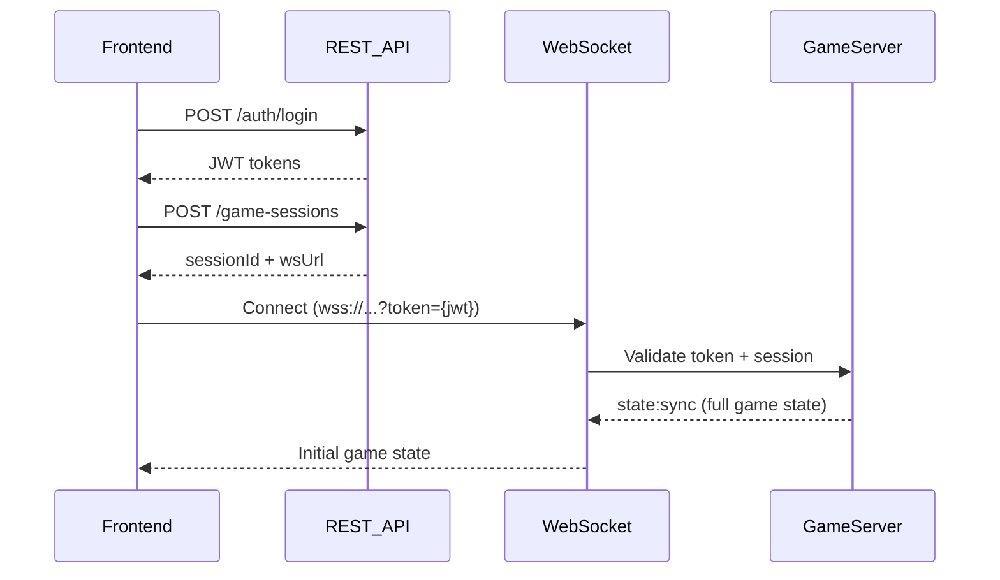

````markdown
<!-- reference @.gaia/designs/design.md -->
<!-- reference @.gaia/designs/1-use-cases.md -->
<!-- reference @.gaia/designs/2-class.md -->

[<< Back](./design.md)

# API & Integration Design

Complete API specifications for Isometric Tower Defense game - REST endpoints, WebSocket events, and integration patterns.

## Template Guidance

**Purpose**: Define API contracts, integration patterns, and system communication
**Focus**: REST API design, WebSocket event specifications, versioning, backwards compatibility
**Avoid**: Implementation code, specific framework details, deployment configuration

**Guidelines**: RESTful principles, real-time WebSocket communication, clear contracts, versioned APIs

## API Architecture Overview

**API Style**: REST + WebSocket Hybrid
**Base URL**: `https://api.towerdefense.com/v1`
**Authentication**: JWT Bearer Tokens (access + refresh)
**Rate Limiting**: 100 req/min per IP (REST), 10 events/sec per player (WebSocket)

**Design Principles**:
- **REST for State**: User management, map CRUD, tribe configuration
- **WebSocket for Real-Time**: Game state synchronization, tower placement, enemy movement
- **Server-Authoritative**: All game logic validated on server
- **Versioning**: URL-based versioning for REST (`/v1/`), event type versioning for WebSocket

## API Versioning Strategy

**Versioning Approach**: URL-based for REST, event type versioning for WebSocket

**Version Lifecycle**:
1. **Development**: v1-beta - Breaking changes allowed during alpha/beta
2. **Stable**: v1 - Backwards compatible only
3. **Deprecated**: v0 - Sunset warnings, 6-month migration period
4. **Retired**: Removed after deprecation period

**Backwards Compatibility Rules**:
- ✅ **Safe Changes**: Add optional fields to DTOs, new endpoints, new WebSocket events
- ❌ **Breaking Changes**: Remove fields, change WebSocket event structure, modify game logic contracts
- **Deprecation Notice**: 6 months minimum before removal
- **Migration Path**: Version header in WebSocket handshake for client version tracking

**Example Versioning**:
```
/v1/users          # Stable API
/v1/maps           # Stable API
/v2/tribes         # New features (if needed), backwards compatible
```

## REST API Specifications

### Authentication Endpoints

#### POST /v1/auth/login
**Purpose**: Authenticate user and receive JWT tokens

**Request Contract**:
```json
{
  "email": "player@example.com",
  "password": "SecurePassword123!"
}
```

**Validation Rules**:
- `email`: Required, valid email format
- `password`: Required, minimum 12 characters

**Response Contract** (200 OK):
```json
{
  "success": true,
  "data": {
    "accessToken": "eyJhbGciOiJIUzI1NiIsInR5cCI6IkpXVCJ9...",
    "refreshToken": "eyJhbGciOiJIUzI1NiIsInR5cCI6IkpXVCJ9...",
    "expiresIn": 900,
    "user": {
      "id": "uuid",
      "email": "player@example.com",
      "username": "PlayerOne",
      "level": 15,
      "totalGamesPlayed": 42
    }
  }
}
```

**Error Scenarios**:
- `400` - Invalid email/password format
- `401` - Invalid credentials
- `429` - Rate limit exceeded (5 attempts per minute)

---

#### POST /v1/auth/refresh
**Purpose**: Refresh expired access token

**Request Contract**:
```json
{
  "refreshToken": "eyJhbGciOiJIUzI1NiIsInR5cCI6IkpXVCJ9..."
}
```

**Response Contract** (200 OK):
```json
{
  "success": true,
  "data": {
    "accessToken": "eyJhbGciOiJIUzI1NiIsInR5cCI6IkpXVCJ9...",
    "refreshToken": "eyJhbGciOiJIUzI1NiIsInR5cCI6IkpXVCJ9...",
    "expiresIn": 900
  }
}
```

**Error Scenarios**:
- `401` - Invalid or expired refresh token

---

### Tribe Endpoints

#### GET /v1/tribes
**Purpose**: Get all tribes for authenticated user

**Authorization**: Required (JWT Bearer)

**Query Parameters**: None

**Response Contract** (200 OK):
```json
{
  "success": true,
  "data": [
    {
      "id": "tribe-uuid-1",
      "name": "Fire Warriors",
      "archetype": "Aggressive",
      "damageBonus": 0.30,
      "attackSpeedBonus": 0.15,
      "rangeBonus": 0.05,
      "colorTheme": "#FF5733",
      "createdAt": "2025-11-20T10:00:00Z"
    }
  ]
}
```

**Error Scenarios**:
- `401` - Missing or invalid authentication

---

#### POST /v1/tribes
**Purpose**: Create new tribe customization

**Authorization**: Required (JWT Bearer)

**Request Contract**:
```json
{
  "name": "Ice Defenders",
  "archetype": "Defensive",
  "damageBonus": 0.10,
  "attackSpeedBonus": 0.20,
  "rangeBonus": 0.20,
  "colorTheme": "#3498DB"
}
```

**Validation Rules**:
- `name`: Required, 3-20 characters, unique per user
- `archetype`: Required, enum ["Aggressive", "Defensive", "Balanced", "Support"]
- `damageBonus + attackSpeedBonus + rangeBonus`: Must equal 0.50 (total 10 bonus points * 0.05 per point)
- `colorTheme`: Required, valid hex color

**Response Contract** (201 Created):
```json
{
  "success": true,
  "data": {
    "id": "tribe-uuid-2",
    "name": "Ice Defenders",
    "archetype": "Defensive",
    "damageBonus": 0.10,
    "attackSpeedBonus": 0.20,
    "rangeBonus": 0.20,
    "colorTheme": "#3498DB",
    "createdAt": "2025-11-22T14:30:00Z"
  }
}
```

**Error Scenarios**:
- `400` - Invalid bonus point allocation or archetype
- `409` - Tribe name already exists for user

---

### Map Endpoints

#### GET /v1/maps?page=1&pageSize=20&filter=public
**Purpose**: Get maps (user's own maps or public community maps)

**Authorization**: Required (JWT Bearer)

**Query Parameters**:
- `page`: Optional, default 1
- `pageSize`: Optional, default 20, max 50
- `filter`: Optional, enum ["own", "public"], default "public"

**Response Contract** (200 OK):
```json
{
  "success": true,
  "data": [
    {
      "id": "map-uuid-1",
      "name": "Volcanic Wasteland",
      "description": "Lava rivers and narrow pathways",
      "width": 50,
      "height": 50,
      "authorId": "user-uuid",
      "authorUsername": "MapMaster",
      "playCount": 1250,
      "rating": 4.7,
      "isPublic": true,
      "createdAt": "2025-11-15T08:00:00Z"
    }
  ],
  "pagination": {
    "page": 1,
    "pageSize": 20,
    "totalPages": 5,
    "totalItems": 95
  }
}
```

---

#### GET /v1/maps/{id}
**Purpose**: Get detailed map data including terrain and wave configuration

**Authorization**: Required (JWT Bearer)

**Path Parameters**:
- `id`: UUID format, required

**Response Contract** (200 OK):
```json
{
  "success": true,
  "data": {
    "id": "map-uuid-1",
    "name": "Volcanic Wasteland",
    "description": "Lava rivers and narrow pathways",
    "width": 50,
    "height": 50,
    "terrainData": [
      {"x": 0, "y": 0, "terrainType": "Grass", "height": 0, "isBlocked": false},
      {"x": 1, "y": 0, "terrainType": "Lava", "height": 0, "isBlocked": false}
    ],
    "spawnPoint": {"x": 0, "y": 25},
    "goalPoint": {"x": 49, "y": 25},
    "waveConfig": {
      "waves": [
        {
          "waveNumber": 1,
          "enemies": [
            {"type": "Basic", "count": 10, "spawnInterval": 0.5}
          ]
        }
      ]
    },
    "authorId": "user-uuid",
    "playCount": 1250,
    "rating": 4.7,
    "createdAt": "2025-11-15T08:00:00Z"
  }
}
```

**Error Scenarios**:
- `404` - Map not found or not accessible (private map not owned by user)

---

#### POST /v1/maps
**Purpose**: Create new custom map

**Authorization**: Required (JWT Bearer)

**Request Contract**:
```json
{
  "name": "Desert Labyrinth",
  "description": "Complex maze with multiple paths",
  "width": 40,
  "height": 40,
  "terrainData": [
    {"x": 0, "y": 0, "terrainType": "Dirt", "height": 0}
  ],
  "spawnPoint": {"x": 0, "y": 20},
  "goalPoint": {"x": 39, "y": 20},
  "waveConfig": {
    "waves": [
      {
        "waveNumber": 1,
        "enemies": [
          {"type": "Basic", "count": 15, "spawnInterval": 0.5}
        ]
      }
    ]
  },
  "isPublic": false
}
```

**Validation Rules**:
- `name`: Required, 3-50 characters
- `width/height`: Required, 20-100 range
- `terrainData`: Required, width * height tiles
- `spawnPoint/goalPoint`: Required, valid coordinates, path must exist between them
- `waveConfig`: Required, at least 1 wave defined

**Response Contract** (201 Created):
```json
{
  "success": true,
  "data": {
    "id": "map-uuid-2",
    "name": "Desert Labyrinth",
    "validationResult": {
      "isValid": true,
      "pathExists": true
    },
    "createdAt": "2025-11-22T15:00:00Z"
  }
}
```

**Error Scenarios**:
- `400` - Invalid map dimensions or terrain data
- `422` - No valid path from spawn to goal

---

### Game Session Endpoints

#### GET /v1/game-sessions/active
**Purpose**: Get active game session for authenticated user (if any)

**Authorization**: Required (JWT Bearer)

**Response Contract** (200 OK):
```json
{
  "success": true,
  "data": {
    "id": "session-uuid-1",
    "mapId": "map-uuid-1",
    "mapName": "Volcanic Wasteland",
    "status": "InProgress",
    "currentWave": 5,
    "sharedLives": 18,
    "players": [
      {
        "id": "player-uuid-1",
        "userId": "user-uuid-1",
        "username": "PlayerOne",
        "tribeId": "tribe-uuid-1",
        "tribeName": "Fire Warriors",
        "gold": 450,
        "isHost": true,
        "isConnected": true
      }
    ],
    "createdAt": "2025-11-22T15:30:00Z"
  }
}
```

**Error Scenarios**:
- `404` - No active session found

---

#### POST /v1/game-sessions
**Purpose**: Create new game session (lobby)

**Authorization**: Required (JWT Bearer)

**Request Contract**:
```json
{
  "mapId": "map-uuid-1",
  "tribeId": "tribe-uuid-1"
}
```

**Response Contract** (201 Created):
```json
{
  "success": true,
  "data": {
    "id": "session-uuid-1",
    "mapId": "map-uuid-1",
    "status": "Lobby",
    "wsConnectionUrl": "wss://ws.towerdefense.com/game/{session-uuid-1}?token={jwt}",
    "createdAt": "2025-11-22T15:30:00Z"
  }
}
```

**Error Scenarios**:
- `400` - Invalid mapId or tribeId
- `409` - User already in active game session

---

## WebSocket API Specifications

### Connection & Authentication

**WebSocket Endpoint**: `wss://ws.towerdefense.com/game/{sessionId}?token={jwt}`

**Connection Flow**:
1. Client obtains JWT access token via REST login
2. Client establishes WebSocket connection with token in query string
3. Server validates token and session membership
4. Server sends initial game state sync
5. Client and server exchange real-time game events

**Connection Handshake**:
```json
// Client → Server (on connection)
{
  "event": "game:connect",
  "data": {
    "clientVersion": "1.0.0",
    "playerId": "player-uuid-1"
  }
}

// Server → Client (connection acknowledgment)
{
  "event": "game:connected",
  "data": {
    "sessionId": "session-uuid-1",
    "playerId": "player-uuid-1",
    "serverTime": 1732285800000
  }
}
```

---

### Game State Events

#### `state:sync` (Server → Client)
**Purpose**: Full game state synchronization (initial load or reconnection)

**Payload**:
```json
{
  "event": "state:sync",
  "data": {
    "sessionId": "session-uuid-1",
    "mapData": {
      "id": "map-uuid-1",
      "width": 50,
      "height": 50,
      "terrainData": [...],
      "spawnPoint": {"x": 0, "y": 25},
      "goalPoint": {"x": 49, "y": 25}
    },
    "players": [...],
    "towers": [...],
    "enemies": [...],
    "currentWave": 5,
    "sharedLives": 18,
    "gameTime": 450.5
  }
}
```

---

#### `state:delta` (Server → Client)
**Purpose**: Incremental state changes (optimized for bandwidth)

**Payload**:
```json
{
  "event": "state:delta",
  "data": {
    "timestamp": 1732285801500,
    "changes": {
      "players": [
        {"id": "player-uuid-1", "gold": 480}
      ],
      "enemies": [
        {"id": "enemy-uuid-5", "position": {"x": 15.3, "y": 25.7}, "health": 75}
      ]
    }
  }
}
```

---

### Tower Events

#### `tower:place` (Client → Server)
**Purpose**: Player requests to place tower

**Payload**:
```json
{
  "event": "tower:place",
  "data": {
    "towerType": "Arrow",
    "position": {"x": 10, "y": 15}
  }
}
```

**Server Validation**:
- Sufficient gold (tower cost: 100 gold)
- Valid tile (not occupied, not out of bounds)
- Pathfinding still valid after placement

**Response Events**:
- Success: `tower:placed` (broadcast to all clients)
- Failure: `tower:place:error` (to requesting client only)

---

#### `tower:placed` (Server → All Clients)
**Purpose**: Confirm tower placement, broadcast to all players

**Payload**:
```json
{
  "event": "tower:placed",
  "data": {
    "tower": {
      "id": "tower-uuid-1",
      "type": "Arrow",
      "position": {"x": 10, "y": 15},
      "ownerId": "player-uuid-1",
      "level": 1,
      "damage": 20,
      "attackSpeed": 1.0,
      "range": 3,
      "createdAt": 1732285802000
    },
    "playerGoldUpdate": {
      "playerId": "player-uuid-1",
      "gold": 380
    },
    "pathfindingUpdate": {
      "recalculated": true,
      "affectedEnemies": ["enemy-uuid-1", "enemy-uuid-2"]
    }
  }
}
```

---

#### `tower:upgrade` (Client → Server)
**Purpose**: Player requests to upgrade tower

**Payload**:
```json
{
  "event": "tower:upgrade",
  "data": {
    "towerId": "tower-uuid-1"
  }
}
```

**Server Validation**:
- Tower exists and is owned by player
- Sufficient gold (upgrade cost: level * 50 gold)
- Tower not at max level (5)

---

#### `tower:upgraded` (Server → All Clients)
**Purpose**: Confirm tower upgrade

**Payload**:
```json
{
  "event": "tower:upgraded",
  "data": {
    "tower": {
      "id": "tower-uuid-1",
      "level": 2,
      "damage": 24,
      "attackSpeed": 1.1,
      "range": 3.3
    },
    "playerGoldUpdate": {
      "playerId": "player-uuid-1",
      "gold": 330
    }
  }
}
```

---

#### `tower:remove` (Client → Server)
**Purpose**: Player sells/removes tower

**Payload**:
```json
{
  "event": "tower:remove",
  "data": {
    "towerId": "tower-uuid-1"
  }
}
```

**Server Response**: 70% refund of total tower investment

---

#### `tower:destroyed` (Server → All Clients)
**Purpose**: Tower destroyed by enemies (boxed-in scenario)

**Payload**:
```json
{
  "event": "tower:destroyed",
  "data": {
    "towerId": "tower-uuid-1",
    "position": {"x": 10, "y": 15},
    "destroyedBy": ["enemy-uuid-3"],
    "pathfindingUpdate": {
      "recalculated": true
    }
  }
}
```

---

### Enemy Events

#### `enemy:spawn` (Server → All Clients)
**Purpose**: Enemy spawned in wave

**Payload**:
```json
{
  "event": "enemy:spawn",
  "data": {
    "enemy": {
      "id": "enemy-uuid-1",
      "type": "Basic",
      "position": {"x": 0, "y": 25},
      "targetPosition": {"x": 49, "y": 25},
      "path": [
        {"x": 0, "y": 25},
        {"x": 1, "y": 25},
        {"x": 2, "y": 25}
      ],
      "health": 100,
      "maxHealth": 100,
      "speed": 2.0,
      "goldReward": 10
    }
  }
}
```

---

#### `enemy:move` (Server → All Clients)
**Purpose**: Enemy position update (sent every 100ms during game loop)

**Payload**:
```json
{
  "event": "enemy:move",
  "data": {
    "updates": [
      {"id": "enemy-uuid-1", "position": {"x": 5.3, "y": 25.1}},
      {"id": "enemy-uuid-2", "position": {"x": 3.7, "y": 24.8}}
    ]
  }
}
```

---

#### `enemy:attack` (Server → All Clients)
**Purpose**: Enemy attacks tower (boxed-in scenario)

**Payload**:
```json
{
  "event": "enemy:attack",
  "data": {
    "enemyId": "enemy-uuid-3",
    "targetTowerId": "tower-uuid-1",
    "damage": 5
  }
}
```

---

#### `enemy:death` (Server → All Clients)
**Purpose**: Enemy killed by tower

**Payload**:
```json
{
  "event": "enemy:death",
  "data": {
    "enemyId": "enemy-uuid-1",
    "position": {"x": 15, "y": 25},
    "killedBy": "tower-uuid-5",
    "goldReward": 10,
    "playerGoldUpdate": {
      "playerId": "player-uuid-1",
      "gold": 390
    }
  }
}
```

---

#### `enemy:goal_reached` (Server → All Clients)
**Purpose**: Enemy reached goal, life lost

**Payload**:
```json
{
  "event": "enemy:goal_reached",
  "data": {
    "enemyId": "enemy-uuid-2",
    "sharedLivesUpdate": 17,
    "livesLost": 1
  }
}
```

---

### Pathfinding Events

#### `pathfinding:recalculate` (Server → All Clients)
**Purpose**: Server initiating pathfinding recalculation

**Payload**:
```json
{
  "event": "pathfinding:recalculate",
  "data": {
    "reason": "tower_placed",
    "affectedEnemies": ["enemy-uuid-1", "enemy-uuid-2", "enemy-uuid-3"]
  }
}
```

---

#### `pathfinding:complete` (Server → All Clients)
**Purpose**: Pathfinding recalculation complete

**Payload**:
```json
{
  "event": "pathfinding:complete",
  "data": {
    "duration_ms": 45,
    "enemyPathUpdates": [
      {
        "enemyId": "enemy-uuid-1",
        "newPath": [
          {"x": 5, "y": 25},
          {"x": 5, "y": 26},
          {"x": 6, "y": 26}
        ]
      }
    ],
    "boxedEnemies": ["enemy-uuid-4"]
  }
}
```

---

#### `enemy:reroute` (Server → All Clients)
**Purpose**: Enemy rerouted to attack tower (no valid path)

**Payload**:
```json
{
  "event": "enemy:reroute",
  "data": {
    "enemyId": "enemy-uuid-4",
    "targetTowerId": "tower-uuid-2",
    "isTargetingTower": true
  }
}
```

---

### Wave Events

#### `wave:start` (Client → Server)
**Purpose**: Player initiates next wave

**Payload**:
```json
{
  "event": "wave:start",
  "data": {}
}
```

**Server Validation**:
- All players ready (or 10s auto-start timeout)
- Previous wave complete

---

#### `wave:started` (Server → All Clients)
**Purpose**: Wave started, enemies spawning

**Payload**:
```json
{
  "event": "wave:started",
  "data": {
    "waveNumber": 6,
    "totalEnemies": 25,
    "waveComposition": [
      {"type": "Basic", "count": 15},
      {"type": "Fast", "count": 10}
    ]
  }
}
```

---

#### `wave:complete` (Server → All Clients)
**Purpose**: Wave completed successfully

**Payload**:
```json
{
  "event": "wave:complete",
  "data": {
    "waveNumber": 6,
    "enemiesKilled": 25,
    "goldEarned": 250,
    "livesLost": 2,
    "waveBonus": 50
  }
}
```

---

### Player Events

#### `player:disconnect` (Server → All Clients)
**Purpose**: Player WebSocket disconnected

**Payload**:
```json
{
  "event": "player:disconnect",
  "data": {
    "playerId": "player-uuid-2",
    "username": "PlayerTwo",
    "reconnectTimeout": 30
  }
}
```

---

#### `player:reconnect` (Server → All Clients)
**Purpose**: Player reconnected within timeout

**Payload**:
```json
{
  "event": "player:reconnect",
  "data": {
    "playerId": "player-uuid-2",
    "username": "PlayerTwo"
  }
}
```

---

#### `player:left` (Server → All Clients)
**Purpose**: Player permanently left session (timeout expired)

**Payload**:
```json
{
  "event": "player:left",
  "data": {
    "playerId": "player-uuid-2",
    "username": "PlayerTwo",
    "resourceRedistribution": {
      "gold": 200
    }
  }
}
```

---

### Map Builder Events (UC-003)

#### `map:save` (Client → Server)
**Purpose**: Save map progress in map builder

**Payload**:
```json
{
  "event": "map:save",
  "data": {
    "mapId": "map-uuid-draft",
    "terrainData": [...],
    "spawnPoint": {"x": 0, "y": 20},
    "goalPoint": {"x": 39, "y": 20}
  }
}
```

---

#### `tile:update` (Client → Server)
**Purpose**: Update single tile in map builder

**Payload**:
```json
{
  "event": "tile:update",
  "data": {
    "x": 10,
    "y": 15,
    "terrainType": "Stone",
    "height": 2
  }
}
```

---

## Rate Limiting & Throttling

**REST API Rate Limits**:
- **Anonymous**: 100 requests/hour
- **Authenticated**: 1000 requests/hour
- **Per-Endpoint Limits**:
  - `POST /auth/login`: 5 requests/minute
  - `POST /maps`: 10 requests/hour

**WebSocket Rate Limits**:
- **Player Actions**: 10 events/second (tower placement, upgrades)
- **State Sync**: Server-controlled, 60 updates/second (game loop)

**Rate Limit Headers** (REST):
```
X-RateLimit-Limit: 1000
X-RateLimit-Remaining: 995
X-RateLimit-Reset: 1732286400
Retry-After: 3600 (when 429 response)
```

**Throttling Approach**:
- **Token Bucket Algorithm**: Smooth traffic distribution
- **Per-Player Limits**: Prevent single player from spamming actions
- **Burst Allowance**: Allow 20-event burst, then throttle

---

## Error Response Structure

**Standard Error Format**:
```json
{
  "success": false,
  "error": {
    "code": "VALIDATION_ERROR",
    "message": "Invalid tower placement",
    "details": [
      {
        "field": "position",
        "message": "Tile is occupied",
        "code": "TILE_OCCUPIED"
      }
    ],
    "requestId": "uuid",
    "timestamp": "2025-11-22T15:45:00Z"
  }
}
```

**Error Codes**:
- `VALIDATION_ERROR`: Invalid input data
- `AUTHENTICATION_ERROR`: Missing or invalid token
- `AUTHORIZATION_ERROR`: Insufficient permissions
- `NOT_FOUND`: Resource not found
- `CONFLICT`: Resource conflict (duplicate, version mismatch)
- `RATE_LIMIT_EXCEEDED`: Too many requests
- `GAME_STATE_ERROR`: Invalid game state operation
- `PATHFINDING_ERROR`: No valid path exists

---

## WebSocket Error Handling

**WebSocket Error Event**:
```json
{
  "event": "error",
  "data": {
    "code": "INSUFFICIENT_GOLD",
    "message": "Not enough gold to place tower",
    "requestedAction": "tower:place",
    "timestamp": 1732285900000
  }
}
```

**Reconnection Strategy**:
- **Disconnect Detection**: Client detects connection loss
- **Exponential Backoff**: Retry after 1s, 2s, 4s, 8s, 16s (max 5 attempts)
- **State Resync**: Full `state:sync` on successful reconnection
- **Grace Period**: 30 seconds before player removed from session

---

## Integration Patterns

### Frontend → Backend Communication

**Game Initialization Flow**:


---

### Real-Time Game Loop

**60fps Game Loop**:
```
Server Tick (16.67ms):
1. Process player actions (tower placement, upgrades)
2. Update enemy positions
3. Process tower attacks
4. Check collisions (projectiles vs enemies)
5. Recalculate pathfinding (if grid changed)
6. Broadcast state:delta to all clients

Client Tick (16.67ms):
1. Receive state:delta from server
2. Interpolate enemy positions (smooth movement)
3. Render updated game state (PixiJS)
4. Send queued player actions (tower placement)
```

---

## Validation Checklist

**REST API Design**:
- [x] RESTful principles followed (resource-based URLs)
- [x] Consistent naming conventions (kebab-case)
- [x] Proper HTTP status codes (200, 201, 400, 401, 404, 409, 429)
- [x] Comprehensive error handling with error codes

**WebSocket Design**:
- [x] Event-based communication (clear event types)
- [x] Server-authoritative validation (prevent cheating)
- [x] Efficient state synchronization (delta updates)
- [x] Graceful reconnection handling

**Versioning**:
- [x] Clear versioning strategy (URL-based for REST)
- [x] Backwards compatibility rules defined
- [x] Deprecation policy documented (6 months)

**Security**:
- [x] JWT authentication for both REST and WebSocket
- [x] Rate limiting configured (100 req/min REST, 10 events/sec WebSocket)
- [x] Input validation on all endpoints and events
- [x] Server-side game logic validation

**Documentation**:
- [x] Request/response contracts for all endpoints
- [x] WebSocket event specifications (30+ events)
- [x] Error scenarios documented
- [x] Integration flow diagrams

**Instructions**: This API specification defines all REST endpoints (auth, tribes, maps, game sessions) and 30+ WebSocket events (tower placement, enemy movement, pathfinding, waves, player connections). All events support UC-001 through UC-010 use cases. Server-authoritative architecture prevents cheating. Ready for frontend/backend implementation.

[<< Back](./design.md)

````
