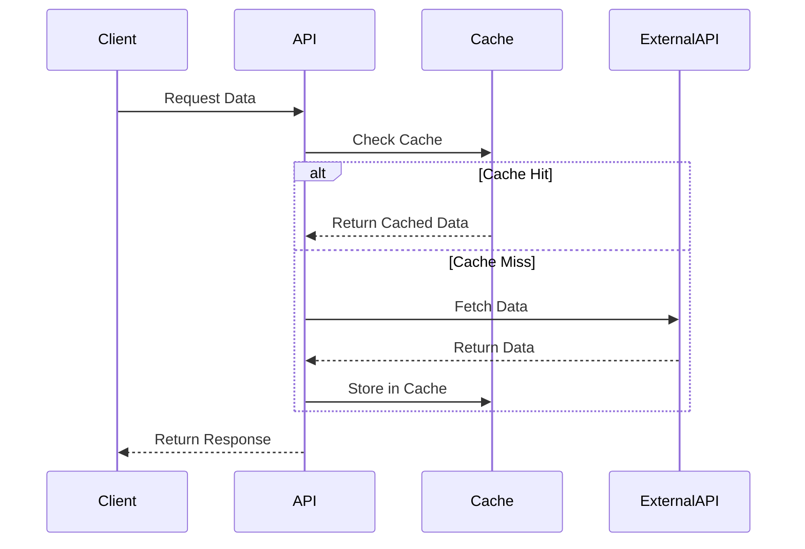
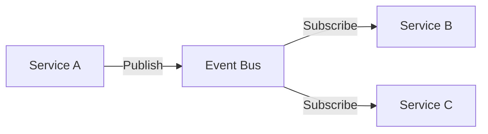

````markdown
<!-- reference @.gaia/designs/design.md -->
<!-- reference @.gaia/designs/1-use-cases.md -->
<!-- reference @.gaia/designs/2-class.md -->

[<< Back](./design.md)

# API & Integration Design

Complete API specifications and integration patterns for system interoperability.

## Template Guidance

**Purpose**: Define API contracts, integration patterns, and external system communication
**Focus**: API design, versioning, contracts, integration strategies, backwards compatibility
**Avoid**: Implementation code, specific framework details, deployment configuration

**Guidelines**: RESTful principles, clear contracts, versioned APIs, comprehensive documentation

## API Architecture Overview

**API Style**: [REST / GraphQL / gRPC / Hybrid]
**Base URL**: `https://api.[domain].com/v{version}`
**Authentication**: [OAuth 2.0 / JWT / API Keys / mTLS]
**Rate Limiting**: [Requests per minute/hour per client]

**Design Principles**:
- **Consistency**: Uniform naming, response structures, error handling
- **Versioning**: Backwards compatible, clear deprecation policy
- **Documentation**: OpenAPI/Swagger specs, interactive docs
- **Security**: Authentication, authorization, input validation, rate limiting

## API Versioning Strategy

**Versioning Approach**: [URL-based / Header-based / Content negotiation]

**Version Lifecycle**:
1. **Development**: v{n}-beta - Breaking changes allowed
2. **Stable**: v{n} - Backwards compatible only
3. **Deprecated**: v{n-1} - Sunset warnings, migration guides
4. **Retired**: v{n-2} - Removed after deprecation period

**Backwards Compatibility Rules**:
- ✅ **Safe Changes**: Add optional fields, new endpoints, expand enums
- ❌ **Breaking Changes**: Remove fields, change types, rename endpoints, modify behavior
- **Deprecation Notice**: 6 months minimum before removal
- **Migration Path**: Clear upgrade guides with code examples

**Example Versioning**:
```
/v1/users          # Stable API
/v2/users          # New features, backwards compatible with v1
/v1/users (sunset) # Deprecated, respond with sunset headers
```

## REST API Specifications

### Endpoint Structure

**Resource Naming**: Plural nouns, kebab-case for multi-word resources
```
GET    /v1/users                    # List users
POST   /v1/users                    # Create user
GET    /v1/users/{id}               # Get user by ID
PUT    /v1/users/{id}               # Update user (full replace)
PATCH  /v1/users/{id}               # Update user (partial)
DELETE /v1/users/{id}               # Delete user
GET    /v1/users/{id}/orders        # Nested resources
```

### Request/Response Contracts

**Standard Request Headers**:
```
Authorization: Bearer {jwt_token}
Content-Type: application/json
Accept: application/json
X-API-Version: v1
X-Request-ID: {uuid}
```

**Standard Response Structure**:
```json
{
  "success": true,
  "data": { /* resource data */ },
  "metadata": {
    "timestamp": "2025-11-20T10:30:00Z",
    "requestId": "uuid",
    "version": "v1"
  },
  "pagination": {
    "page": 1,
    "pageSize": 20,
    "totalPages": 5,
    "totalItems": 100
  }
}
```

**Error Response Structure**:
```json
{
  "success": false,
  "error": {
    "code": "VALIDATION_ERROR",
    "message": "Invalid input data",
    "details": [
      {
        "field": "email",
        "message": "Invalid email format",
        "code": "INVALID_FORMAT"
      }
    ],
    "requestId": "uuid",
    "timestamp": "2025-11-20T10:30:00Z"
  }
}
```

### HTTP Status Codes

**Success Codes**:
- `200 OK` - Successful GET, PUT, PATCH, DELETE
- `201 Created` - Successful POST with resource creation
- `202 Accepted` - Async operation accepted
- `204 No Content` - Successful DELETE with no response body

**Client Error Codes**:
- `400 Bad Request` - Invalid request format/validation error
- `401 Unauthorized` - Missing or invalid authentication
- `403 Forbidden` - Authenticated but insufficient permissions
- `404 Not Found` - Resource does not exist
- `409 Conflict` - Resource conflict (duplicate, version mismatch)
- `422 Unprocessable Entity` - Semantic validation error
- `429 Too Many Requests` - Rate limit exceeded

**Server Error Codes**:
- `500 Internal Server Error` - Unexpected server error
- `502 Bad Gateway` - Upstream service error
- `503 Service Unavailable` - Service temporarily down
- `504 Gateway Timeout` - Upstream service timeout

## API Endpoints by Use Case

### UC-001: [Use Case Name]

**Endpoint**: `POST /v1/[resource]`

**Request Contract**:
```json
{
  "field1": "string",
  "field2": 123,
  "nestedObject": {
    "subField": "value"
  }
}
```

**Validation Rules**:
- `field1`: Required, 3-50 characters, alphanumeric
- `field2`: Required, positive integer, max 9999
- `nestedObject.subField`: Optional, enum [value1, value2, value3]

**Response Contract** (201 Created):
```json
{
  "success": true,
  "data": {
    "id": "uuid",
    "field1": "string",
    "field2": 123,
    "createdAt": "2025-11-20T10:30:00Z"
  }
}
```

**Error Scenarios**:
- `400` - Invalid input format
- `401` - Missing authentication
- `409` - Resource already exists
- `429` - Rate limit exceeded

### UC-002: [Another Use Case]

**Endpoint**: `GET /v1/[resource]/{id}`

**Path Parameters**:
- `id`: UUID format, required

**Query Parameters**:
- `include`: Optional, comma-separated related resources to include
- `fields`: Optional, comma-separated field projection

**Response Contract** (200 OK):
```json
{
  "success": true,
  "data": {
    "id": "uuid",
    "attributes": {},
    "relationships": []
  }
}
```

## GraphQL Specifications (If Applicable)

**Schema Endpoint**: `/graphql`
**GraphQL Playground**: `/graphql/playground`

**Type Definitions**:
```graphql
type User {
  id: ID!
  email: String!
  name: String
  createdAt: DateTime!
}

type Query {
  user(id: ID!): User
  users(page: Int, pageSize: Int): UserConnection!
}

type Mutation {
  createUser(input: CreateUserInput!): User!
  updateUser(id: ID!, input: UpdateUserInput!): User!
}
```

**Query Examples**:
```graphql
query GetUser {
  user(id: "uuid") {
    id
    email
    name
  }
}

mutation CreateUser {
  createUser(input: {
    email: "user@example.com"
    name: "John Doe"
  }) {
    id
    email
  }
}
```

## Authentication & Authorization

**Authentication Mechanisms**:
- **JWT Bearer Tokens**: For user authentication
- **API Keys**: For service-to-service communication
- **OAuth 2.0**: For third-party integrations

**Token Structure** (JWT):
```json
{
  "sub": "user-uuid",
  "email": "user@example.com",
  "roles": ["user", "admin"],
  "permissions": ["read:users", "write:users"],
  "iat": 1700000000,
  "exp": 1700003600
}
```

**Authorization Patterns**:
- **RBAC (Role-Based)**: Permissions assigned to roles
- **ABAC (Attribute-Based)**: Dynamic permissions based on context
- **Resource-Based**: Owner-based access control

**Endpoint Security**:
```
GET    /v1/public/status         # Public, no auth
GET    /v1/users/me              # Authenticated users
POST   /v1/admin/users           # Admin role required
DELETE /v1/users/{id}            # Owner or admin only
```

## Rate Limiting & Throttling

**Rate Limit Strategy**:
- **Anonymous**: 100 requests/hour
- **Authenticated**: 1000 requests/hour
- **Premium Tier**: 10,000 requests/hour

**Rate Limit Headers**:
```
X-RateLimit-Limit: 1000
X-RateLimit-Remaining: 999
X-RateLimit-Reset: 1700003600
Retry-After: 3600 (when 429 response)
```

**Throttling Approach**:
- **Token Bucket Algorithm**: Smooth traffic distribution
- **Per-Endpoint Limits**: Critical endpoints have stricter limits
- **Burst Allowance**: Short bursts allowed within overall limit

## Integration Patterns

### Webhook Integrations

**Webhook Registration**:
```
POST /v1/webhooks
{
  "url": "https://client.com/webhook",
  "events": ["user.created", "order.completed"],
  "secret": "webhook-secret-key"
}
```

**Webhook Payload**:
```json
{
  "event": "user.created",
  "timestamp": "2025-11-20T10:30:00Z",
  "data": {
    "id": "uuid",
    "email": "user@example.com"
  },
  "signature": "HMAC-SHA256 signature"
}
```

**Webhook Reliability**:
- **Retry Policy**: Exponential backoff (1s, 2s, 4s, 8s, 16s)
- **Timeout**: 10 seconds per delivery attempt
- **Signature Verification**: HMAC-SHA256 for payload integrity
- **Dead Letter Queue**: Failed deliveries after max retries

### External Service Integration

**Third-Party API Consumption**:


**Integration Strategies**:
- **Circuit Breaker**: Prevent cascading failures from external services
- **Fallback Mechanism**: Degraded functionality when external service unavailable
- **Caching**: Reduce external API calls with intelligent caching
- **Async Processing**: Non-critical integrations processed asynchronously

### Event-Driven Integration

**Event Bus Architecture**:


**Event Structure**:
```json
{
  "eventId": "uuid",
  "eventType": "user.registered",
  "version": "v1",
  "timestamp": "2025-11-20T10:30:00Z",
  "source": "user-service",
  "data": {
    "userId": "uuid",
    "email": "user@example.com"
  }
}
```

**Event Patterns**:
- **Pub/Sub**: Multiple consumers for single event
- **Event Sourcing**: Events as source of truth
- **CQRS**: Separate read/write models with event synchronization

## API Documentation

**OpenAPI/Swagger Specification**:
- **Live Documentation**: Interactive API explorer at `/api/docs`
- **Specification File**: OpenAPI 3.0 YAML/JSON at `/api/openapi.json`
- **Code Generation**: Client SDKs generated from OpenAPI spec

**Documentation Requirements**:
- **Endpoint Descriptions**: Clear purpose and use cases
- **Request Examples**: Real-world request payloads
- **Response Examples**: Success and error responses
- **Authentication Guide**: How to obtain and use credentials
- **Rate Limits**: Documented limits per endpoint
- **Changelog**: Version history with migration guides

## API Testing Strategy

**Contract Testing**:
- **Provider Tests**: Validate API matches published contracts
- **Consumer Tests**: Validate client expectations against API
- **Schema Validation**: Ensure responses match OpenAPI spec

**Integration Testing**:
- **End-to-End Flows**: Complete user journeys through API
- **Error Scenarios**: Test all error paths and edge cases
- **Rate Limiting**: Verify throttling behavior
- **Authentication**: Test all auth mechanisms

**Performance Testing**:
- **Load Testing**: Verify performance under expected load
- **Stress Testing**: Identify breaking points
- **Spike Testing**: Handle sudden traffic increases

## Migration & Deprecation

**Deprecation Process**:
1. **Announce**: 6 months before removal, update docs
2. **Warn**: Add `Sunset` header to deprecated endpoints
3. **Sunset Header**: `Sunset: Wed, 20 Nov 2026 10:00:00 GMT`
4. **Migration Guide**: Provide detailed upgrade instructions
5. **Remove**: After deprecation period, return 410 Gone

**Breaking Change Communication**:
- **Changelog**: Detailed list of breaking changes
- **Migration Scripts**: Automated tools where possible
- **Support Window**: Extended support for critical clients

## Validation Checklist

**API Design**:
- [ ] RESTful principles followed (or GraphQL best practices)
- [ ] Consistent naming conventions
- [ ] Proper HTTP status codes
- [ ] Comprehensive error handling

**Versioning**:
- [ ] Clear versioning strategy
- [ ] Backwards compatibility rules defined
- [ ] Deprecation policy documented

**Security**:
- [ ] Authentication mechanism specified
- [ ] Authorization patterns defined
- [ ] Rate limiting configured
- [ ] Input validation rules documented

**Documentation**:
- [ ] OpenAPI/Swagger spec complete
- [ ] Interactive documentation available
- [ ] Request/response examples provided
- [ ] Migration guides for version changes

**Integration**:
- [ ] Webhook patterns documented (if applicable)
- [ ] External service integration patterns defined
- [ ] Event-driven patterns specified (if applicable)
- [ ] Circuit breaker and fallback mechanisms planned

**Instructions**:
1. Define API style and authentication approach
2. Document all endpoints with request/response contracts
3. Specify versioning and backwards compatibility strategy
4. Design integration patterns for external systems
5. Plan comprehensive API documentation and testing

[<< Back](./design.md)

````
