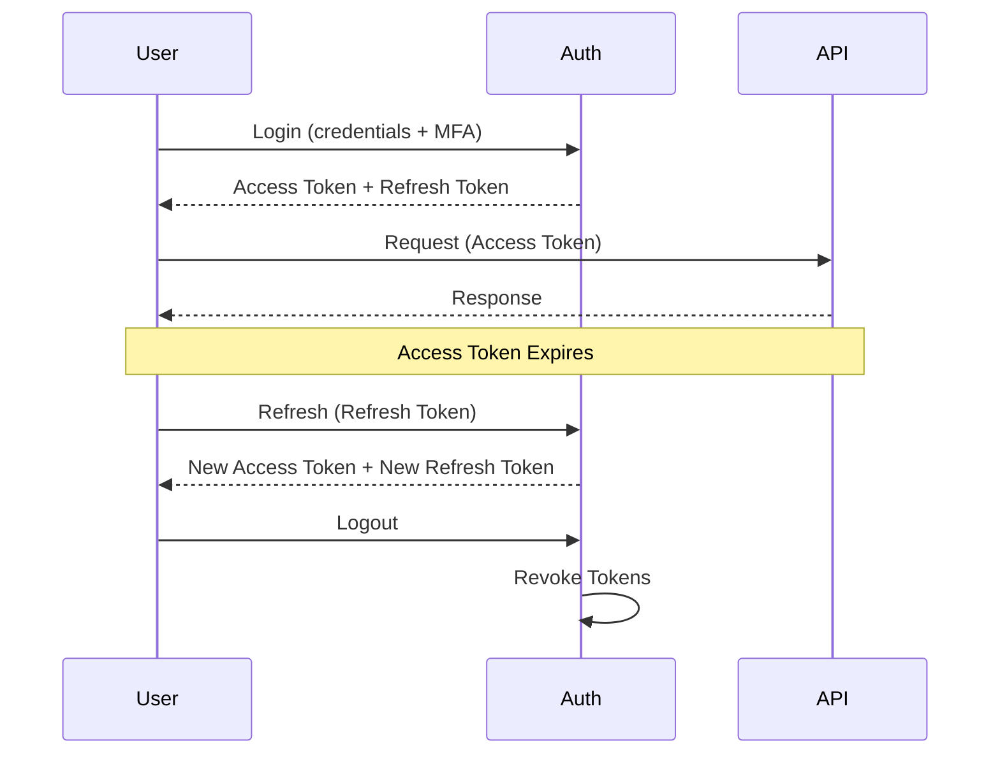
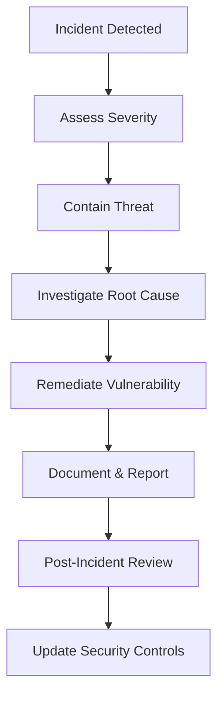

````markdown
<!-- reference @.gaia/designs/design.md -->
<!-- reference @.gaia/designs/5-api.md -->

[<< Back](./design.md)

# Security Architecture

Comprehensive security design ensuring data protection, threat mitigation, and compliance.

## Template Guidance

**Purpose**: Define security controls, threat mitigation, and compliance requirements
**Focus**: Authentication, authorization, data protection, threat modeling, compliance
**Avoid**: Implementation code, specific tool configurations, deployment details

**Guidelines**: Defense in depth, least privilege, security by design, compliance-first

## Security Principles

**Core Principles**:
- **Defense in Depth**: Multiple layers of security controls
- **Least Privilege**: Minimum permissions necessary for operations
- **Zero Trust**: Never trust, always verify
- **Security by Design**: Security integrated from inception
- **Fail Secure**: System defaults to secure state on failure

**Security Objectives**:
- **Confidentiality**: Protect sensitive data from unauthorized access
- **Integrity**: Ensure data accuracy and prevent tampering
- **Availability**: Maintain system accessibility for authorized users
- **Accountability**: Audit trails for all security-relevant actions

## Threat Modeling

### STRIDE Analysis

**Spoofing Identity**:
- **Threat**: Attacker impersonates legitimate user
- **Mitigation**: Multi-factor authentication, JWT validation, session management
- **Detection**: Failed login monitoring, anomalous access patterns

**Tampering with Data**:
- **Threat**: Unauthorized modification of data in transit or at rest
- **Mitigation**: TLS encryption, digital signatures, database integrity checks
- **Detection**: Checksum validation, audit logs for data changes

**Repudiation**:
- **Threat**: User denies performing action without proof
- **Mitigation**: Comprehensive audit logging, non-repudiation signatures
- **Detection**: Audit log analysis, transaction tracking

**Information Disclosure**:
- **Threat**: Exposure of sensitive information to unauthorized parties
- **Mitigation**: Encryption, access controls, data classification, secure storage
- **Detection**: Data leakage prevention, access monitoring

**Denial of Service**:
- **Threat**: System unavailability due to resource exhaustion
- **Mitigation**: Rate limiting, resource quotas, load balancing, DDoS protection
- **Detection**: Performance monitoring, traffic analysis

**Elevation of Privilege**:
- **Threat**: User gains unauthorized higher-level permissions
- **Mitigation**: RBAC, input validation, secure APIs, privilege separation
- **Detection**: Permission change auditing, privilege escalation alerts

### Attack Surface Analysis

**External Attack Vectors**:
- Public APIs and endpoints
- Authentication mechanisms
- File upload functionality
- Search and query interfaces
- Third-party integrations

**Internal Attack Vectors**:
- Database access
- Inter-service communication
- Admin interfaces
- Configuration management
- Secret management

**Mitigation Strategies**:
- Minimize exposed endpoints
- Input validation and sanitization
- Secure defaults
- Regular security assessments

## Authentication Architecture

### User Authentication

**Authentication Methods**:
- **Primary**: Username/Password with MFA
- **Social OAuth**: Google, GitHub, Microsoft
- **Enterprise SSO**: SAML 2.0, OIDC
- **Biometric**: Fingerprint, Face ID (mobile apps)

**Multi-Factor Authentication (MFA)**:
- **TOTP**: Time-based one-time passwords (Google Authenticator)
- **SMS**: Text message verification codes (fallback only)
- **Hardware Keys**: FIDO2/WebAuthn security keys
- **Backup Codes**: Single-use recovery codes

**Password Policy**:
- Minimum 12 characters
- Complexity: Upper, lower, number, special character
- No common passwords (dictionary check)
- Password history: Last 5 passwords cannot be reused
- Password expiration: 90 days (configurable)
- Account lockout: 5 failed attempts, 30-minute lockout

### Session Management

**Session Security**:
- **JWT Tokens**: Stateless authentication
- **Token Expiration**: Access tokens 15 minutes, refresh tokens 7 days
- **Token Rotation**: Refresh token rotation on each use
- **Secure Storage**: HttpOnly, Secure, SameSite cookies
- **Token Revocation**: Blacklist for logout and security events

**Session Lifecycle**:


### API Authentication

**Service-to-Service Authentication**:
- **API Keys**: For external partners, rate-limited
- **OAuth 2.0 Client Credentials**: For trusted services
- **mTLS**: Mutual TLS for high-security scenarios
- **JWT Service Tokens**: For internal microservices

**API Key Management**:
- Unique keys per client/environment
- Key rotation every 90 days
- Scope-limited permissions
- Rate limiting per key
- Key revocation capability

## Authorization Architecture

### Role-Based Access Control (RBAC)

**Roles**:
- **Public**: Unauthenticated users (read-only public content)
- **User**: Authenticated standard users
- **Premium**: Paid subscription users
- **Moderator**: Content moderation permissions
- **Admin**: Full system administration
- **Super Admin**: System-wide control, user management

**Permissions Matrix**:
| Resource | Public | User | Premium | Moderator | Admin | Super Admin |
|----------|--------|------|---------|-----------|-------|-------------|
| View Public Content | ✓ | ✓ | ✓ | ✓ | ✓ | ✓ |
| Create Content | - | ✓ | ✓ | ✓ | ✓ | ✓ |
| Edit Own Content | - | ✓ | ✓ | ✓ | ✓ | ✓ |
| Delete Own Content | - | ✓ | ✓ | ✓ | ✓ | ✓ |
| Access Premium Features | - | - | ✓ | ✓ | ✓ | ✓ |
| Moderate Content | - | - | - | ✓ | ✓ | ✓ |
| User Management | - | - | - | - | ✓ | ✓ |
| System Configuration | - | - | - | - | - | ✓ |

### Attribute-Based Access Control (ABAC)

**Dynamic Authorization Rules**:
```
ALLOW if:
  - user.role == "admin" OR
  - (resource.owner == user.id AND action == "read") OR
  - (user.department == resource.department AND user.clearance >= resource.classification)
```

**Attributes**:
- **User Attributes**: Role, department, clearance level, location
- **Resource Attributes**: Owner, classification, department, sensitivity
- **Environment Attributes**: Time of day, IP address, device trust level
- **Action Attributes**: Operation type (create, read, update, delete)

### Resource-Based Authorization

**Ownership Model**:
- Users can modify/delete their own resources
- Admins can modify/delete any resources
- Shared resources require explicit permissions

**Permission Delegation**:
- Resource owners can grant permissions to other users
- Time-limited access grants
- Granular permission levels (view, edit, admin)

## Data Protection

### Encryption Strategy

**Data at Rest**:
- **Database Encryption**: AES-256 encryption for all databases
- **File Storage**: AES-256 encryption for uploaded files
- **Backup Encryption**: All backups encrypted before storage
- **Key Management**: AWS KMS / Azure Key Vault / HashiCorp Vault

**Data in Transit**:
- **TLS 1.3**: All external communications
- **Certificate Pinning**: Mobile apps pin certificates
- **HSTS**: HTTP Strict Transport Security enforced
- **Perfect Forward Secrecy**: Ephemeral key exchange

**Sensitive Data Encryption**:
- **PII**: Personal Identifiable Information encrypted in database
- **Payment Data**: PCI DSS compliant encryption
- **Credentials**: Passwords hashed with bcrypt (cost 12+)
- **Secrets**: API keys, tokens encrypted with separate keys

### Data Classification

**Classification Levels**:
- **Public**: No confidentiality concern (marketing content)
- **Internal**: Not for public disclosure (internal docs)
- **Confidential**: Business-sensitive information (financial data)
- **Restricted**: Highly sensitive data (PII, payment info, credentials)

**Handling Requirements**:
| Level | Encryption | Access Control | Audit Logging | Retention |
|-------|------------|----------------|---------------|-----------|
| Public | Optional | Public | No | Indefinite |
| Internal | Recommended | Authenticated | Basic | Per policy |
| Confidential | Required | Role-based | Detailed | Per policy |
| Restricted | Required | Strict RBAC/ABAC | Comprehensive | Minimal |

### Data Sanitization

**Input Validation**:
- **Whitelist Approach**: Allow only expected input patterns
- **Type Validation**: Enforce strict data types
- **Length Limits**: Maximum input sizes
- **Encoding Validation**: UTF-8 encoding enforcement

**Output Encoding**:
- **HTML Encoding**: Prevent XSS attacks
- **SQL Parameterization**: Prevent SQL injection
- **JSON Encoding**: Safe API responses
- **URL Encoding**: Safe redirect and parameter handling

**Data Masking**:
- **PII Redaction**: Mask sensitive data in logs and non-production environments
- **Credit Card Masking**: Show only last 4 digits
- **Email Masking**: Partial email obfuscation in UI

## Security Testing

### Automated Security Testing

**Static Analysis (SAST)**:
- **Code Scanning**: SonarQube, Checkmarx, or Snyk
- **Dependency Scanning**: Detect vulnerable dependencies
- **Secret Detection**: Scan for hardcoded credentials
- **Frequency**: On every commit

**Dynamic Analysis (DAST)**:
- **Vulnerability Scanning**: OWASP ZAP, Burp Suite
- **API Security Testing**: REST API vulnerability detection
- **Frequency**: Nightly on staging environment

**Dependency Scanning**:
- **npm audit / nuget audit**: Vulnerability checking
- **Automated Updates**: Dependabot for security patches
- **License Compliance**: Ensure compatible licenses

### Penetration Testing

**Testing Scope**:
- **External Penetration Test**: Annually by third party
- **Internal Security Assessment**: Quarterly by security team
- **Red Team Exercise**: Annually for critical systems

**Testing Focus Areas**:
- Authentication and authorization bypasses
- Injection vulnerabilities (SQL, XSS, LDAP)
- Business logic flaws
- API security vulnerabilities
- Infrastructure misconfigurations

## Compliance & Regulatory Requirements

### GDPR Compliance (If Applicable)

**Data Subject Rights**:
- **Right to Access**: Export all personal data
- **Right to Rectification**: Update inaccurate data
- **Right to Erasure**: Delete personal data (right to be forgotten)
- **Right to Portability**: Export data in machine-readable format
- **Right to Restrict Processing**: Limit data usage

**Technical Implementations**:
- **Consent Management**: Granular consent tracking
- **Data Minimization**: Collect only necessary data
- **Privacy by Design**: Privacy integrated into system design
- **Data Breach Notification**: 72-hour notification process

### PCI DSS Compliance (If Applicable)

**Requirements**:
- **Secure Network**: Firewall configuration, no default passwords
- **Data Protection**: Encrypt cardholder data, key management
- **Vulnerability Management**: Updated antivirus, secure coding
- **Access Control**: Unique IDs, restricted access, physical security
- **Monitoring**: Audit trails, regular testing
- **Security Policy**: Documented security policies

**Implementation Strategy**:
- **Tokenization**: Store payment tokens, not card numbers
- **PCI SAQ**: Self-assessment questionnaire completion
- **External Scanning**: Quarterly ASV scans

### HIPAA Compliance (If Applicable)

**Protected Health Information (PHI)**:
- **Encryption**: All PHI encrypted at rest and in transit
- **Access Controls**: Role-based access to PHI
- **Audit Logs**: Comprehensive PHI access logging
- **Business Associate Agreements**: Required for third parties

### SOC 2 Compliance

**Trust Service Criteria**:
- **Security**: Protection against unauthorized access
- **Availability**: System operational as agreed
- **Processing Integrity**: Complete, accurate, timely processing
- **Confidentiality**: Protected confidential information
- **Privacy**: Personal information handling per policy

## Incident Response

### Security Incident Classification

**Severity Levels**:
- **Critical (P0)**: Active data breach, system compromise
- **High (P1)**: Vulnerability with potential for exploitation
- **Medium (P2)**: Security policy violation, minor vulnerability
- **Low (P3)**: Security concern with minimal impact

### Incident Response Process

**Response Workflow**:


**Response Team**:
- **Security Lead**: Incident commander
- **DevOps Engineer**: System access and remediation
- **Legal Counsel**: Compliance and notification requirements
- **Communications**: Stakeholder and customer communication

**Breach Notification**:
- **Internal Notification**: Immediate to security team
- **Customer Notification**: Within 72 hours if PII affected
- **Regulatory Notification**: Per compliance requirements (GDPR, HIPAA)

## Security Monitoring & Logging

### Audit Logging

**Events to Log**:
- **Authentication**: Login attempts, MFA usage, logout
- **Authorization**: Permission checks, access denials
- **Data Access**: Read/write operations on sensitive data
- **Configuration Changes**: System settings modifications
- **Security Events**: Failed validations, suspicious activity

**Log Structure**:
```json
{
  "timestamp": "2025-11-20T10:30:00Z",
  "eventType": "authentication.login",
  "userId": "uuid",
  "ipAddress": "192.168.1.1",
  "userAgent": "Mozilla/5.0...",
  "result": "success",
  "mfaUsed": true,
  "metadata": {
    "location": "New York, USA",
    "device": "Desktop"
  }
}
```

**Log Retention**:
- **Security Logs**: 1 year minimum (or per compliance requirements)
- **Audit Logs**: 7 years (or per compliance requirements)
- **Access Logs**: 90 days

### Security Monitoring

**Real-Time Alerts**:
- **Failed Login Spikes**: Multiple failed authentication attempts
- **Privilege Escalation**: Unauthorized permission changes
- **Data Exfiltration**: Large data transfers to external systems
- **Anomalous Access**: Unusual access patterns or locations

**Security Metrics**:
- Authentication failure rate
- Authorization denial rate
- Vulnerability count by severity
- Mean time to detect (MTTD)
- Mean time to respond (MTTR)

## Validation Checklist

**Authentication**:
- [ ] Multi-factor authentication implemented
- [ ] Password policy enforced
- [ ] Session management secure (token rotation, secure storage)
- [ ] API authentication mechanisms defined

**Authorization**:
- [ ] RBAC roles and permissions documented
- [ ] Resource-based authorization implemented
- [ ] Least privilege principle enforced

**Data Protection**:
- [ ] Data at rest encrypted (AES-256)
- [ ] Data in transit encrypted (TLS 1.3)
- [ ] Sensitive data classification defined
- [ ] Key management strategy documented

**Security Testing**:
- [ ] SAST/DAST integrated into CI/CD
- [ ] Dependency scanning automated
- [ ] Penetration testing scheduled
- [ ] Security acceptance criteria defined

**Compliance**:
- [ ] Applicable regulations identified (GDPR, PCI DSS, HIPAA, SOC 2)
- [ ] Compliance requirements documented
- [ ] Data subject rights implementation planned
- [ ] Audit logging comprehensive

**Incident Response**:
- [ ] Incident response plan documented
- [ ] Response team identified
- [ ] Breach notification process defined
- [ ] Security monitoring and alerting configured

**Instructions**:
1. Perform threat modeling using STRIDE methodology
2. Design authentication and authorization architecture
3. Define data protection and encryption strategy
4. Plan comprehensive security testing approach
5. Document compliance requirements and implementations
6. Establish incident response and monitoring procedures

[<< Back](./design.md)

````
