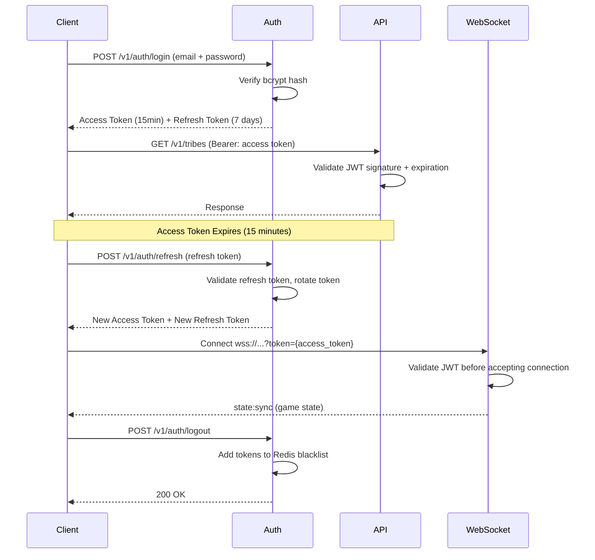
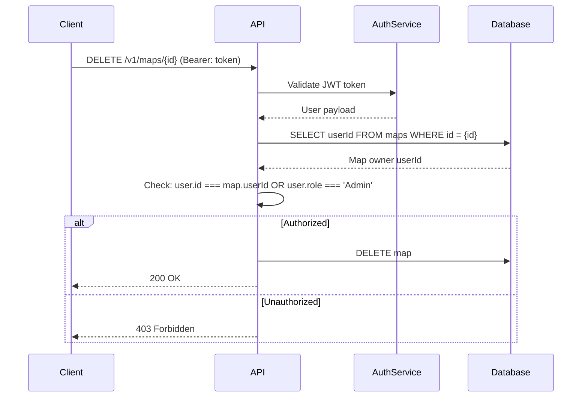
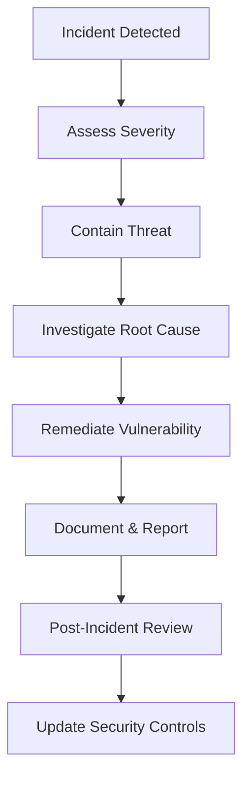

````markdown
<!-- reference @.gaia/designs/design.md -->
<!-- reference @.gaia/designs/5-api.md -->

[<< Back](./design.md)

# Security Architecture

Comprehensive security design ensuring data protection, threat mitigation, and compliance.

## Template Guidance

**Purpose**: Define security controls, threat mitigation, and compliance requirements
**Focus**: Authentication, authorization, data protection, threat modeling, compliance
**Avoid**: Implementation code, specific tool configurations, deployment details

**Guidelines**: Defense in depth, least privilege, security by design, compliance-first

## Security Principles

**Core Principles**:
- **Defense in Depth**: Multiple layers of security controls
- **Least Privilege**: Minimum permissions necessary for operations
- **Zero Trust**: Never trust, always verify
- **Security by Design**: Security integrated from inception
- **Fail Secure**: System defaults to secure state on failure

**Security Objectives**:
- **Confidentiality**: Protect sensitive data from unauthorized access
- **Integrity**: Ensure data accuracy and prevent tampering
- **Availability**: Maintain system accessibility for authorized users
- **Accountability**: Audit trails for all security-relevant actions

## Threat Modeling

### STRIDE Analysis

**Spoofing Identity**:
- **Threat**: Attacker impersonates legitimate user
- **Mitigation**: Multi-factor authentication, JWT validation, session management
- **Detection**: Failed login monitoring, anomalous access patterns

**Tampering with Data**:
- **Threat**: Unauthorized modification of data in transit or at rest
- **Mitigation**: TLS encryption, digital signatures, database integrity checks
- **Detection**: Checksum validation, audit logs for data changes

**Repudiation**:
- **Threat**: User denies performing action without proof
- **Mitigation**: Comprehensive audit logging, non-repudiation signatures
- **Detection**: Audit log analysis, transaction tracking

**Information Disclosure**:
- **Threat**: Exposure of sensitive information to unauthorized parties
- **Mitigation**: Encryption, access controls, data classification, secure storage
- **Detection**: Data leakage prevention, access monitoring

**Denial of Service**:
- **Threat**: System unavailability due to resource exhaustion
- **Mitigation**: Rate limiting, resource quotas, load balancing, DDoS protection
- **Detection**: Performance monitoring, traffic analysis

**Elevation of Privilege**:
- **Threat**: User gains unauthorized higher-level permissions
- **Mitigation**: RBAC, input validation, secure APIs, privilege separation
- **Detection**: Permission change auditing, privilege escalation alerts

### Attack Surface Analysis

**External Attack Vectors**:
- Public APIs and endpoints
- Authentication mechanisms
- File upload functionality
- Search and query interfaces
- Third-party integrations

**Internal Attack Vectors**:
- Database access
- Inter-service communication
- Admin interfaces
- Configuration management
- Secret management

**Mitigation Strategies**:
- Minimize exposed endpoints
- Input validation and sanitization
- Secure defaults
- Regular security assessments

## Authentication Architecture

### User Authentication

**Authentication Methods**:
- **Primary**: Email/Password (bcrypt hashing, 12 rounds)
- **OAuth**: Google OAuth 2.0 (future enhancement)
- **Token-Based**: JWT for REST and WebSocket authentication

**Password Policy**:
- Minimum 8 characters (lowercase for casual game)
- Complexity: At least one uppercase, lowercase, number
- Bcrypt hashing with 12 salt rounds
- No password expiration (not critical for game)
- Account lockout: 5 failed login attempts, 15-minute lockout
- Password reset: Secure token-based flow with 1-hour expiration

**Password Security Implementation**:
```typescript
// Password hashing (bcrypt)
import bcrypt from 'bcrypt';

async function hashPassword(password: string): Promise<string> {
  const saltRounds = 12;
  return bcrypt.hash(password, saltRounds);
}

async function verifyPassword(password: string, hash: string): Promise<boolean> {
  return bcrypt.compare(password, hash);
}
```

### Session Management

**Session Security**:
- **JWT Tokens**: Stateless authentication for REST and WebSocket
- **Token Expiration**: Access tokens 15 minutes, refresh tokens 7 days
- **Algorithm**: HS256 (HMAC SHA-256)
- **Token Rotation**: Refresh token rotation on each use
- **Secure Storage**: HttpOnly cookies for refresh tokens (web), secure storage for access tokens
- **Token Revocation**: Redis-backed blacklist for logout and security events

**JWT Token Structure**:
```json
{
  "header": {
    "alg": "HS256",
    "typ": "JWT"
  },
  "payload": {
    "sub": "user-uuid",
    "email": "player@example.com",
    "username": "PlayerOne",
    "iat": 1732285800,
    "exp": 1732286700,
    "tokenType": "access"
  },
  "signature": "HMACSHA256(base64UrlEncode(header) + '.' + base64UrlEncode(payload), secret)"
}
```

**Session Lifecycle**:


**Redis Session Storage**:
```typescript
// WebSocket connection session (Redis-backed)
interface WebSocketSession {
  sessionId: string;
  userId: string;
  connectionId: string;
  connectedAt: number;
  lastPing: number;
}

// Redis key: `ws:session:{sessionId}:{userId}`
// TTL: 30 minutes (auto-cleanup on disconnect)
```

### API Authentication

**REST API Authentication**:
- **Authorization Header**: `Authorization: Bearer {access_token}`
- **Token Validation**: Every REST endpoint validates JWT signature and expiration
- **Middleware**: Express middleware for auth validation before route handlers

**WebSocket Authentication**:
- **Query Parameter**: `wss://ws.towerdefense.com/game/{sessionId}?token={access_token}`
- **Handshake Validation**: Validate JWT before accepting WebSocket upgrade
- **Connection Rejection**: Close connection immediately if token invalid (401 status)
- **Session Association**: Link WebSocket connection to game session and user

**Token Validation Flow**:
```typescript
// REST API middleware
async function authenticateJWT(req, res, next) {
  const authHeader = req.headers.authorization;
  const token = authHeader && authHeader.split(' ')[1]; // Bearer {token}

  if (!token) return res.sendStatus(401);

  try {
    const payload = jwt.verify(token, process.env.JWT_SECRET);

    // Check Redis blacklist (logout/revocation)
    const isBlacklisted = await redis.exists(`token:blacklist:${token}`);
    if (isBlacklisted) return res.sendStatus(401);

    req.user = payload; // Attach user to request
    next();
  } catch (error) {
    return res.sendStatus(403); // Invalid/expired token
  }
}

// WebSocket authentication
async function authenticateWebSocket(socket, next) {
  const token = socket.handshake.query.token;

  try {
    const payload = jwt.verify(token, process.env.JWT_SECRET);
    const isBlacklisted = await redis.exists(`token:blacklist:${token}`);

    if (isBlacklisted) {
      return next(new Error('Token revoked'));
    }

    socket.user = payload;
    next();
  } catch (error) {
    next(new Error('Authentication failed'));
  }
}
```

## Authorization Architecture

### Role-Based Access Control (RBAC)

**Roles**:
- **Player**: Authenticated users (play games, create maps, customize tribes)
- **Admin**: System administrators (moderate content, manage users, system configuration)

**Permissions Matrix**:
| Resource | Player | Admin |
|----------|--------|-------|
| Play Games | ✓ | ✓ |
| Create Tribes | ✓ | ✓ |
| Edit Own Tribes | ✓ | ✓ |
| Delete Own Tribes | ✓ | ✓ |
| Create Maps | ✓ | ✓ |
| Edit Own Maps | ✓ | ✓ |
| Delete Own Maps | ✓ | ✓ |
| View Public Maps | ✓ | ✓ |
| Moderate Maps (flag/delete) | - | ✓ |
| Moderate Users (ban/warn) | - | ✓ |
| View Admin Dashboard | - | ✓ |
| System Configuration | - | ✓ |

**Authorization Rules**:
```typescript
// Resource ownership validation
function canEditMap(user: User, map: Map): boolean {
  return user.role === 'Admin' || map.userId === user.id;
}

function canDeleteMap(user: User, map: Map): boolean {
  return user.role === 'Admin' || map.userId === user.id;
}

function canEditTribe(user: User, tribe: Tribe): boolean {
  return user.role === 'Admin' || tribe.userId === user.id;
}

// Game session authorization
function canJoinSession(user: User, session: GameSession): boolean {
  // Public sessions: anyone can join
  // Private sessions: only invited players can join
  return session.isPublic || session.invitedPlayers.includes(user.id);
}

// Tower placement authorization (in-game)
function canPlaceTower(player: Player, position: Point): boolean {
  // Must be current player, must have sufficient gold
  return player.gold >= TOWER_COST;
}
```

### Resource-Based Authorization

**Ownership Model**:
- **Maps**: Users can create/edit/delete own maps, admins can moderate all maps
- **Tribes**: Users can create/edit/delete own tribes (max 10 tribes per user)
- **Towers**: Players can only upgrade/sell towers they placed (in multiplayer)

**Authorization Flow**:


**In-Game Authorization (WebSocket)**:
```typescript
// Server-authoritative validation for all player actions
async function handleTowerPlacement(socket, data) {
  const { towerType, position } = data;
  const player = await getPlayerFromSession(socket.user.id, socket.gameSessionId);

  // Validate player ownership
  if (!player) {
    return socket.emit('tower:place:error', { code: 'PLAYER_NOT_IN_SESSION' });
  }

  // Validate resources
  if (player.gold < TOWER_COSTS[towerType]) {
    return socket.emit('tower:place:error', { code: 'INSUFFICIENT_GOLD' });
  }

  // Validate tile ownership (not occupied)
  const tile = await getTile(position.x, position.y);
  if (tile.isBlocked || tile.towerId) {
    return socket.emit('tower:place:error', { code: 'TILE_OCCUPIED' });
  }

  // Place tower (server-authoritative)
  const tower = await createTower({
    type: towerType,
    position,
    ownerId: player.id,
    sessionId: socket.gameSessionId
  });

  // Deduct gold
  await updatePlayerGold(player.id, player.gold - TOWER_COSTS[towerType]);

  // Broadcast to all players
  io.to(socket.gameSessionId).emit('tower:placed', { tower });
}
```

## Data Protection

### Encryption Strategy

**Data at Rest**:
- **Database Encryption**: PostgreSQL Transparent Data Encryption (TDE) enabled
- **Password Storage**: Bcrypt hashing with 12 salt rounds (not reversible encryption)
- **Secrets Management**: Environment variables only, never commit to git
- **JWT Secret**: 256-bit random secret stored in environment variable
- **Backup Encryption**: Database backups encrypted with AES-256 before storage

**Data in Transit**:
- **TLS 1.3**: All HTTPS/WSS connections encrypted
- **HSTS**: HTTP Strict Transport Security enforced (`Strict-Transport-Security: max-age=31536000; includeSubDomains`)
- **WebSocket Secure**: Only WSS (WebSocket Secure) connections allowed, no WS
- **Certificate Validation**: Valid SSL certificates required (Let's Encrypt or commercial CA)

**Sensitive Data**:
- **Passwords**: Bcrypt hashed (12 rounds), never stored in plaintext or logs
- **Email Addresses**: Stored in plaintext (needed for login), redacted in logs
- **JWT Tokens**: Signed with HS256, secret stored securely
- **User IDs**: UUID format, non-sequential to prevent enumeration attacks

### Data Classification

**Classification Levels**:
- **Public**: No confidentiality concern (public maps, leaderboards, usernames)
- **Internal**: Not for public disclosure (game session state, active connections)
- **Confidential**: User-sensitive information (email addresses, private maps)
- **Restricted**: Highly sensitive data (password hashes, JWT secrets)

**Handling Requirements**:
| Level | Example Data | Encryption | Access Control | Audit Logging |
|-------|--------------|------------|----------------|---------------|
| Public | Public maps, usernames | No | Public read | No |
| Internal | Game sessions, WebSocket connections | In transit (TLS) | Authenticated | Basic |
| Confidential | Email addresses, private maps | At rest + transit | User ownership | Detailed |
| Restricted | Password hashes, JWT secrets | At rest + transit | Admin only | Comprehensive |

### Data Sanitization & Validation

**Input Validation (Zod Schemas)**:
```typescript
import { z } from 'zod';

// User registration validation
const RegisterSchema = z.object({
  email: z.string().email().max(255),
  username: z.string().min(3).max(50).regex(/^[a-zA-Z0-9_-]+$/),
  password: z.string().min(8).max(128),
});

// Map creation validation
const CreateMapSchema = z.object({
  name: z.string().min(3).max(100),
  description: z.string().max(500).optional(),
  width: z.number().int().min(20).max(100),
  height: z.number().int().min(20).max(100),
  terrainData: z.array(z.object({
    x: z.number().int(),
    y: z.number().int(),
    terrainType: z.enum(['Grass', 'Dirt', 'Stone', 'Water', 'Lava']),
    height: z.number().int().min(0).max(5),
  })),
  spawnPoint: z.object({ x: z.number().int(), y: z.number().int() }),
  goalPoint: z.object({ x: z.number().int(), y: z.number().int() }),
});

// Tower placement validation (WebSocket)
const PlaceTowerSchema = z.object({
  towerType: z.enum(['Arrow', 'Cannon', 'Magic', 'Wall']),
  position: z.object({
    x: z.number().int().min(0),
    y: z.number().int().min(0),
  }),
});
```

**Output Encoding**:
- **React Auto-Escaping**: React automatically escapes all dynamic content, preventing XSS
- **JSON API Responses**: JSON.stringify() automatically escapes dangerous characters
- **SQL Parameterization**: Prisma ORM uses parameterized queries (automatic protection against SQL injection)

**CORS Configuration**:
```typescript
// Whitelist frontend origin only
const corsOptions = {
  origin: process.env.FRONTEND_URL || 'http://localhost:3000',
  credentials: true, // Allow cookies/auth headers
  methods: ['GET', 'POST', 'PUT', 'DELETE'],
  allowedHeaders: ['Content-Type', 'Authorization'],
};

app.use(cors(corsOptions));
```

**Content Security Policy (CSP)**:
```typescript
// Helmet middleware for security headers
app.use(helmet({
  contentSecurityPolicy: {
    directives: {
      defaultSrc: ["'self'"],
      scriptSrc: ["'self'"], // No inline scripts allowed
      styleSrc: ["'self'", "'unsafe-inline'"], // Allow inline styles for PixiJS
      imgSrc: ["'self'", "data:", "https:"], // Allow images from CDN
      connectSrc: ["'self'", "wss://ws.towerdefense.com"], // WebSocket whitelist
      fontSrc: ["'self'"],
      objectSrc: ["'none'"],
      upgradeInsecureRequests: [],
    },
  },
}));
```

**Request Size Limits**:
```typescript
// Prevent DoS via large payloads
app.use(express.json({ limit: '100kb' })); // API requests
app.use(express.urlencoded({ limit: '10mb', extended: true })); // Map uploads
```

**Data Sanitization in Logs**:
```typescript
// Redact sensitive fields before logging
function sanitizeForLogging(obj: any) {
  const sanitized = { ...obj };
  delete sanitized.password;
  delete sanitized.passwordHash;
  delete sanitized.accessToken;
  delete sanitized.refreshToken;

  if (sanitized.email) {
    sanitized.email = sanitized.email.replace(/(.{3})(.*)(@.*)/, '$1***$3');
  }

  return sanitized;
}

logger.info('User login', sanitizeForLogging({ email: 'player@example.com', password: 'secret' }));
// Output: { email: 'pla***@example.com' }
```

## Threat Protection

### Common Threat Scenarios

**SQL Injection Protection**:
- **Mitigation**: Prisma ORM with parameterized queries (automatic protection)
- **Example**: `prisma.user.findUnique({ where: { email } })` - never uses string concatenation
- **Testing**: Automated security tests with SQL injection payloads

**Cross-Site Scripting (XSS) Protection**:
- **Mitigation**: React automatic escaping + CSP headers
- **CSP**: `script-src 'self'` - no inline scripts allowed
- **Sanitization**: DOMPurify for user-generated map descriptions (if HTML allowed)

**Cross-Site Request Forgery (CSRF) Protection**:
- **Not Needed for JWT**: JWT tokens in Authorization header (not cookies)
- **SameSite Cookies**: If using cookies for refresh tokens, set `SameSite=Strict`

**Path Traversal Protection**:
- **Mitigation**: Validate all file paths, sanitize map names
- **Example**: Reject map names with `../` or absolute paths
- **File Upload**: If allowing sprite uploads, validate file type and sanitize filenames

**Denial of Service (DoS) Protection**:
- **Rate Limiting**: 100 req/min per IP (REST), 10 events/sec per player (WebSocket)
- **Connection Limits**: Max 1000 concurrent WebSocket connections per backend instance
- **Request Size**: 100KB for API, 10MB for map uploads
- **Timeouts**: 30s for API requests, 5s for database queries

**Rate Limiting Implementation**:
```typescript
import rateLimit from 'express-rate-limit';

// REST API rate limiter
const apiLimiter = rateLimit({
  windowMs: 1 * 60 * 1000, // 1 minute
  max: 100, // 100 requests per minute
  message: 'Too many requests from this IP, please try again later.',
  standardHeaders: true, // Return rate limit info in headers
  legacyHeaders: false,
});

// Login endpoint stricter rate limit
const loginLimiter = rateLimit({
  windowMs: 1 * 60 * 1000,
  max: 5, // 5 login attempts per minute
  skipSuccessfulRequests: true, // Don't count successful logins
});

app.use('/v1/', apiLimiter);
app.use('/v1/auth/login', loginLimiter);

// WebSocket event rate limiter
class WebSocketRateLimiter {
  private eventCounts = new Map<string, number[]>();

  isAllowed(playerId: string, maxEventsPerSecond: number = 10): boolean {
    const now = Date.now();
    const events = this.eventCounts.get(playerId) || [];

    // Remove events older than 1 second
    const recentEvents = events.filter(timestamp => now - timestamp < 1000);

    if (recentEvents.length >= maxEventsPerSecond) {
      return false; // Rate limit exceeded
    }

    recentEvents.push(now);
    this.eventCounts.set(playerId, recentEvents);
    return true;
  }
}
```

**Brute Force Protection**:
- **Account Lockout**: 5 failed login attempts → 15-minute lockout
- **Exponential Backoff**: Increase lockout duration on repeated failures
- **Alerting**: Alert admins on multiple brute force attempts from same IP

## Security Testing

### Automated Security Testing

**Static Analysis (SAST)**:
- **Tool**: npm audit + Snyk (dependency scanning)
- **Frequency**: On every commit via GitHub Actions
- **Scope**: Detect known vulnerabilities in dependencies
- **Action**: Fail build if high/critical vulnerabilities found

**Dependency Scanning**:
```yaml
# GitHub Actions workflow
name: Security Scan
on: [push, pull_request]
jobs:
  security:
    runs-on: ubuntu-latest
    steps:
      - uses: actions/checkout@v3
      - name: Run npm audit
        run: npm audit --audit-level=high
      - name: Run Snyk test
        run: npx snyk test --severity-threshold=high
```

**Secret Detection**:
- **Tool**: git-secrets or TruffleHog
- **Scope**: Scan commits for hardcoded API keys, passwords, JWT secrets
- **Pre-commit Hook**: Prevent commits with secrets

**Security Headers Validation**:
```typescript
// Automated test for security headers
describe('Security Headers', () => {
  it('should include HSTS header', async () => {
    const response = await request(app).get('/');
    expect(response.headers['strict-transport-security']).toBeDefined();
  });

  it('should include CSP header', async () => {
    const response = await request(app).get('/');
    expect(response.headers['content-security-policy']).toContain("script-src 'self'");
  });

  it('should include X-Frame-Options', async () => {
    const response = await request(app).get('/');
    expect(response.headers['x-frame-options']).toBe('DENY');
  });
});
```

### Penetration Testing (Manual)

**Testing Scope**:
- **Frequency**: Quarterly security assessments (or before major releases)
- **Focus Areas**:
  - Authentication bypass attempts (JWT manipulation, token replay)
  - Authorization bypass (access other users' maps/tribes)
  - SQL injection attempts (verify Prisma protection)
  - XSS attempts (verify React + CSP protection)
  - WebSocket event tampering (validate server-authoritative game logic)
  - Rate limit bypass attempts
  - Pathfinding manipulation (ensure server validates all moves)

**OWASP Top 10 2021 Compliance**:
- [x] **A01:2021 - Broken Access Control**: Server-authoritative validation, ownership checks
- [x] **A02:2021 - Cryptographic Failures**: TLS 1.3, bcrypt hashing, JWT signing
- [x] **A03:2021 - Injection**: Prisma parameterized queries, Zod input validation
- [x] **A04:2021 - Insecure Design**: Security by design, threat modeling
- [x] **A05:2021 - Security Misconfiguration**: Helmet security headers, CSP, CORS
- [x] **A06:2021 - Vulnerable Components**: npm audit, Snyk scanning
- [x] **A07:2021 - Identification and Authentication Failures**: JWT auth, bcrypt, rate limiting
- [x] **A08:2021 - Software and Data Integrity Failures**: Code signing, dependency verification
- [x] **A09:2021 - Security Logging**: Winston structured logging, auth failure tracking
- [x] **A10:2021 - Server-Side Request Forgery**: No external URL fetching (not applicable)

## Compliance & Regulatory Requirements

### GDPR Compliance (EU Players)

**Data Subject Rights Implementation**:
- **Right to Access**: Export API endpoint: `GET /v1/users/me/data-export` (JSON format)
- **Right to Rectification**: Update profile endpoint: `PUT /v1/users/me`
- **Right to Erasure**: Account deletion endpoint: `DELETE /v1/users/me` (anonymize game data, delete PII)
- **Right to Portability**: Export includes all user data (tribes, maps, game stats)
- **Consent**: Privacy policy acceptance required during registration

**Data Minimization**:
- Only collect email, username, password (no phone, address, payment info)
- Game telemetry: anonymous aggregate statistics only
- No third-party analytics (Google Analytics, etc.) without consent

**Data Breach Notification**:
- Notify affected users within 72 hours via email
- Breach log maintained by admins
- Contact: privacy@towerdefense.com

### No Payment Processing (No PCI DSS)

**Monetization Strategy**:
- Free-to-play game (no in-app purchases at launch)
- Future: Cosmetic purchases via external payment gateway (Stripe)
- **PCI DSS**: Not applicable (no payment card data stored)

### No Health Data (No HIPAA)

**Not Applicable**: Game does not collect or process protected health information

### Security Incident Response

**Incident Response Plan**:
1. **Detection**: Monitoring alerts (failed auth spikes, unusual activity)
2. **Assessment**: Classify severity (P0-Critical, P1-High, P2-Medium, P3-Low)
3. **Containment**: Revoke compromised tokens, block malicious IPs
4. **Investigation**: Review logs, identify root cause
5. **Remediation**: Patch vulnerabilities, deploy fixes
6. **Communication**: Notify affected users (if data breach)
7. **Post-Mortem**: Document incident, update security controls

**Security Contact**: security@towerdefense.com

## Incident Response

### Security Incident Classification

**Severity Levels**:
- **Critical (P0)**: Active data breach, system compromise
- **High (P1)**: Vulnerability with potential for exploitation
- **Medium (P2)**: Security policy violation, minor vulnerability
- **Low (P3)**: Security concern with minimal impact

### Incident Response Process

**Response Workflow**:


**Response Team**:
- **Security Lead**: Incident commander
- **DevOps Engineer**: System access and remediation
- **Legal Counsel**: Compliance and notification requirements
- **Communications**: Stakeholder and customer communication

**Breach Notification**:
- **Internal Notification**: Immediate to security team
- **Customer Notification**: Within 72 hours if PII affected
- **Regulatory Notification**: Per compliance requirements (GDPR, HIPAA)

## Security Monitoring & Logging

### Audit Logging

**Events to Log**:
- **Authentication**: Login attempts, MFA usage, logout
- **Authorization**: Permission checks, access denials
- **Data Access**: Read/write operations on sensitive data
- **Configuration Changes**: System settings modifications
- **Security Events**: Failed validations, suspicious activity

**Log Structure**:
```json
{
  "timestamp": "2025-11-20T10:30:00Z",
  "eventType": "authentication.login",
  "userId": "uuid",
  "ipAddress": "192.168.1.1",
  "userAgent": "Mozilla/5.0...",
  "result": "success",
  "mfaUsed": true,
  "metadata": {
    "location": "New York, USA",
    "device": "Desktop"
  }
}
```

**Log Retention**:
- **Security Logs**: 1 year minimum (or per compliance requirements)
- **Audit Logs**: 7 years (or per compliance requirements)
- **Access Logs**: 90 days

### Security Monitoring

**Real-Time Alerts**:
- **Failed Login Spikes**: Multiple failed authentication attempts
- **Privilege Escalation**: Unauthorized permission changes
- **Data Exfiltration**: Large data transfers to external systems
- **Anomalous Access**: Unusual access patterns or locations

**Security Metrics**:
- Authentication failure rate
- Authorization denial rate
- Vulnerability count by severity
- Mean time to detect (MTTD)
- Mean time to respond (MTTR)

## Validation Checklist

**Authentication** (JWT + bcrypt):
- [x] Password policy enforced (8 chars minimum, bcrypt 12 rounds)
- [x] JWT authentication for REST and WebSocket
- [x] Token expiration: Access 15min, Refresh 7 days
- [x] Token rotation on refresh
- [x] Redis-backed token blacklist for logout

**Authorization** (RBAC + Ownership):
- [x] Player and Admin roles defined
- [x] Resource ownership validation (maps, tribes, towers)
- [x] Server-authoritative game logic (anti-cheat)
- [x] Permissions matrix documented

**Data Protection**:
- [x] Data at rest encrypted (PostgreSQL TDE)
- [x] Data in transit encrypted (TLS 1.3, WSS)
- [x] Passwords hashed with bcrypt (12 rounds)
- [x] JWT secrets stored in environment variables
- [x] Email addresses redacted in logs

**Input Validation** (Zod):
- [x] All REST API requests validated with Zod schemas
- [x] All WebSocket events validated with Zod schemas
- [x] Map creation: Validate dimensions (20-100), terrain types, spawn/goal points
- [x] Tower placement: Validate position, resources, tile availability
- [x] XSS protection: React auto-escaping + CSP headers
- [x] SQL injection protection: Prisma ORM parameterized queries

**Rate Limiting**:
- [x] REST API: 100 req/min per IP
- [x] Login endpoint: 5 attempts/min per IP
- [x] WebSocket: 10 events/sec per player
- [x] Connection limits: 1000 concurrent WebSocket connections per instance

**Security Testing**:
- [x] npm audit integrated into CI/CD (fail on high/critical)
- [x] Snyk dependency scanning
- [x] Security headers testing (HSTS, CSP, X-Frame-Options)
- [x] OWASP Top 10 2021 compliance validated
- [x] Quarterly penetration testing scheduled

**Compliance**:
- [x] GDPR data export/deletion endpoints implemented
- [x] Privacy policy acceptance required
- [x] Data minimization (email, username, password only)
- [x] Breach notification process documented (72-hour)

**Incident Response**:
- [x] Incident classification (P0-P3)
- [x] Response plan documented (detect, assess, contain, remediate)
- [x] Security contact: security@towerdefense.com
- [x] Winston structured logging with auth failure tracking

**Instructions**: Security design complete for isometric tower defense game. All authentication (JWT + bcrypt), authorization (RBAC + ownership), input validation (Zod), rate limiting (REST + WebSocket), and threat protection (SQL injection, XSS, CSRF, DoS) specified. OWASP Top 10 compliant. Ready for implementation in 11-testing.md test scenarios and builder execution.

[<< Back](./design.md)

[<< Back](./design.md)

````
