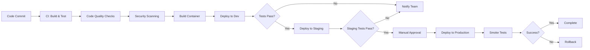
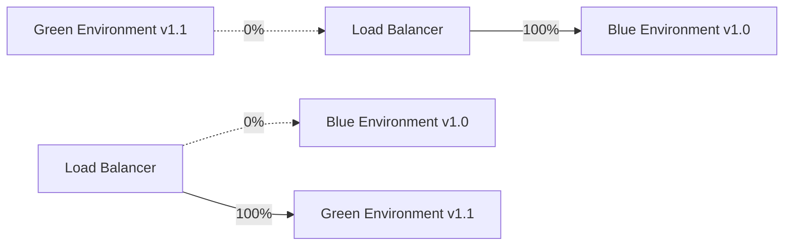
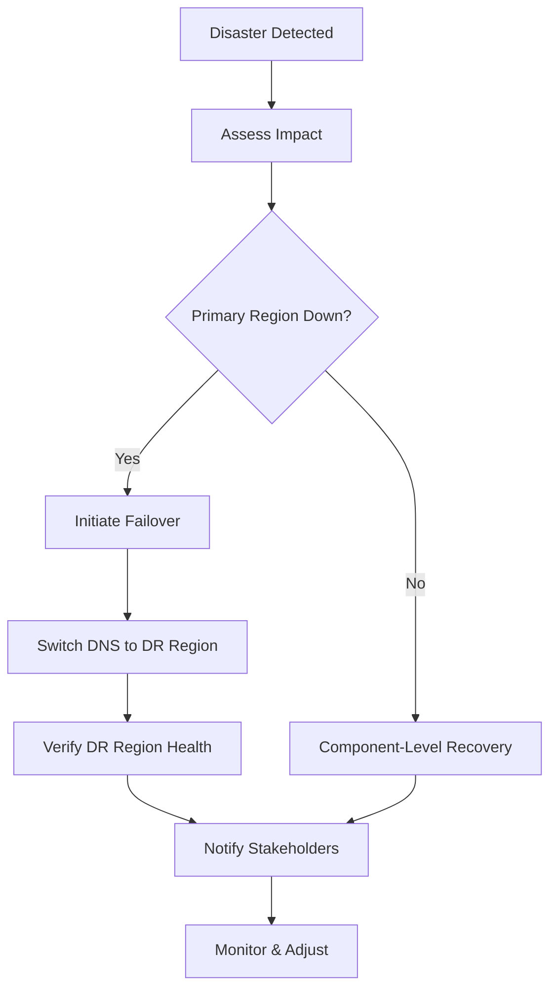

````markdown
<!-- reference @.gaia/designs/design.md -->
<!-- reference @.gaia/designs/5-api.md -->
<!-- reference @.gaia/designs/6-security.md -->

[<< Back](./design.md)

# Infrastructure & DevOps

Complete infrastructure design, CI/CD pipelines, and deployment strategies.

## Template Guidance

**Purpose**: Define infrastructure architecture, deployment pipelines, and operational workflows
**Focus**: CI/CD, environments, Infrastructure-as-Code, container orchestration, deployment strategies
**Avoid**: Specific tool configurations, implementation code, manual processes

**Guidelines**: Automation-first, infrastructure-as-code, immutable infrastructure, GitOps principles

## Infrastructure Architecture

**Architecture Philosophy**: [Cloud-Native / Hybrid / On-Premise]
**Cloud Provider**: [AWS / Azure / GCP / Multi-Cloud]
**Compute Model**: [Containers / Serverless / VMs / Hybrid]
**Orchestration**: [Kubernetes / ECS / App Service / Cloud Run]

**Infrastructure Principles**:
- **Infrastructure as Code**: All infrastructure defined in version control
- **Immutable Infrastructure**: Replace rather than modify infrastructure
- **Declarative Configuration**: Desired state specification
- **Automation**: No manual infrastructure changes
- **Reproducibility**: Consistent environments across all stages

## Environment Strategy

### Environment Tiers

**Development (dev)**:
- **Purpose**: Active development and feature testing
- **Data**: Mock/synthetic data only
- **Deployment**: Automatic on merge to dev branch
- **Access**: All developers
- **Cost Optimization**: Scaled down resources, auto-shutdown

**Staging (stg)**:
- **Purpose**: Pre-production validation and QA testing
- **Data**: Sanitized production-like data
- **Deployment**: Automatic on merge to main/staging branch
- **Access**: QA team, developers (read-only production access)
- **Infrastructure**: Production-equivalent configuration

**Production (prod)**:
- **Purpose**: Live customer-facing environment
- **Data**: Real customer data
- **Deployment**: Manual approval required after staging validation
- **Access**: Restricted to ops team and specific engineers
- **High Availability**: Multi-region, auto-scaling, disaster recovery

**Additional Environments** (Optional):
- **Local**: Developer workstations with Docker Compose
- **Feature**: Temporary environments for major features
- **Hotfix**: Emergency production-equivalent environment
- **Performance**: Load testing and performance benchmarking

### Environment Parity

**Configuration Management**:
```
.
├── infrastructure/
│   ├── base/                    # Shared configuration
│   ├── environments/
│   │   ├── dev/                 # Dev overrides
│   │   ├── staging/             # Staging overrides
│   │   └── production/          # Production overrides
│   └── modules/                 # Reusable IaC modules
```

**Parity Principles**:
- **Same Infrastructure Code**: Only parameter differences between environments
- **Configuration Drift Prevention**: Automated drift detection
- **Environment Variables**: Environment-specific secrets and config
- **Database Schema**: Same schema across all environments

## Infrastructure as Code (IaC)

### IaC Tooling

**Primary Tool**: [Terraform / Pulumi / AWS CDK / ARM Templates / Bicep]
**Configuration Management**: [Ansible / Chef / Puppet]
**Container Orchestration**: [Kubernetes YAML / Helm Charts / Kustomize]

**IaC Structure**:
```
infrastructure/
├── terraform/
│   ├── modules/
│   │   ├── networking/          # VPC, subnets, security groups
│   │   ├── compute/             # EC2, ECS, Lambda
│   │   ├── database/            # RDS, DynamoDB, Redis
│   │   ├── storage/             # S3, EBS, EFS
│   │   └── monitoring/          # CloudWatch, alarms
│   ├── environments/
│   │   ├── dev/
│   │   │   ├── main.tf
│   │   │   ├── variables.tf
│   │   │   └── terraform.tfvars
│   │   ├── staging/
│   │   └── production/
│   └── backend.tf               # Remote state configuration
```

### Core Infrastructure Components

**Networking**:
```hcl
# VPC with public/private subnets across multiple AZs
module "networking" {
  source = "./modules/networking"

  vpc_cidr = "10.0.0.0/16"
  public_subnets = ["10.0.1.0/24", "10.0.2.0/24", "10.0.3.0/24"]
  private_subnets = ["10.0.11.0/24", "10.0.12.0/24", "10.0.13.0/24"]
  availability_zones = ["us-east-1a", "us-east-1b", "us-east-1c"]
}
```

**Compute Resources**:
- **Container Cluster**: ECS/EKS cluster with auto-scaling
- **Load Balancer**: Application Load Balancer with SSL termination
- **Auto Scaling**: CPU/Memory-based scaling policies
- **Bastion Host**: Secure SSH access to private resources

**Database**:
- **Primary Database**: RDS PostgreSQL Multi-AZ with read replicas
- **Caching Layer**: ElastiCache Redis cluster
- **Backup**: Automated daily snapshots with 30-day retention

**Storage**:
- **Object Storage**: S3 buckets with versioning and lifecycle policies
- **Persistent Volumes**: EBS volumes for stateful workloads
- **CDN**: CloudFront for static asset distribution

## Container Strategy

### Container Architecture

**Containerization Approach**:
- **Base Images**: Official minimal images (Alpine, Distroless)
- **Multi-Stage Builds**: Optimize image size and security
- **Image Scanning**: Automated vulnerability scanning
- **Image Registry**: Private container registry (ECR, ACR, GCR)

**Dockerfile Best Practices**:
```dockerfile
# Multi-stage build example
FROM node:18-alpine AS builder
WORKDIR /app
COPY package*.json ./
RUN npm ci --only=production
COPY . .
RUN npm run build

FROM node:18-alpine
WORKDIR /app
COPY --from=builder /app/dist ./dist
COPY --from=builder /app/node_modules ./node_modules
USER node
EXPOSE 3000
CMD ["node", "dist/server.js"]
```

### Kubernetes Architecture (If Applicable)

**Cluster Configuration**:
- **Node Pools**: Separate pools for different workload types
- **Namespaces**: Environment/team isolation
- **Resource Quotas**: Prevent resource exhaustion
- **Network Policies**: Pod-to-pod communication rules

**Kubernetes Resources**:
```yaml
# Deployment with resource limits and health checks
apiVersion: apps/v1
kind: Deployment
metadata:
  name: api-service
spec:
  replicas: 3
  selector:
    matchLabels:
      app: api-service
  template:
    metadata:
      labels:
        app: api-service
    spec:
      containers:
      - name: api
        image: registry.example.com/api:latest
        resources:
          requests:
            cpu: 100m
            memory: 256Mi
          limits:
            cpu: 500m
            memory: 512Mi
        livenessProbe:
          httpGet:
            path: /health
            port: 3000
          initialDelaySeconds: 30
          periodSeconds: 10
        readinessProbe:
          httpGet:
            path: /ready
            port: 3000
          initialDelaySeconds: 5
          periodSeconds: 5
```

**Service Mesh** (Optional):
- **Tool**: Istio / Linkerd / AWS App Mesh
- **Benefits**: Traffic management, observability, security
- **Use Case**: Complex microservices architectures

## CI/CD Pipeline

### Pipeline Architecture



### CI Pipeline (Continuous Integration)

**Build Stage**:
```yaml
# Example GitHub Actions CI workflow
name: CI Pipeline
on:
  push:
    branches: [ main, develop ]
  pull_request:
    branches: [ main ]

jobs:
  build:
    runs-on: ubuntu-latest
    steps:
      - uses: actions/checkout@v3

      - name: Setup Node.js
        uses: actions/setup-node@v3
        with:
          node-version: '18'
          cache: 'npm'

      - name: Install dependencies
        run: npm ci

      - name: Run linter
        run: npm run lint

      - name: Run unit tests
        run: npm run test:unit

      - name: Run integration tests
        run: npm run test:integration

      - name: Code coverage
        run: npm run test:coverage

      - name: Upload coverage to Codecov
        uses: codecov/codecov-action@v3
```

**Quality Gates**:
- **Code Coverage**: Minimum 80% coverage required
- **Linting**: Zero linting errors
- **Security Scan**: No high/critical vulnerabilities
- **Build Success**: All builds must succeed
- **Test Pass Rate**: 100% test pass rate

### CD Pipeline (Continuous Deployment)

**Deployment Stage**:
```yaml
# Example deployment workflow
deploy:
  needs: build
  runs-on: ubuntu-latest
  steps:
    - name: Configure AWS credentials
      uses: aws-actions/configure-aws-credentials@v2
      with:
        aws-access-key-id: ${{ secrets.AWS_ACCESS_KEY_ID }}
        aws-secret-access-key: ${{ secrets.AWS_SECRET_ACCESS_KEY }}
        aws-region: us-east-1

    - name: Build and push Docker image
      run: |
        docker build -t myapp:${{ github.sha }} .
        docker tag myapp:${{ github.sha }} ecr.amazonaws.com/myapp:latest
        docker push ecr.amazonaws.com/myapp:${{ github.sha }}
        docker push ecr.amazonaws.com/myapp:latest

    - name: Deploy to ECS
      run: |
        aws ecs update-service \
          --cluster production-cluster \
          --service api-service \
          --force-new-deployment
```

**Deployment Approval**:
- **Dev**: Automatic deployment on commit
- **Staging**: Automatic after CI passes
- **Production**: Manual approval + change window

## Deployment Strategies

### Blue-Green Deployment

**Strategy**:
- **Blue Environment**: Current production version
- **Green Environment**: New version deployed alongside
- **Traffic Switch**: Instant cutover from blue to green
- **Rollback**: Switch back to blue if issues detected

**Implementation**:


**Benefits**: Zero-downtime, instant rollback
**Drawbacks**: Requires double infrastructure during deployment

### Canary Deployment

**Strategy**:
- **Baseline**: Current version serves majority of traffic
- **Canary**: New version serves small percentage (5-10%)
- **Monitor**: Observe canary metrics for errors/performance issues
- **Gradual Rollout**: Increase canary traffic if healthy (10% → 25% → 50% → 100%)

**Traffic Splitting**:
```
Traffic Distribution:
├── Canary (v2.0):  5%  → 10% → 25% → 50% → 100%
└── Baseline (v1.0): 95% → 90% → 75% → 50% → 0%
```

**Benefits**: Low-risk, gradual rollout, early detection
**Drawbacks**: Complex routing, longer deployment time

### Rolling Deployment

**Strategy**:
- **Incremental Update**: Replace instances one by one (or in batches)
- **Health Checks**: Ensure each new instance healthy before proceeding
- **Progressive**: Gradually replace all instances

**Process**:
```
Instance 1: v1.0 → v2.0 (health check) ✓
Instance 2: v1.0 → v2.0 (health check) ✓
Instance 3: v1.0 → v2.0 (health check) ✓
Instance 4: v1.0 → v2.0 (health check) ✓
```

**Benefits**: No extra infrastructure, simple
**Drawbacks**: Slower rollback, mixed versions during deployment

## Configuration Management

### Secret Management

**Secret Storage**: [AWS Secrets Manager / Azure Key Vault / HashiCorp Vault / GCP Secret Manager]

**Secret Types**:
- **Database Credentials**: Connection strings, passwords
- **API Keys**: Third-party service credentials
- **Encryption Keys**: Data encryption keys
- **Certificates**: SSL/TLS certificates

**Secret Injection**:
```yaml
# Kubernetes secret injection
apiVersion: v1
kind: Pod
spec:
  containers:
  - name: app
    env:
    - name: DATABASE_PASSWORD
      valueFrom:
        secretKeyRef:
          name: db-secrets
          key: password
```

**Secret Rotation**:
- **Automatic Rotation**: Every 90 days for all credentials
- **Zero-Downtime Rotation**: Dual credentials during rotation
- **Audit Trail**: All secret access logged

### Environment Configuration

**Configuration Hierarchy**:
1. **Default Configuration**: Application defaults
2. **Environment Variables**: Environment-specific overrides
3. **Secret Manager**: Sensitive configuration
4. **Runtime Configuration**: Dynamic configuration service

**Example Configuration Structure**:
```json
{
  "app": {
    "name": "MyApp",
    "environment": "${ENVIRONMENT}",
    "port": "${PORT:-3000}"
  },
  "database": {
    "host": "${DB_HOST}",
    "port": "${DB_PORT:-5432}",
    "name": "${DB_NAME}",
    "password": "${DB_PASSWORD}"  // Injected from secret manager
  },
  "features": {
    "newFeature": "${FEATURE_FLAG_NEW_FEATURE:-false}"
  }
}
```

## Disaster Recovery & Backup

### Backup Strategy

**Database Backups**:
- **Automated Snapshots**: Daily full snapshots
- **Point-in-Time Recovery**: Transaction log backups every 5 minutes
- **Retention**: 30 days for automated backups, 1 year for monthly snapshots
- **Cross-Region Replication**: Backups replicated to secondary region

**Application State Backups**:
- **Configuration Backups**: Infrastructure state stored in version control
- **File Storage Backups**: S3 versioning and cross-region replication
- **Container Images**: Registry with image retention policies

### Disaster Recovery Plan

**Recovery Objectives**:
- **RTO (Recovery Time Objective)**: < 4 hours
- **RPO (Recovery Point Objective)**: < 15 minutes data loss

**DR Strategy**: [Active-Passive / Active-Active / Backup & Restore]

**Failover Process**:


**DR Testing**:
- **Frequency**: Quarterly DR drills
- **Scope**: Full region failover simulation
- **Validation**: Verify RTO/RPO objectives met

## Infrastructure Monitoring

### Health Checks

**Application Health**:
- **Liveness Probe**: Is the application running?
- **Readiness Probe**: Is the application ready to serve traffic?
- **Startup Probe**: Has the application completed initialization?

**Health Check Endpoints**:
```
GET /health
{
  "status": "healthy",
  "version": "2.1.0",
  "uptime": 86400,
  "checks": {
    "database": "healthy",
    "cache": "healthy",
    "externalApi": "degraded"
  }
}
```

### Infrastructure Metrics

**Key Metrics**:
- **CPU Utilization**: Target < 70% average
- **Memory Usage**: Target < 80% with headroom
- **Disk I/O**: Monitor for bottlenecks
- **Network Traffic**: Bandwidth utilization and latency
- **Container Restart Rate**: Detect crash loops

**Auto-Scaling Triggers**:
- Scale up when CPU > 70% for 5 minutes
- Scale down when CPU < 30% for 15 minutes
- Minimum replicas: 2 (high availability)
- Maximum replicas: 10 (cost control)

## Cost Optimization

**Cost Management Strategies**:
- **Right-Sizing**: Match instance sizes to actual usage
- **Auto-Scaling**: Scale down during low-traffic periods
- **Reserved Instances**: Commit to long-term for predictable workloads
- **Spot Instances**: Use for non-critical batch workloads
- **Resource Cleanup**: Automated deletion of unused resources

**Cost Monitoring**:
- **Budget Alerts**: Notify when costs exceed threshold
- **Cost Attribution**: Tag resources by team/project
- **Cost Optimization Recommendations**: Weekly review of optimization opportunities

## Validation Checklist

**Infrastructure**:
- [ ] Infrastructure-as-Code for all resources
- [ ] Multi-region deployment for high availability
- [ ] Auto-scaling configured with appropriate thresholds
- [ ] Disaster recovery plan documented and tested

**Environments**:
- [ ] Development, staging, production environments defined
- [ ] Environment parity maintained
- [ ] Environment-specific configuration managed
- [ ] Secret management solution implemented

**CI/CD**:
- [ ] Automated build and test pipeline
- [ ] Quality gates enforced (coverage, linting, security)
- [ ] Deployment automation to all environments
- [ ] Manual approval gates for production

**Deployment**:
- [ ] Deployment strategy selected (blue-green, canary, rolling)
- [ ] Zero-downtime deployment capability
- [ ] Rollback procedure documented and tested
- [ ] Smoke tests after deployment

**Monitoring**:
- [ ] Health check endpoints implemented
- [ ] Infrastructure metrics monitored
- [ ] Auto-scaling based on metrics
- [ ] Cost monitoring and optimization

**Instructions**:
1. Define infrastructure architecture and cloud provider
2. Establish environment strategy and parity
3. Implement Infrastructure-as-Code for all resources
4. Design CI/CD pipeline with quality gates
5. Select and implement deployment strategy
6. Configure secret management and environment configuration
7. Plan disaster recovery and backup strategies
8. Set up infrastructure monitoring and auto-scaling

[<< Back](./design.md)

````
