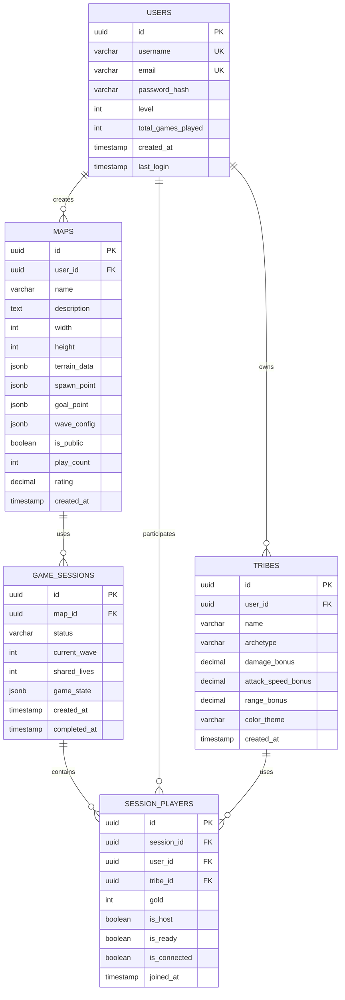

````markdown
<!-- reference @.gaia/designs/design.md -->
<!-- reference @.gaia/designs/2-class.md -->
<!-- reference @.gaia/designs/7-infrastructure.md -->

[<< Back](./design.md)

# Data Architecture

Complete data design including database schema, migrations, caching, and data lifecycle management.

## Template Guidance

**Purpose**: Define data models, storage strategies, access patterns, and data lifecycle management
**Focus**: Database schema, migrations, caching, data integrity, backup/recovery, data governance
**Avoid**: Implementation code, specific vendor details, deployment configuration

**Guidelines**: Normalization, scalability, performance optimization, data integrity, ACID compliance

## Data Architecture Overview

**Database Type**: Relational (PostgreSQL 15)
**Caching Layer**: Redis 7 (session data, game state hot cache)
**Search Engine**: None (PostgreSQL full-text search for map names)
**Data Warehouse**: None (future: analytics database)
**Message Queue**: None (WebSocket for real-time sync)

**Data Principles**:
- **Data Integrity**: Foreign keys, check constraints, triggers for audit logs
- **Normalization**: 3NF for user/tribe/map data, denormalized game state (JSONB) for performance
- **Scalability**: Connection pooling (max 10 per instance), read replicas for map browsing
- **Performance**: Indexes on foreign keys, JSONB for complex game state
- **Security**: Encrypted at rest (AES-256), SSL connections, no sensitive data in logs

## Database Schema Design

### Entity-Relationship Model

**Isometric Tower Defense Game Schema**:


### Prisma Schema (schema.prisma)

**Complete Database Schema**:
```prisma
datasource db {
  provider = "postgresql"
  url      = env("DATABASE_URL")
}

generator client {
  provider = "prisma-client-js"
}

model User {
  id                UUID      @id @default(uuid())
  username          String    @unique @db.VarChar(50)
  email             String    @unique @db.VarChar(255)
  passwordHash      String    @map("password_hash") @db.VarChar(255)
  level             Int       @default(1)
  totalGamesPlayed  Int       @default(0) @map("total_games_played")
  createdAt         DateTime  @default(now()) @map("created_at")
  lastLogin         DateTime? @map("last_login")

  // Relations
  tribes            Tribe[]
  maps              Map[]
  sessionPlayers    SessionPlayer[]

  @@index([username])
  @@index([email])
  @@map("users")
}

model Tribe {
  id                 UUID      @id @default(uuid())
  userId             UUID      @map("user_id")
  name               String    @db.VarChar(100)
  archetype          String    @db.VarChar(50) // Aggressive, Defensive, Balanced, Support
  damageBonus        Decimal   @default(0) @map("damage_bonus") @db.Decimal(5, 2)
  attackSpeedBonus   Decimal   @default(0) @map("attack_speed_bonus") @db.Decimal(5, 2)
  rangeBonus         Decimal   @default(0) @map("range_bonus") @db.Decimal(5, 2)
  colorTheme         String    @map("color_theme") @db.VarChar(7) // Hex color #FFFFFF
  createdAt          DateTime  @default(now()) @map("created_at")

  // Relations
  user               User      @relation(fields: [userId], references: [id], onDelete: Cascade)
  sessionPlayers     SessionPlayer[]

  @@index([userId])
  @@map("tribes")
}

model Map {
  id          UUID      @id @default(uuid())
  userId      UUID      @map("user_id")
  name        String    @db.VarChar(100)
  description String?   @db.Text
  width       Int       // 20-100
  height      Int       // 20-100
  terrainData Json      @map("terrain_data") // Array of { x, y, terrainType, height, isBlocked }
  spawnPoint  Json      @map("spawn_point") // { x, y }
  goalPoint   Json      @map("goal_point") // { x, y }
  waveConfig  Json      @map("wave_config") // { waves: [{ waveNumber, enemies: [{ type, count, spawnInterval }] }] }
  isPublic    Boolean   @default(false) @map("is_public")
  playCount   Int       @default(0) @map("play_count")
  rating      Decimal   @default(0) @db.Decimal(3, 2) // 0.00 - 5.00
  createdAt   DateTime  @default(now()) @map("created_at")

  // Relations
  user           User          @relation(fields: [userId], references: [id], onDelete: Cascade)
  gameSessions   GameSession[]

  @@index([userId])
  @@index([isPublic])
  @@index([playCount])
  @@map("maps")
}

model GameSession {
  id            UUID       @id @default(uuid())
  mapId         UUID       @map("map_id")
  status        String     @db.VarChar(50) // Lobby, InProgress, Paused, Completed, Abandoned
  currentWave   Int        @default(0) @map("current_wave")
  sharedLives   Int        @default(20) @map("shared_lives")
  gameState     Json?      @map("game_state") // { towers: [], enemies: [], resources: {} }
  createdAt     DateTime   @default(now()) @map("created_at")
  completedAt   DateTime?  @map("completed_at")

  // Relations
  map            Map               @relation(fields: [mapId], references: [id], onDelete: Restrict)
  players        SessionPlayer[]

  @@index([mapId])
  @@index([status])
  @@index([createdAt])
  @@map("game_sessions")
}

model SessionPlayer {
  id          UUID      @id @default(uuid())
  sessionId   UUID      @map("session_id")
  userId      UUID      @map("user_id")
  tribeId     UUID      @map("tribe_id")
  gold        Int       @default(500)
  isHost      Boolean   @default(false) @map("is_host")
  isReady     Boolean   @default(false) @map("is_ready")
  isConnected Boolean   @default(true) @map("is_connected")
  joinedAt    DateTime  @default(now()) @map("joined_at")

  // Relations
  session     GameSession @relation(fields: [sessionId], references: [id], onDelete: Cascade)
  user        User        @relation(fields: [userId], references: [id], onDelete: Cascade)
  tribe       Tribe       @relation(fields: [tribeId], references: [id], onDelete: Restrict)

  @@index([sessionId])
  @@index([userId])
  @@map("session_players")
}
```

### SQL Table Creation (Generated from Prisma)

**Users Table**:
```sql
CREATE TABLE users (
    id UUID PRIMARY KEY DEFAULT gen_random_uuid(),
    username VARCHAR(50) NOT NULL UNIQUE,
    email VARCHAR(255) NOT NULL UNIQUE,
    password_hash VARCHAR(255) NOT NULL,
    level INT NOT NULL DEFAULT 1,
    total_games_played INT NOT NULL DEFAULT 0,
    created_at TIMESTAMP NOT NULL DEFAULT CURRENT_TIMESTAMP,
    last_login TIMESTAMP,

    CONSTRAINT email_format CHECK (email ~* '^[A-Za-z0-9._%+-]+@[A-Za-z0-9.-]+\.[A-Z|a-z]{2,}$'),
    CONSTRAINT username_length CHECK (length(username) >= 3 AND length(username) <= 50)
);

CREATE INDEX idx_users_username ON users(username);
CREATE INDEX idx_users_email ON users(email);
```

**Tribes Table**:
```sql
CREATE TABLE tribes (
    id UUID PRIMARY KEY DEFAULT gen_random_uuid(),
    user_id UUID NOT NULL REFERENCES users(id) ON DELETE CASCADE,
    name VARCHAR(100) NOT NULL,
    archetype VARCHAR(50) NOT NULL,
    damage_bonus DECIMAL(5, 2) NOT NULL DEFAULT 0,
    attack_speed_bonus DECIMAL(5, 2) NOT NULL DEFAULT 0,
    range_bonus DECIMAL(5, 2) NOT NULL DEFAULT 0,
    color_theme VARCHAR(7) NOT NULL,
    created_at TIMESTAMP NOT NULL DEFAULT CURRENT_TIMESTAMP,

    CONSTRAINT archetype_values CHECK (archetype IN ('Aggressive', 'Defensive', 'Balanced', 'Support')),
    CONSTRAINT total_bonus_points CHECK (damage_bonus + attack_speed_bonus + range_bonus = 0.50),
    CONSTRAINT valid_color_theme CHECK (color_theme ~* '^#[0-9A-Fa-f]{6}$')
);

CREATE INDEX idx_tribes_user_id ON tribes(user_id);
```

**Maps Table**:
```sql
CREATE TABLE maps (
    id UUID PRIMARY KEY DEFAULT gen_random_uuid(),
    user_id UUID NOT NULL REFERENCES users(id) ON DELETE CASCADE,
    name VARCHAR(100) NOT NULL,
    description TEXT,
    width INT NOT NULL,
    height INT NOT NULL,
    terrain_data JSONB NOT NULL,
    spawn_point JSONB NOT NULL,
    goal_point JSONB NOT NULL,
    wave_config JSONB NOT NULL,
    is_public BOOLEAN NOT NULL DEFAULT false,
    play_count INT NOT NULL DEFAULT 0,
    rating DECIMAL(3, 2) NOT NULL DEFAULT 0,
    created_at TIMESTAMP NOT NULL DEFAULT CURRENT_TIMESTAMP,

    CONSTRAINT map_dimensions CHECK (width >= 20 AND width <= 100 AND height >= 20 AND height <= 100),
    CONSTRAINT rating_range CHECK (rating >= 0 AND rating <= 5)
);

CREATE INDEX idx_maps_user_id ON maps(user_id);
CREATE INDEX idx_maps_is_public ON maps(is_public);
CREATE INDEX idx_maps_play_count ON maps(play_count DESC);
```

**Game Sessions Table**:
```sql
CREATE TABLE game_sessions (
    id UUID PRIMARY KEY DEFAULT gen_random_uuid(),
    map_id UUID NOT NULL REFERENCES maps(id) ON DELETE RESTRICT,
    status VARCHAR(50) NOT NULL,
    current_wave INT NOT NULL DEFAULT 0,
    shared_lives INT NOT NULL DEFAULT 20,
    game_state JSONB,
    created_at TIMESTAMP NOT NULL DEFAULT CURRENT_TIMESTAMP,
    completed_at TIMESTAMP,

    CONSTRAINT status_values CHECK (status IN ('Lobby', 'InProgress', 'Paused', 'Completed', 'Abandoned'))
);

CREATE INDEX idx_game_sessions_map_id ON game_sessions(map_id);
CREATE INDEX idx_game_sessions_status ON game_sessions(status);
CREATE INDEX idx_game_sessions_created_at ON game_sessions(created_at DESC);
```

**Session Players Table**:
```sql
CREATE TABLE session_players (
    id UUID PRIMARY KEY DEFAULT gen_random_uuid(),
    session_id UUID NOT NULL REFERENCES game_sessions(id) ON DELETE CASCADE,
    user_id UUID NOT NULL REFERENCES users(id) ON DELETE CASCADE,
    tribe_id UUID NOT NULL REFERENCES tribes(id) ON DELETE RESTRICT,
    gold INT NOT NULL DEFAULT 500,
    is_host BOOLEAN NOT NULL DEFAULT false,
    is_ready BOOLEAN NOT NULL DEFAULT false,
    is_connected BOOLEAN NOT NULL DEFAULT true,
    joined_at TIMESTAMP NOT NULL DEFAULT CURRENT_TIMESTAMP
);

CREATE INDEX idx_session_players_session_id ON session_players(session_id);
CREATE INDEX idx_session_players_user_id ON session_players(user_id);
```

### Data Constraints & Validation

**Primary Keys**:
- **Type**: UUID for distributed systems, auto-increment for single-database systems
- **Benefits**: Globally unique, no collision risk, security (non-sequential)

**Foreign Keys**:
- **ON DELETE CASCADE**: Child records deleted with parent (order_items → orders)
- **ON DELETE RESTRICT**: Prevent deletion if references exist (orders → users)
- **ON DELETE SET NULL**: Nullify references (optional relationships)

**Check Constraints**:
- Email format validation
- Enum value validation (order status)
- Business rule enforcement (positive amounts, valid calculations)

**Unique Constraints**:
- Single column: Email, username, slug
- Composite: (user_id, product_id) for unique user-product combinations

## Indexing Strategy

### Index Types

**B-Tree Indexes** (Default):
```sql
-- Single column indexes for frequent WHERE/ORDER BY
CREATE INDEX idx_users_email ON users(email);
CREATE INDEX idx_orders_created_at ON orders(created_at DESC);

-- Composite indexes for multi-column queries
CREATE INDEX idx_orders_user_status ON orders(user_id, status);
```

**Partial Indexes**:
```sql
-- Index only active records
CREATE INDEX idx_active_users ON users(email) WHERE is_active = true;

-- Index only pending/processing orders
CREATE INDEX idx_open_orders ON orders(user_id, created_at)
WHERE status IN ('pending', 'processing');
```

**Full-Text Search Indexes**:
```sql
-- PostgreSQL full-text search
CREATE INDEX idx_products_search ON products
USING gin(to_tsvector('english', name || ' ' || description));
```

**Index Optimization Guidelines**:
- Index foreign keys for JOIN performance
- Index columns used in WHERE, ORDER BY, GROUP BY
- Composite indexes: Most selective column first
- Avoid over-indexing: Each index has write overhead
- Monitor query plans: Use EXPLAIN ANALYZE

## Data Access Patterns

### Query Optimization

**Common Queries**:
```sql
-- Get user with recent orders (optimized with indexes)
SELECT u.*, o.*
FROM users u
LEFT JOIN orders o ON u.id = o.user_id
WHERE u.email = 'user@example.com'
  AND o.ordered_at > NOW() - INTERVAL '30 days'
ORDER BY o.ordered_at DESC;

-- Get order with items and product details
SELECT o.*, oi.*, p.name, p.price
FROM orders o
JOIN order_items oi ON o.id = oi.order_id
JOIN products p ON oi.product_id = p.id
WHERE o.id = '123e4567-e89b-12d3-a456-426614174000';

-- Get products by category with stock
SELECT p.*, c.name AS category_name
FROM products p
JOIN product_category c ON p.category_id = c.id
WHERE c.slug = 'electronics'
  AND p.stock_quantity > 0
  AND p.is_active = true
ORDER BY p.created_at DESC
LIMIT 20 OFFSET 0;
```

**Query Performance Targets**:
- Simple queries (single table): < 10ms
- Join queries (2-3 tables): < 50ms
- Complex queries (4+ tables): < 200ms
- Full-text search: < 100ms

### Pagination Strategy

**Offset-Based Pagination** (Simple, but slow for large offsets):
```sql
SELECT * FROM products
ORDER BY created_at DESC
LIMIT 20 OFFSET 40;  -- Page 3
```

**Cursor-Based Pagination** (Efficient for large datasets):
```sql
-- First page
SELECT * FROM products
ORDER BY created_at DESC, id
LIMIT 20;

-- Next page (cursor = last item's created_at and id)
SELECT * FROM products
WHERE (created_at, id) < ('2025-11-20 10:00:00', 'last-uuid')
ORDER BY created_at DESC, id
LIMIT 20;
```

## Caching Strategy

### Redis Caching Architecture

**Application-Level Caching** (Redis 7):
- **Session Data**: JWT tokens, user sessions (TTL: 15 min access, 7 days refresh)
- **Active Game Sessions**: Hot cache for in-progress games (TTL: 2 hours or until game ends)
- **Tribe Configurations**: User tribe stats (TTL: 1 hour, invalidate on update)
- **Public Maps**: Top 100 most played maps (TTL: 15 minutes)
- **Rate Limiting**: API rate limit counters (100 req/min per IP)

**Redis Key Patterns**:
```
session:{user_id}:access_token     -> JWT (TTL: 15min)
session:{user_id}:refresh_token    -> JWT (TTL: 7 days)
game:{session_id}:state            -> Game state JSONB (TTL: 2 hours)
tribe:{tribe_id}:config            -> Tribe stats (TTL: 1 hour)
map:{map_id}:data                  -> Map terrain data (TTL: 15 min)
maps:public:top100                 -> List of popular map IDs (TTL: 15 min)
ratelimit:{ip_address}:{endpoint}  -> Request count (TTL: 60 seconds)
```

**Database Query Caching**:
- **Read Replicas**: Route map browsing queries to read replica
- **No Materialized Views**: Game data too dynamic
- **PostgreSQL Cache**: Rely on PostgreSQL query cache for repeated queries

**CDN Caching** (CloudFront):
- **Static Assets**: Sprite sheets, terrain textures, fonts (1 year TTL)
- **API Responses**: None (all game data real-time via WebSocket)

### Cache Patterns

**Cache-Aside (Lazy Loading)**:
```
1. Check cache for data
2. If cache hit: Return cached data
3. If cache miss:
   a. Query database
   b. Store result in cache
   c. Return data
```

**Write-Through**:
```
1. Write to database
2. Write to cache
3. Return success
```

**Write-Behind (Write-Back)**:
```
1. Write to cache
2. Return success immediately
3. Asynchronously write to database (batched)
```

### Cache Invalidation

**TTL-Based Expiration**:
- **Short TTL**: Frequently changing data (30s - 5min)
- **Medium TTL**: Semi-static data (15min - 1hr)
- **Long TTL**: Rarely changing data (1hr - 24hr)

**Event-Based Invalidation**:
```
When user profile updated:
  - Invalidate cache key: user:{user_id}:profile
  - Invalidate cache key: user:{user_id}:orders

When product updated:
  - Invalidate cache key: product:{product_id}
  - Invalidate cache key: category:{category_id}:products
```

**Cache Keys Structure**:
```
user:{user_id}:profile
user:{user_id}:orders
product:{product_id}
category:{category_id}:products:page:{page_number}
search:{query_hash}
```

## Database Migrations

### Migration Strategy

**Migration Tool**: Prisma Migrate (integrated with Prisma ORM)

**Migration Principles**:
- **Version Control**: All migrations in `prisma/migrations/` directory
- **Forward-Only**: No rollback migrations (create new migration to fix)
- **Idempotent**: Prisma ensures safe migrations
- **Tested**: Test on staging before production
- **Backwards Compatible**: Add nullable columns, deprecate instead of drop

### Migration File Structure

```
prisma/
├── schema.prisma
└── migrations/
    ├── 20251122000001_initial_schema/
    │   └── migration.sql
    ├── 20251122000002_add_tribes/
    │   └── migration.sql
    ├── 20251122000003_add_maps_and_sessions/
    │   └── migration.sql
    └── 20251122000004_add_session_players/
        └── migration.sql
```

**Migration Example** (Initial Schema):
```sql
-- 20251122000001_initial_schema/migration.sql
-- Create users table with authentication

CREATE TABLE users (
    id UUID PRIMARY KEY DEFAULT gen_random_uuid(),
    username VARCHAR(50) NOT NULL UNIQUE,
    email VARCHAR(255) NOT NULL UNIQUE,
    password_hash VARCHAR(255) NOT NULL,
    level INT NOT NULL DEFAULT 1,
    total_games_played INT NOT NULL DEFAULT 0,
    created_at TIMESTAMP NOT NULL DEFAULT CURRENT_TIMESTAMP,
    last_login TIMESTAMP,
    CONSTRAINT email_format CHECK (email ~* '^[A-Za-z0-9._%+-]+@[A-Za-z0-9.-]+\.[A-Z|a-z]{2,}$'),
    CONSTRAINT username_length CHECK (length(username) >= 3 AND length(username) <= 50)
);

CREATE INDEX idx_users_username ON users(username);
CREATE INDEX idx_users_email ON users(email);
```

**Migration Example** (Add Tribes):
```sql
-- 20251122000002_add_tribes/migration.sql
-- Add tribe customization system

CREATE TABLE tribes (
    id UUID PRIMARY KEY DEFAULT gen_random_uuid(),
    user_id UUID NOT NULL REFERENCES users(id) ON DELETE CASCADE,
    name VARCHAR(100) NOT NULL,
    archetype VARCHAR(50) NOT NULL,
    damage_bonus DECIMAL(5, 2) NOT NULL DEFAULT 0,
    attack_speed_bonus DECIMAL(5, 2) NOT NULL DEFAULT 0,
    range_bonus DECIMAL(5, 2) NOT NULL DEFAULT 0,
    color_theme VARCHAR(7) NOT NULL,
    created_at TIMESTAMP NOT NULL DEFAULT CURRENT_TIMESTAMP,
    CONSTRAINT archetype_values CHECK (archetype IN ('Aggressive', 'Defensive', 'Balanced', 'Support')),
    CONSTRAINT total_bonus_points CHECK (damage_bonus + attack_speed_bonus + range_bonus = 0.50),
    CONSTRAINT valid_color_theme CHECK (color_theme ~* '^#[0-9A-Fa-f]{6}$')
);

CREATE INDEX idx_tribes_user_id ON tribes(user_id);
```

**Running Migrations**:
```bash
# Development: Apply migrations and update Prisma Client
npx prisma migrate dev

# Production: Apply pending migrations only
npx prisma migrate deploy

# Generate migration without applying
npx prisma migrate dev --create-only
```

### Breaking Change Migrations

**Multi-Phase Migration** (Rename column without downtime):
```sql
-- Phase 1: Add new column
ALTER TABLE users ADD COLUMN new_name VARCHAR(255);

-- Phase 2: Backfill data (in application code over time)
UPDATE users SET new_name = old_name WHERE new_name IS NULL;

-- Phase 3: Make new column NOT NULL (after backfill complete)
ALTER TABLE users ALTER COLUMN new_name SET NOT NULL;

-- Phase 4: Drop old column (after all app instances updated)
ALTER TABLE users DROP COLUMN old_name;
```

## Data Partitioning & Sharding

### Horizontal Partitioning

**Range Partitioning** (by date):
```sql
-- Partition orders by month
CREATE TABLE orders (
    id UUID,
    user_id UUID,
    ordered_at TIMESTAMP,
    ...
) PARTITION BY RANGE (ordered_at);

CREATE TABLE orders_2025_01 PARTITION OF orders
    FOR VALUES FROM ('2025-01-01') TO ('2025-02-01');

CREATE TABLE orders_2025_02 PARTITION OF orders
    FOR VALUES FROM ('2025-02-01') TO ('2025-03-01');
```

**Hash Partitioning** (by user_id):
```sql
CREATE TABLE user_events (
    id UUID,
    user_id UUID,
    event_type VARCHAR(50),
    ...
) PARTITION BY HASH (user_id);

CREATE TABLE user_events_0 PARTITION OF user_events
    FOR VALUES WITH (MODULUS 4, REMAINDER 0);

CREATE TABLE user_events_1 PARTITION OF user_events
    FOR VALUES WITH (MODULUS 4, REMAINDER 1);
```

### Database Sharding

**Sharding Strategy**: [User-based / Geographic / Hash-based]

**Shard Key Selection**:
- **Good Shard Keys**: user_id, tenant_id, geographic_region
- **Poor Shard Keys**: timestamp, sequential IDs (unbalanced distribution)

**Shard Routing**:
```
Request → Shard Router → Determine Shard (hash user_id) → Query Specific Shard
```

**Cross-Shard Queries**: Minimize with denormalization or lookup tables

## Backup & Recovery

### Backup Strategy

**Full Backups** (PostgreSQL):
- **Frequency**: Daily at 3 AM UTC (low player activity)
- **Retention**: 30 days (compliant with user data retention)
- **Storage**: AWS S3 with cross-region replication (us-east-1 → us-west-2)
- **Method**: `pg_dump` with compression (gzip)

**Incremental Backups**:
- **Frequency**: Every 6 hours (9 AM, 3 PM, 9 PM, 3 AM UTC)
- **Method**: PostgreSQL WAL (Write-Ahead Logging) archives
- **Retention**: 7 days
- **Storage**: S3 with lifecycle policies

**Point-in-Time Recovery** (PITR):
- **Granularity**: 5-minute intervals via WAL replay
- **Retention**: 7 days
- **Use Case**: Recover from accidental map deletion, user data corruption
- **RTO**: 4 hours (restore full backup + replay WAL logs)
- **RPO**: 5 minutes (max data loss)

### Backup Testing

**Recovery Drills**:
- **Frequency**: Monthly
- **Scenarios**: Full restore, point-in-time recovery, single table restore
- **Validation**: Data integrity checks, application functionality tests

**Backup Validation**:
- Automated backup integrity checks
- Test restores to isolated environment
- Verify backup completeness and consistency

### Data Retention & Archival

**Retention Policies**:
- **Active Data**: Last 12 months in primary database
- **Archived Data**: 1-7 years in cold storage (S3 Glacier)
- **Deleted Data**: Soft delete with 30-day grace period

**Archival Process**:
```sql
-- Move old orders to archive table
INSERT INTO orders_archive
SELECT * FROM orders
WHERE ordered_at < NOW() - INTERVAL '12 months';

DELETE FROM orders
WHERE ordered_at < NOW() - INTERVAL '12 months';
```

## Data Governance & Compliance

### Data Classification

**Classification Levels**:
- **Public**: Marketing content, product information
- **Internal**: Business data, analytics
- **Confidential**: User PII, financial data
- **Restricted**: Payment details, health records

**Handling Requirements**:
| Level | Encryption at Rest | Encryption in Transit | Access Logging | Retention |
|-------|-------------------|----------------------|----------------|-----------|
| Public | Optional | Recommended | No | Indefinite |
| Internal | Recommended | Required | Basic | Per policy |
| Confidential | Required | Required | Detailed | Minimal necessary |
| Restricted | Required (key isolation) | Required | Comprehensive | Minimal necessary |

### PII Management

**Personal Identifiable Information**:
- Email, phone, full name, address
- IP address, device identifiers
- Payment information

**GDPR/Privacy Requirements**:
- **Data Minimization**: Collect only necessary data
- **Consent Tracking**: Record user consent for data collection
- **Right to Access**: Export all user data on request
- **Right to Erasure**: Delete user data on request
- **Data Portability**: Provide data in machine-readable format

**Anonymization**:
```sql
-- Anonymize user data after account deletion
UPDATE users
SET
    email = 'deleted_' || id || '@example.com',
    first_name = 'Deleted',
    last_name = 'User',
    phone = NULL
WHERE id = 'user-id-to-delete';
```

## Data Quality & Integrity

### Data Validation

**Database-Level Validation**:
- Check constraints on column values
- Foreign key constraints for referential integrity
- Unique constraints for data uniqueness
- Triggers for complex validation rules

**Application-Level Validation**:
- Input validation before database operations
- Business rule enforcement
- Cross-field validation

### Data Auditing

**Audit Log Table**:
```sql
CREATE TABLE audit_log (
    id UUID PRIMARY KEY DEFAULT gen_random_uuid(),
    table_name VARCHAR(100) NOT NULL,
    record_id UUID NOT NULL,
    action VARCHAR(10) NOT NULL,  -- INSERT, UPDATE, DELETE
    user_id UUID,
    changed_data JSONB,
    created_at TIMESTAMP DEFAULT CURRENT_TIMESTAMP,

    CONSTRAINT action_values CHECK (action IN ('INSERT', 'UPDATE', 'DELETE'))
);

CREATE INDEX idx_audit_log_table_record ON audit_log(table_name, record_id);
CREATE INDEX idx_audit_log_user ON audit_log(user_id);
CREATE INDEX idx_audit_log_created_at ON audit_log(created_at);
```

**Audit Trigger Example**:
```sql
CREATE OR REPLACE FUNCTION audit_trigger_function()
RETURNS TRIGGER AS $$
BEGIN
    IF (TG_OP = 'DELETE') THEN
        INSERT INTO audit_log (table_name, record_id, action, changed_data)
        VALUES (TG_TABLE_NAME, OLD.id, 'DELETE', row_to_json(OLD));
        RETURN OLD;
    ELSIF (TG_OP = 'UPDATE') THEN
        INSERT INTO audit_log (table_name, record_id, action, changed_data)
        VALUES (TG_TABLE_NAME, NEW.id, 'UPDATE', row_to_json(NEW));
        RETURN NEW;
    ELSIF (TG_OP = 'INSERT') THEN
        INSERT INTO audit_log (table_name, record_id, action, changed_data)
        VALUES (TG_TABLE_NAME, NEW.id, 'INSERT', row_to_json(NEW));
        RETURN NEW;
    END IF;
END;
$$ LANGUAGE plpgsql;
```

## Validation Checklist

**Schema Design**:
- [x] ERD complete with all entities and relationships (Users, Tribes, Maps, GameSessions, SessionPlayers)
- [x] Primary keys defined (UUID for all tables)
- [x] Foreign keys with appropriate cascade rules (CASCADE for tribes, RESTRICT for map references)
- [x] Check constraints for business rules (archetype values, bonus point totals, map dimensions, rating range)
- [x] Appropriate data types (UUID, VARCHAR, INT, DECIMAL, JSONB, TIMESTAMP, BOOLEAN)

**Indexing**:
- [x] Indexes on foreign keys (user_id, map_id, session_id, tribe_id)
- [x] Indexes on frequently queried columns (username, email, is_public, status)
- [x] Composite indexes not needed (simple queries)
- [x] Partial indexes not used (full table scans acceptable for small tables)

**Caching**:
- [x] Caching strategy defined (Redis cache-aside for game sessions, tribes, top maps)
- [x] Cache invalidation strategy documented (event-based on update, TTL-based for reads)
- [x] TTL values appropriate (15min access token, 1hr tribe config, 15min top maps)
- [x] Cache keys structured consistently (entity:id:field pattern)

**Migrations**:
- [x] Migration tool selected (Prisma Migrate)
- [x] Migration versioning strategy defined (timestamp-based directories)
- [x] Backwards-compatible migration approach (add nullable fields, deprecate before drop)
- [x] Migration testing process documented (dev → staging → production)

**Backup**:
- [x] Full backup schedule defined (daily at 3 AM UTC)
- [x] Incremental backup strategy (WAL archives every 6 hours)
- [x] Point-in-Time recovery capability (5-minute granularity, 7-day retention)
- [x] Backup testing schedule established (monthly recovery drills)

**Compliance**:
- [x] Data classification levels defined (Public: maps, Internal: user profiles, Confidential: email/password)
- [x] PII handling requirements documented (email, username encrypted at rest)
- [x] Data retention policies established (30-day backups, 7-day WAL, indefinite user data)
- [x] GDPR compliance (user can delete account, export data)

**Game-Specific Data**:
- [x] Prisma schema includes all game entities from 2-class.md
- [x] JSONB fields for complex game state (terrain_data, wave_config, game_state)
- [x] Connection pooling configured (max 10 connections per backend instance)
- [x] Redis caching for hot game sessions (reduce database load during gameplay)
- [x] Query performance targets (< 50ms for user/tribe queries, < 100ms for map queries)

**Instructions**: This data architecture specification defines the complete PostgreSQL + Prisma schema, Redis caching strategy, database migrations approach, backup/recovery procedures, and indexing strategy for the Isometric Tower Defense game. All schemas support use cases from 1-use-cases.md and entities from 2-class.md. Ready for implementation.

[<< Back](./design.md)

````
