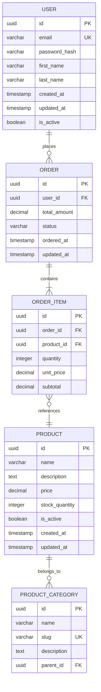

````markdown
<!-- reference @.gaia/designs/design.md -->
<!-- reference @.gaia/designs/2-class.md -->
<!-- reference @.gaia/designs/7-infrastructure.md -->

[<< Back](./design.md)

# Data Architecture

Complete data design including database schema, migrations, caching, and data lifecycle management.

## Template Guidance

**Purpose**: Define data models, storage strategies, access patterns, and data lifecycle management
**Focus**: Database schema, migrations, caching, data integrity, backup/recovery, data governance
**Avoid**: Implementation code, specific vendor details, deployment configuration

**Guidelines**: Normalization, scalability, performance optimization, data integrity, ACID compliance

## Data Architecture Overview

**Database Type**: [Relational (PostgreSQL/MySQL) / NoSQL (MongoDB/DynamoDB) / Hybrid]
**Caching Layer**: [Redis / Memcached / None]
**Search Engine**: [Elasticsearch / Solr / None]
**Data Warehouse**: [Redshift / BigQuery / Snowflake / None]
**Message Queue**: [RabbitMQ / Kafka / SQS / None]

**Data Principles**:
- **Data Integrity**: Enforce constraints and validation at database level
- **Normalization**: Reduce redundancy (3NF minimum for transactional data)
- **Scalability**: Design for growth (partitioning, sharding strategies)
- **Performance**: Optimize for common query patterns
- **Security**: Encryption, access control, audit trails

## Database Schema Design

### Entity-Relationship Model

**Core Entities**:


### Table Specifications

**Users Table**:
```sql
CREATE TABLE users (
    id UUID PRIMARY KEY DEFAULT gen_random_uuid(),
    email VARCHAR(255) NOT NULL UNIQUE,
    password_hash VARCHAR(255) NOT NULL,
    first_name VARCHAR(100),
    last_name VARCHAR(100),
    is_active BOOLEAN DEFAULT true,
    created_at TIMESTAMP DEFAULT CURRENT_TIMESTAMP,
    updated_at TIMESTAMP DEFAULT CURRENT_TIMESTAMP,

    CONSTRAINT email_format CHECK (email ~* '^[A-Za-z0-9._%+-]+@[A-Za-z0-9.-]+\.[A-Z|a-z]{2,}$')
);

CREATE INDEX idx_users_email ON users(email);
CREATE INDEX idx_users_created_at ON users(created_at);
```

**Orders Table**:
```sql
CREATE TABLE orders (
    id UUID PRIMARY KEY DEFAULT gen_random_uuid(),
    user_id UUID NOT NULL REFERENCES users(id) ON DELETE RESTRICT,
    total_amount DECIMAL(10, 2) NOT NULL,
    status VARCHAR(50) NOT NULL DEFAULT 'pending',
    ordered_at TIMESTAMP DEFAULT CURRENT_TIMESTAMP,
    updated_at TIMESTAMP DEFAULT CURRENT_TIMESTAMP,

    CONSTRAINT status_values CHECK (status IN ('pending', 'processing', 'shipped', 'delivered', 'cancelled')),
    CONSTRAINT positive_amount CHECK (total_amount >= 0)
);

CREATE INDEX idx_orders_user_id ON orders(user_id);
CREATE INDEX idx_orders_status ON orders(status);
CREATE INDEX idx_orders_ordered_at ON orders(ordered_at DESC);
```

**Order Items Table**:
```sql
CREATE TABLE order_items (
    id UUID PRIMARY KEY DEFAULT gen_random_uuid(),
    order_id UUID NOT NULL REFERENCES orders(id) ON DELETE CASCADE,
    product_id UUID NOT NULL REFERENCES products(id) ON DELETE RESTRICT,
    quantity INTEGER NOT NULL,
    unit_price DECIMAL(10, 2) NOT NULL,
    subtotal DECIMAL(10, 2) NOT NULL,

    CONSTRAINT positive_quantity CHECK (quantity > 0),
    CONSTRAINT positive_prices CHECK (unit_price >= 0 AND subtotal >= 0),
    CONSTRAINT valid_subtotal CHECK (subtotal = quantity * unit_price)
);

CREATE INDEX idx_order_items_order_id ON order_items(order_id);
CREATE INDEX idx_order_items_product_id ON order_items(product_id);
```

### Data Constraints & Validation

**Primary Keys**:
- **Type**: UUID for distributed systems, auto-increment for single-database systems
- **Benefits**: Globally unique, no collision risk, security (non-sequential)

**Foreign Keys**:
- **ON DELETE CASCADE**: Child records deleted with parent (order_items → orders)
- **ON DELETE RESTRICT**: Prevent deletion if references exist (orders → users)
- **ON DELETE SET NULL**: Nullify references (optional relationships)

**Check Constraints**:
- Email format validation
- Enum value validation (order status)
- Business rule enforcement (positive amounts, valid calculations)

**Unique Constraints**:
- Single column: Email, username, slug
- Composite: (user_id, product_id) for unique user-product combinations

## Indexing Strategy

### Index Types

**B-Tree Indexes** (Default):
```sql
-- Single column indexes for frequent WHERE/ORDER BY
CREATE INDEX idx_users_email ON users(email);
CREATE INDEX idx_orders_created_at ON orders(created_at DESC);

-- Composite indexes for multi-column queries
CREATE INDEX idx_orders_user_status ON orders(user_id, status);
```

**Partial Indexes**:
```sql
-- Index only active records
CREATE INDEX idx_active_users ON users(email) WHERE is_active = true;

-- Index only pending/processing orders
CREATE INDEX idx_open_orders ON orders(user_id, created_at)
WHERE status IN ('pending', 'processing');
```

**Full-Text Search Indexes**:
```sql
-- PostgreSQL full-text search
CREATE INDEX idx_products_search ON products
USING gin(to_tsvector('english', name || ' ' || description));
```

**Index Optimization Guidelines**:
- Index foreign keys for JOIN performance
- Index columns used in WHERE, ORDER BY, GROUP BY
- Composite indexes: Most selective column first
- Avoid over-indexing: Each index has write overhead
- Monitor query plans: Use EXPLAIN ANALYZE

## Data Access Patterns

### Query Optimization

**Common Queries**:
```sql
-- Get user with recent orders (optimized with indexes)
SELECT u.*, o.*
FROM users u
LEFT JOIN orders o ON u.id = o.user_id
WHERE u.email = 'user@example.com'
  AND o.ordered_at > NOW() - INTERVAL '30 days'
ORDER BY o.ordered_at DESC;

-- Get order with items and product details
SELECT o.*, oi.*, p.name, p.price
FROM orders o
JOIN order_items oi ON o.id = oi.order_id
JOIN products p ON oi.product_id = p.id
WHERE o.id = '123e4567-e89b-12d3-a456-426614174000';

-- Get products by category with stock
SELECT p.*, c.name AS category_name
FROM products p
JOIN product_category c ON p.category_id = c.id
WHERE c.slug = 'electronics'
  AND p.stock_quantity > 0
  AND p.is_active = true
ORDER BY p.created_at DESC
LIMIT 20 OFFSET 0;
```

**Query Performance Targets**:
- Simple queries (single table): < 10ms
- Join queries (2-3 tables): < 50ms
- Complex queries (4+ tables): < 200ms
- Full-text search: < 100ms

### Pagination Strategy

**Offset-Based Pagination** (Simple, but slow for large offsets):
```sql
SELECT * FROM products
ORDER BY created_at DESC
LIMIT 20 OFFSET 40;  -- Page 3
```

**Cursor-Based Pagination** (Efficient for large datasets):
```sql
-- First page
SELECT * FROM products
ORDER BY created_at DESC, id
LIMIT 20;

-- Next page (cursor = last item's created_at and id)
SELECT * FROM products
WHERE (created_at, id) < ('2025-11-20 10:00:00', 'last-uuid')
ORDER BY created_at DESC, id
LIMIT 20;
```

## Caching Strategy

### Caching Layers

**Application-Level Caching** (Redis):
- **Session Data**: User sessions and authentication tokens
- **Frequently Accessed Data**: User profiles, product catalog
- **Computed Results**: Expensive calculations, aggregations
- **Rate Limiting**: API rate limit counters

**Database Query Caching**:
- **Read Replicas**: Route read queries to replicas
- **Materialized Views**: Pre-computed aggregations
- **Query Result Caching**: Database-level query cache

**CDN Caching**:
- **Static Assets**: Images, CSS, JavaScript
- **API Responses**: Cacheable GET requests with cache headers

### Cache Patterns

**Cache-Aside (Lazy Loading)**:
```
1. Check cache for data
2. If cache hit: Return cached data
3. If cache miss:
   a. Query database
   b. Store result in cache
   c. Return data
```

**Write-Through**:
```
1. Write to database
2. Write to cache
3. Return success
```

**Write-Behind (Write-Back)**:
```
1. Write to cache
2. Return success immediately
3. Asynchronously write to database (batched)
```

### Cache Invalidation

**TTL-Based Expiration**:
- **Short TTL**: Frequently changing data (30s - 5min)
- **Medium TTL**: Semi-static data (15min - 1hr)
- **Long TTL**: Rarely changing data (1hr - 24hr)

**Event-Based Invalidation**:
```
When user profile updated:
  - Invalidate cache key: user:{user_id}:profile
  - Invalidate cache key: user:{user_id}:orders

When product updated:
  - Invalidate cache key: product:{product_id}
  - Invalidate cache key: category:{category_id}:products
```

**Cache Keys Structure**:
```
user:{user_id}:profile
user:{user_id}:orders
product:{product_id}
category:{category_id}:products:page:{page_number}
search:{query_hash}
```

## Database Migrations

### Migration Strategy

**Migration Tool**: [Flyway / Liquibase / Entity Framework Migrations / Alembic]

**Migration Principles**:
- **Version Control**: All migrations in source control
- **Forward-Only**: No rollback migrations (use new migration to fix)
- **Idempotent**: Safe to run multiple times
- **Tested**: Test on staging before production
- **Backwards Compatible**: Don't break running application versions

### Migration File Structure

```
migrations/
├── V001__initial_schema.sql
├── V002__add_users_table.sql
├── V003__add_orders_table.sql
├── V004__add_products_index.sql
├── V005__alter_users_add_phone.sql
└── V006__create_audit_log_table.sql
```

**Migration Example** (V005):
```sql
-- V005__alter_users_add_phone.sql
-- Add phone number field to users table

ALTER TABLE users
ADD COLUMN phone VARCHAR(20);

CREATE INDEX idx_users_phone ON users(phone) WHERE phone IS NOT NULL;

COMMENT ON COLUMN users.phone IS 'User phone number in E.164 format';
```

### Breaking Change Migrations

**Multi-Phase Migration** (Rename column without downtime):
```sql
-- Phase 1: Add new column
ALTER TABLE users ADD COLUMN new_name VARCHAR(255);

-- Phase 2: Backfill data (in application code over time)
UPDATE users SET new_name = old_name WHERE new_name IS NULL;

-- Phase 3: Make new column NOT NULL (after backfill complete)
ALTER TABLE users ALTER COLUMN new_name SET NOT NULL;

-- Phase 4: Drop old column (after all app instances updated)
ALTER TABLE users DROP COLUMN old_name;
```

## Data Partitioning & Sharding

### Horizontal Partitioning

**Range Partitioning** (by date):
```sql
-- Partition orders by month
CREATE TABLE orders (
    id UUID,
    user_id UUID,
    ordered_at TIMESTAMP,
    ...
) PARTITION BY RANGE (ordered_at);

CREATE TABLE orders_2025_01 PARTITION OF orders
    FOR VALUES FROM ('2025-01-01') TO ('2025-02-01');

CREATE TABLE orders_2025_02 PARTITION OF orders
    FOR VALUES FROM ('2025-02-01') TO ('2025-03-01');
```

**Hash Partitioning** (by user_id):
```sql
CREATE TABLE user_events (
    id UUID,
    user_id UUID,
    event_type VARCHAR(50),
    ...
) PARTITION BY HASH (user_id);

CREATE TABLE user_events_0 PARTITION OF user_events
    FOR VALUES WITH (MODULUS 4, REMAINDER 0);

CREATE TABLE user_events_1 PARTITION OF user_events
    FOR VALUES WITH (MODULUS 4, REMAINDER 1);
```

### Database Sharding

**Sharding Strategy**: [User-based / Geographic / Hash-based]

**Shard Key Selection**:
- **Good Shard Keys**: user_id, tenant_id, geographic_region
- **Poor Shard Keys**: timestamp, sequential IDs (unbalanced distribution)

**Shard Routing**:
```
Request → Shard Router → Determine Shard (hash user_id) → Query Specific Shard
```

**Cross-Shard Queries**: Minimize with denormalization or lookup tables

## Backup & Recovery

### Backup Strategy

**Full Backups**:
- **Frequency**: Daily at 2 AM UTC
- **Retention**: 30 days
- **Storage**: Cross-region replication (S3 / Azure Blob)

**Incremental Backups**:
- **Frequency**: Every 6 hours
- **Method**: Transaction log backups
- **Retention**: 7 days

**Point-in-Time Recovery**:
- **Granularity**: 5-minute intervals
- **Retention**: 7 days
- **Use Case**: Recover from accidental data deletion

### Backup Testing

**Recovery Drills**:
- **Frequency**: Monthly
- **Scenarios**: Full restore, point-in-time recovery, single table restore
- **Validation**: Data integrity checks, application functionality tests

**Backup Validation**:
- Automated backup integrity checks
- Test restores to isolated environment
- Verify backup completeness and consistency

### Data Retention & Archival

**Retention Policies**:
- **Active Data**: Last 12 months in primary database
- **Archived Data**: 1-7 years in cold storage (S3 Glacier)
- **Deleted Data**: Soft delete with 30-day grace period

**Archival Process**:
```sql
-- Move old orders to archive table
INSERT INTO orders_archive
SELECT * FROM orders
WHERE ordered_at < NOW() - INTERVAL '12 months';

DELETE FROM orders
WHERE ordered_at < NOW() - INTERVAL '12 months';
```

## Data Governance & Compliance

### Data Classification

**Classification Levels**:
- **Public**: Marketing content, product information
- **Internal**: Business data, analytics
- **Confidential**: User PII, financial data
- **Restricted**: Payment details, health records

**Handling Requirements**:
| Level | Encryption at Rest | Encryption in Transit | Access Logging | Retention |
|-------|-------------------|----------------------|----------------|-----------|
| Public | Optional | Recommended | No | Indefinite |
| Internal | Recommended | Required | Basic | Per policy |
| Confidential | Required | Required | Detailed | Minimal necessary |
| Restricted | Required (key isolation) | Required | Comprehensive | Minimal necessary |

### PII Management

**Personal Identifiable Information**:
- Email, phone, full name, address
- IP address, device identifiers
- Payment information

**GDPR/Privacy Requirements**:
- **Data Minimization**: Collect only necessary data
- **Consent Tracking**: Record user consent for data collection
- **Right to Access**: Export all user data on request
- **Right to Erasure**: Delete user data on request
- **Data Portability**: Provide data in machine-readable format

**Anonymization**:
```sql
-- Anonymize user data after account deletion
UPDATE users
SET
    email = 'deleted_' || id || '@example.com',
    first_name = 'Deleted',
    last_name = 'User',
    phone = NULL
WHERE id = 'user-id-to-delete';
```

## Data Quality & Integrity

### Data Validation

**Database-Level Validation**:
- Check constraints on column values
- Foreign key constraints for referential integrity
- Unique constraints for data uniqueness
- Triggers for complex validation rules

**Application-Level Validation**:
- Input validation before database operations
- Business rule enforcement
- Cross-field validation

### Data Auditing

**Audit Log Table**:
```sql
CREATE TABLE audit_log (
    id UUID PRIMARY KEY DEFAULT gen_random_uuid(),
    table_name VARCHAR(100) NOT NULL,
    record_id UUID NOT NULL,
    action VARCHAR(10) NOT NULL,  -- INSERT, UPDATE, DELETE
    user_id UUID,
    changed_data JSONB,
    created_at TIMESTAMP DEFAULT CURRENT_TIMESTAMP,

    CONSTRAINT action_values CHECK (action IN ('INSERT', 'UPDATE', 'DELETE'))
);

CREATE INDEX idx_audit_log_table_record ON audit_log(table_name, record_id);
CREATE INDEX idx_audit_log_user ON audit_log(user_id);
CREATE INDEX idx_audit_log_created_at ON audit_log(created_at);
```

**Audit Trigger Example**:
```sql
CREATE OR REPLACE FUNCTION audit_trigger_function()
RETURNS TRIGGER AS $$
BEGIN
    IF (TG_OP = 'DELETE') THEN
        INSERT INTO audit_log (table_name, record_id, action, changed_data)
        VALUES (TG_TABLE_NAME, OLD.id, 'DELETE', row_to_json(OLD));
        RETURN OLD;
    ELSIF (TG_OP = 'UPDATE') THEN
        INSERT INTO audit_log (table_name, record_id, action, changed_data)
        VALUES (TG_TABLE_NAME, NEW.id, 'UPDATE', row_to_json(NEW));
        RETURN NEW;
    ELSIF (TG_OP = 'INSERT') THEN
        INSERT INTO audit_log (table_name, record_id, action, changed_data)
        VALUES (TG_TABLE_NAME, NEW.id, 'INSERT', row_to_json(NEW));
        RETURN NEW;
    END IF;
END;
$$ LANGUAGE plpgsql;
```

## Validation Checklist

**Schema Design**:
- [ ] ERD complete with all entities and relationships
- [ ] Primary keys defined (UUID or auto-increment)
- [ ] Foreign keys with appropriate cascade rules
- [ ] Check constraints for business rules
- [ ] Appropriate data types and constraints

**Indexing**:
- [ ] Indexes on foreign keys
- [ ] Indexes on frequently queried columns
- [ ] Composite indexes for multi-column queries
- [ ] Partial indexes for filtered queries

**Caching**:
- [ ] Caching strategy defined (cache-aside, write-through)
- [ ] Cache invalidation strategy documented
- [ ] TTL values appropriate for data volatility
- [ ] Cache keys structured consistently

**Migrations**:
- [ ] Migration tool selected and configured
- [ ] Migration versioning strategy defined
- [ ] Backwards-compatible migration approach
- [ ] Migration testing process documented

**Backup**:
- [ ] Full backup schedule defined
- [ ] Incremental backup strategy
- [ ] Point-in-time recovery capability
- [ ] Backup testing schedule established

**Compliance**:
- [ ] Data classification levels defined
- [ ] PII handling requirements documented
- [ ] Data retention policies established
- [ ] GDPR/privacy compliance implemented (if applicable)

**Instructions**:
1. Design complete ERD with all entities and relationships
2. Define table schemas with constraints and validation
3. Plan indexing strategy for query optimization
4. Design caching layers and invalidation strategy
5. Establish database migration approach
6. Plan partitioning/sharding for scalability (if needed)
7. Define backup, recovery, and archival strategies
8. Implement data governance and compliance requirements

[<< Back](./design.md)

````
