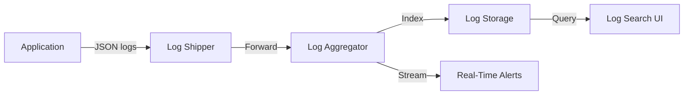
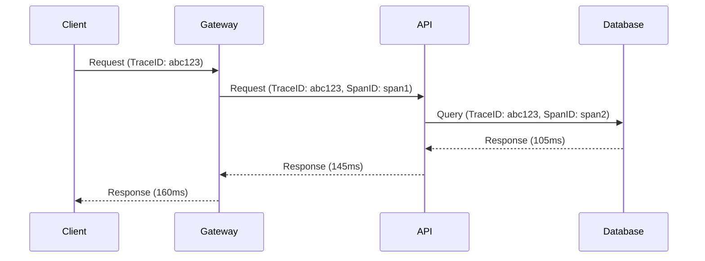
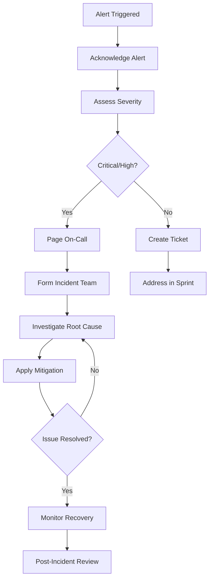

````markdown
<!-- reference @.gaia/designs/design.md -->
<!-- reference @.gaia/designs/7-infrastructure.md -->

[<< Back](./design.md)

# Observability & Monitoring

Comprehensive monitoring, logging, tracing, and alerting for production systems.

## Template Guidance

**Purpose**: Define monitoring strategy, logging architecture, distributed tracing, and incident response
**Focus**: Observability pillars (logs, metrics, traces), alerting, dashboards, runbooks
**Avoid**: Implementation code, specific tool configurations, deployment details

**Guidelines**: Three pillars of observability, proactive monitoring, actionable alerts, SLO-driven

## Observability Overview

**Observability Pillars**:
- **Logs**: Discrete events with context (what happened)
- **Metrics**: Numerical measurements over time (how much/many)
- **Traces**: Request flows through distributed systems (journey mapping)

**Monitoring Stack**: [Prometheus + Grafana / ELK / Datadog / New Relic / Azure Monitor]

**Observability Principles**:
- **High Cardinality**: Support rich dimensional data
- **Unified Context**: Correlate logs, metrics, and traces
- **Real-Time**: Near-instant visibility into system state
- **Actionable**: Every alert must be actionable with clear remediation
- **Cost-Aware**: Balance observability needs with infrastructure costs

## Logging Architecture

### Structured Logging

**Log Format**: JSON structured logs for machine readability

**Standard Log Structure**:
```json
{
  "timestamp": "2025-11-20T10:30:00.123Z",
  "level": "INFO",
  "service": "api-service",
  "version": "2.1.0",
  "environment": "production",
  "traceId": "550e8400-e29b-41d4-a716-446655440000",
  "spanId": "6ba7b810-9dad-11d1-80b4-00c04fd430c8",
  "userId": "user-123",
  "message": "Order created successfully",
  "metadata": {
    "orderId": "order-456",
    "amount": 99.99,
    "duration_ms": 145
  },
  "error": null
}
```

**Log Levels**:
- **TRACE**: Very detailed debugging (disabled in production)
- **DEBUG**: Detailed debugging information (minimal in production)
- **INFO**: General informational messages (default production level)
- **WARN**: Warning messages, potential issues (actionable)
- **ERROR**: Error events that allow continued operation
- **FATAL**: Critical errors causing application shutdown

### Log Categories

**Application Logs**:
- API request/response (method, path, status, duration)
- Business logic events (order created, payment processed)
- Authentication/authorization attempts
- External service calls (success, failure, latency)

**Security Logs**:
- Authentication attempts (success/failure)
- Authorization checks (granted/denied)
- Data access (PII, sensitive data)
- Security events (suspicious activity, rate limit exceeded)

**Audit Logs**:
- Data mutations (create, update, delete)
- Configuration changes
- User actions requiring accountability
- Administrative operations

**Performance Logs**:
- Query execution times
- External API call latencies
- Resource utilization
- Cache hit/miss rates

### Log Aggregation & Storage

**Log Pipeline**:


**Log Storage Strategy**:
- **Hot Storage**: Last 7 days in Elasticsearch/CloudWatch (fast search)
- **Warm Storage**: 8-30 days in cheaper storage tier
- **Cold Storage**: 31-365 days in S3/Blob Storage (archive)
- **Retention**: Purge logs older than 1 year (or per compliance)

**Log Sampling** (High-Volume Services):
- **INFO logs**: 10% sample rate for high-traffic endpoints
- **WARN/ERROR logs**: 100% retention (never sample errors)
- **Trace logs**: Enabled only for debugging with targeted sampling

### Log Security & Privacy

**PII Redaction**:
```json
{
  "message": "User login successful",
  "userId": "user-123",
  "email": "[REDACTED]",
  "ipAddress": "192.168.x.x"
}
```

**Secret Masking**:
- Never log passwords, tokens, API keys
- Mask credit card numbers (show last 4 digits only)
- Redact sensitive fields automatically

## Metrics & Time-Series Data

### Metric Categories

**RED Metrics** (Request-focused services):
- **Rate**: Requests per second
- **Errors**: Error rate (% of failed requests)
- **Duration**: Response time distribution (p50, p95, p99)

**USE Metrics** (Resource-focused systems):
- **Utilization**: % of resource capacity used (CPU, memory, disk)
- **Saturation**: Work queued but not yet processed
- **Errors**: Error count and rate

**Business Metrics**:
- **Orders per minute**: Business transaction rate
- **Revenue per hour**: Business value generation
- **Active users**: Current system utilization
- **Conversion rate**: Business outcome success

### Key Performance Indicators (KPIs)

**Application Metrics**:
```
# HTTP request metrics
http_requests_total{method="GET", endpoint="/api/users", status="200"}
http_request_duration_seconds{method="GET", endpoint="/api/users"}

# Database metrics
db_query_duration_seconds{operation="SELECT", table="users"}
db_connection_pool_size{state="active|idle|waiting"}

# Cache metrics
cache_hits_total{cache="redis", key_prefix="user"}
cache_misses_total{cache="redis", key_prefix="user"}

# External service metrics
external_api_calls_total{service="payment-gateway", status="success|failure"}
external_api_duration_seconds{service="payment-gateway"}
```

**Infrastructure Metrics**:
```
# CPU and Memory
cpu_usage_percent{host="web-server-1"}
memory_usage_bytes{host="web-server-1"}

# Disk I/O
disk_io_bytes_read{device="/dev/sda"}
disk_io_bytes_written{device="/dev/sda"}

# Network
network_bytes_sent{interface="eth0"}
network_bytes_received{interface="eth0"}
```

**Custom Business Metrics**:
```
# Business-specific metrics
orders_created_total{product_category="electronics"}
revenue_total_dollars{payment_method="credit_card"}
user_registrations_total{source="organic|referral"}
```

### Metric Collection

**Instrumentation Approach**:
- **Application Instrumentation**: Custom metrics in application code
- **Sidecar Agents**: Collect infrastructure metrics alongside containers
- **Service Mesh**: Automatic metric collection for service-to-service calls
- **Synthetic Monitoring**: Proactive health checks and availability testing

**Collection Frequency**:
- **High-frequency**: 10s intervals for critical metrics
- **Standard**: 60s intervals for most metrics
- **Low-frequency**: 5min intervals for less critical metrics

## Distributed Tracing

### Trace Architecture

**Trace Context Propagation**:


**Trace Components**:
- **Trace ID**: Unique identifier for entire request flow
- **Span ID**: Unique identifier for each operation within trace
- **Parent Span ID**: Links spans into hierarchical structure
- **Timing**: Start time and duration of each span
- **Tags**: Key-value metadata (http.method, db.statement)
- **Logs**: Events that occurred within span

### Span Instrumentation

**Auto-Instrumentation**:
- HTTP clients and servers
- Database queries
- Message queue operations
- External service calls

**Manual Instrumentation**:
```javascript
// Example: Custom span for business logic
const span = tracer.startSpan('process_order', {
  childOf: parentSpan,
  tags: {
    'order.id': orderId,
    'order.amount': amount,
    'user.id': userId
  }
});

try {
  const result = await processOrderLogic(orderId);
  span.setTag('order.status', result.status);
  return result;
} catch (error) {
  span.setTag('error', true);
  span.log({ event: 'error', message: error.message });
  throw error;
} finally {
  span.finish();
}
```

**Sampling Strategy**:
- **Always Sample**: Error traces (100%)
- **High Priority**: Authentication, payment, checkout (100%)
- **Standard Traffic**: 10% sample rate
- **Health Checks**: 1% sample rate

## Alerting Strategy

### Alert Design Principles

**Actionable Alerts**:
- Every alert must have clear remediation steps
- Include context (runbook link, recent changes)
- Avoid alert fatigue (tune thresholds carefully)
- Route to appropriate on-call team

**Alert Severity Levels**:
- **Critical (P0)**: Immediate response required, customer impact
- **High (P1)**: Urgent, potential customer impact within 1 hour
- **Medium (P2)**: Important, address within business hours
- **Low (P3)**: Informational, no immediate action required

### Alert Rules

**Availability Alerts**:
```
# Service down
CRITICAL: http_up{job="api-service"} == 0
Duration: 2 minutes
Action: Immediate investigation, page on-call

# High error rate
HIGH: rate(http_requests_total{status=~"5.."}[5m]) > 0.05
Duration: 5 minutes
Action: Investigate error logs, check dependencies
```

**Performance Alerts**:
```
# API latency degradation
HIGH: histogram_quantile(0.95, http_request_duration_seconds) > 1.0
Duration: 10 minutes
Action: Check database performance, external services

# Database slow queries
MEDIUM: db_query_duration_seconds > 5.0
Duration: 15 minutes
Action: Review slow query log, optimize queries
```

**Resource Alerts**:
```
# High CPU usage
HIGH: cpu_usage_percent > 80
Duration: 15 minutes
Action: Scale horizontally or investigate CPU-intensive processes

# High memory usage
HIGH: memory_usage_percent > 90
Duration: 10 minutes
Action: Check for memory leaks, scale resources

# Disk space low
CRITICAL: disk_usage_percent > 90
Duration: 5 minutes
Action: Clean up logs, expand storage, investigate growth
```

**Business Metric Alerts**:
```
# Order processing stopped
CRITICAL: rate(orders_created_total[10m]) == 0
Duration: 10 minutes
Action: Check payment gateway, API availability

# Revenue drop
HIGH: rate(revenue_total_dollars[1h]) < threshold
Duration: 1 hour
Action: Check conversion funnel, investigate user experience issues
```

### Alert Routing

**Notification Channels**:
- **Critical/High**: PagerDuty/Opsgenie (immediate)
- **Medium**: Slack/Teams (business hours)
- **Low**: Email digest (daily summary)

**On-Call Schedule**:
- 24/7 on-call rotation for critical systems
- Escalation policy: Primary → Secondary → Manager
- Alert acknowledgment within 5 minutes (critical)

## Dashboards & Visualization

### Dashboard Categories

**System Health Dashboard**:
- Overall system status (green/yellow/red)
- Service uptime percentages
- Error rate trends
- Request rate and latency

**Application Performance Dashboard**:
- RED metrics for each service
- Dependency health (database, cache, external APIs)
- Top slow endpoints
- Error breakdown by type/endpoint

**Infrastructure Dashboard**:
- CPU, memory, disk, network utilization
- Container/pod counts and health
- Database connection pool metrics
- Load balancer metrics

**Business Metrics Dashboard**:
- Revenue and order trends
- User activity (registrations, logins, active users)
- Conversion funnel visualization
- Feature adoption rates

### Dashboard Best Practices

**Layout Principles**:
- **Top Section**: Critical health indicators (red/yellow/green)
- **Middle Section**: Key metrics and trends
- **Bottom Section**: Detailed breakdowns and drill-downs
- **Time Range**: Last 1 hour (default), with flexible time picker

**Visualization Types**:
- **Gauges**: Current state (CPU usage, error rate)
- **Line Charts**: Trends over time (request rate, latency)
- **Heatmaps**: Distribution (latency percentiles)
- **Tables**: Detailed breakdowns (top errors, slow queries)

## Service Level Objectives (SLOs)

### SLO Definitions

**Availability SLO**:
```
Target: 99.9% uptime (8.76 hours downtime/year)
Measurement: Successful requests / Total requests
Time Window: 30-day rolling window
```

**Latency SLO**:
```
Target: 95% of requests < 200ms
Measurement: p95 response time
Time Window: 7-day rolling window
```

**Error Rate SLO**:
```
Target: < 0.1% error rate
Measurement: Failed requests / Total requests
Time Window: 24-hour rolling window
```

### Error Budget

**Error Budget Calculation**:
```
Allowed downtime per month (99.9% SLO): 43.2 minutes
Error budget remaining: 43.2min - actual_downtime
Error budget consumed: (actual_downtime / 43.2min) * 100%
```

**Error Budget Policy**:
- **Budget > 50%**: Normal feature development velocity
- **Budget 20-50%**: Focus on reliability, defer risky features
- **Budget < 20%**: Feature freeze, all hands on reliability
- **Budget exhausted**: Incident post-mortem, reliability sprint

## Incident Management

### Incident Response Workflow



### Runbooks

**Runbook Structure**:
```markdown
# Runbook: API Service High Latency

## Symptoms
- p95 response time > 1 second
- Users reporting slow page loads
- Alert: "API_HIGH_LATENCY" fired

## Impact
- Degraded user experience
- Potential timeout errors
- Estimated affected users: [XX%]

## Investigation Steps
1. Check database performance dashboard
   - Query: SELECT * FROM slow_queries WHERE duration > 1s
2. Review application logs for errors
   - Grafana: [Link to relevant dashboard]
3. Check external service health
   - Payment gateway status page: [URL]

## Common Causes
- Database slow queries
- External service degradation
- Memory pressure causing GC pauses
- Network latency spikes

## Mitigation Steps
1. Scale application horizontally: `kubectl scale deployment api --replicas=10`
2. Restart stuck pods: `kubectl rollout restart deployment api`
3. Clear cache if stale: `redis-cli FLUSHDB`
4. Increase database connection pool: [Config change link]

## Rollback Procedure
1. Revert to previous version: `kubectl rollout undo deployment api`
2. Verify latency returns to normal
3. Create incident ticket for root cause analysis

## Post-Incident
- Document timeline in incident report
- Schedule blameless post-mortem within 48 hours
- Update runbook with lessons learned
```

### Post-Incident Reviews

**Post-Mortem Template**:
1. **Incident Summary**: What happened, when, impact
2. **Timeline**: Detailed chronology of events
3. **Root Cause**: Technical root cause analysis
4. **Contributing Factors**: What made this possible/worse
5. **Resolution**: How was it resolved
6. **Action Items**: Preventive measures (assigned owners, due dates)
7. **Lessons Learned**: What we learned, what we'll do differently

**Blameless Culture**:
- Focus on systemic improvements, not individual blame
- Psychological safety to discuss failures openly
- Celebrate learning from incidents

## Synthetic Monitoring

### Health Checks

**Endpoint Monitoring**:
```
# Liveness probe (is service running?)
GET /health/live
Expected: 200 OK, response < 1s

# Readiness probe (is service ready for traffic?)
GET /health/ready
Expected: 200 OK, checks database/cache connectivity

# Startup probe (has service completed initialization?)
GET /health/startup
Expected: 200 OK after initialization complete
```

**Multi-Region Monitoring**:
- Health checks from multiple geographic locations
- DNS resolution verification
- SSL certificate expiration monitoring
- Latency testing from user regions

### Synthetic Transactions

**Critical User Flows**:
```
# Order placement flow
1. Login with test user
2. Add product to cart
3. Proceed to checkout
4. Complete payment (test mode)
5. Verify order confirmation
Frequency: Every 5 minutes
Alert: If failure rate > 10% over 15 minutes
```

**API Contract Testing**:
- Validate API responses match schema
- Test authentication flows
- Verify rate limiting behavior
- Check error handling

## Validation Checklist

**Logging**:
- [ ] Structured JSON logging implemented
- [ ] Log levels appropriate (INFO in production)
- [ ] PII redaction and secret masking
- [ ] Log aggregation and retention strategy

**Metrics**:
- [ ] RED/USE metrics instrumented
- [ ] Business metrics tracked
- [ ] Custom metrics for critical paths
- [ ] Metric retention and aggregation rules

**Tracing**:
- [ ] Distributed tracing implemented
- [ ] Trace sampling strategy defined
- [ ] Critical paths fully instrumented
- [ ] Trace retention policy established

**Alerting**:
- [ ] Actionable alerts with runbooks
- [ ] Alert severity and routing defined
- [ ] On-call schedule established
- [ ] Alert fatigue minimized (tuned thresholds)

**Dashboards**:
- [ ] System health dashboard created
- [ ] Application performance dashboard
- [ ] Infrastructure monitoring dashboard
- [ ] Business metrics dashboard

**SLOs**:
- [ ] Availability SLO defined and tracked
- [ ] Latency SLO defined and tracked
- [ ] Error budget calculated and monitored
- [ ] Error budget policy established

**Incident Management**:
- [ ] Incident response workflow defined
- [ ] Runbooks created for common incidents
- [ ] Post-incident review process established
- [ ] Blameless culture promoted

**Instructions**:
1. Implement structured logging with PII redaction
2. Instrument RED/USE metrics for all services
3. Set up distributed tracing with appropriate sampling
4. Create actionable alerts with clear runbooks
5. Build dashboards for system health and business metrics
6. Define and track SLOs with error budgets
7. Establish incident response workflow and runbooks
8. Implement synthetic monitoring for critical user flows

[<< Back](./design.md)

````
