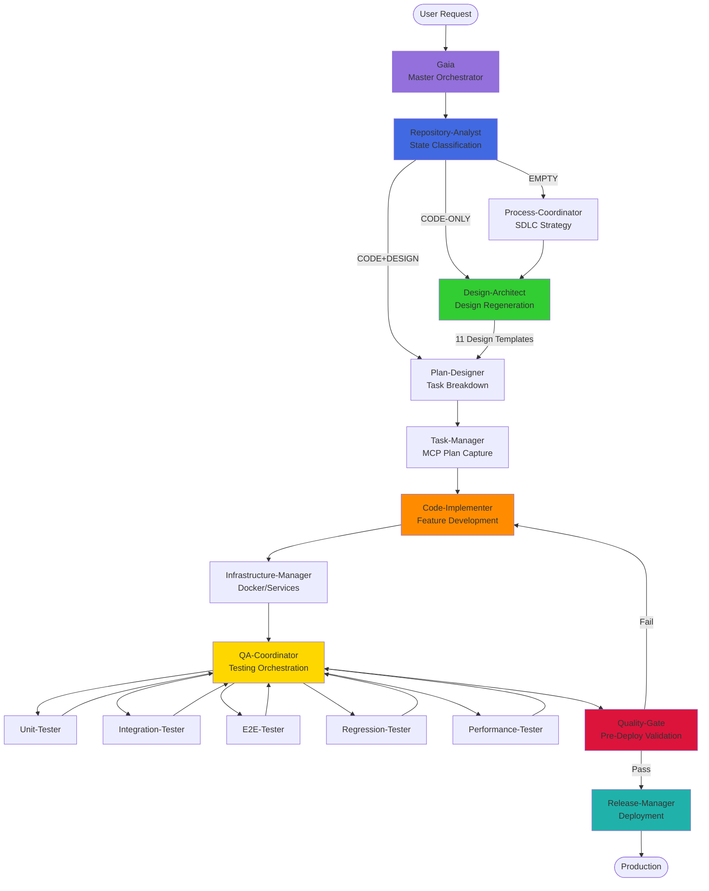

<p align="center">
  
</p>

<h1 align="center">
  <b>GAIA</b>
</h1>
<h3 align="center">🌍 Autonomous AI Software Development Framework</h3>

**A spec-driven AI framework that orchestrates 22 specialized agents to build production-ready applications through design-first development.**

[](https://opensource.org/licenses/MIT)
[]()
[]()
[]()
[]()

## 📋 Requirements

- **AI Assistant**: GitHub Copilot (with MCP support) or Claude
- **.NET SDK**: .NET 9+ (for Gaia MCP server)
- **Runtime**: Node.js 20+ LTS
- **Containerization**: Docker 24+ & Docker Compose
- **Version Control**: Git 2.40+

## 🎯 What is GAIA?

GAIA is a **spec-driven development framework** that enforces a rigorous ANALYZE → DESIGN → PLAN → IMPLEMENT workflow through orchestrated AI agents. It's built on three pillars:

1. **Design-First Methodology**: 11 comprehensive design templates drive all implementation
2. **Agent Orchestration**: 22 specialized agents handle analysis, design, implementation, testing, and deployment
3. **100% Quality Standards**: Mandatory test coverage, linting, regression validation, and performance benchmarks

### Core Workflow

```
ANALYZE → DESIGN → PLAN → IMPLEMENT
```

- **ANALYZE**: Repository state classification (EMPTY | CODE+DESIGN | CODE-ONLY)
- **DESIGN**: Complete 11 design templates before any code
- **PLAN**: Hierarchical task planning via MCP tools
- **IMPLEMENT**: Code against specs with continuous testing

## 🏗️ Technology Stack

**Default Stack** (customizable per project):
- **Frontend**: React 18+ + TypeScript 5+ + Tailwind CSS + Ant Design
- **Backend**: .NET 9+ + ASP.NET Core + Entity Framework Core
- **Database**: PostgreSQL 15+ with migrations
- **Testing**: xUnit + Vitest + Playwright (100% coverage)
- **Infrastructure**: Docker + GitHub Actions

**Supported Alternatives**: Node.js/Express, Python/FastAPI, various databases and testing frameworks

## 🎭 Agent Architecture

GAIA orchestrates **22 specialized agents** in a coordinated workflow. Each agent has specific responsibilities and communicates via TASK_REQUEST/TASK_RESULT protocols.

### Agent Categories

**🔍 Analysis & Planning**
- **Gaia**: Master orchestrator
- **Repository-Analyst**: Codebase classification
- **Process-Coordinator**: SDLC strategy
- **Plan-Designer**: Task breakdown
- **Task-Manager**: MCP-based task tracking

**🏗️ Design & Architecture**
- **Design-Architect**: System architecture
- **Database-Designer**: Schema design
- **UI-Designer**: UI/UX specifications
- **Security-Specialist**: Security architecture

**🔨 Implementation**
- **Code-Implementer**: Feature development
- **Infrastructure-Manager**: Docker/services

**🧪 Quality Assurance**
- **QA-Coordinator**: Testing orchestration
- **Unit-Tester**: Unit tests (100% coverage)
- **Integration-Tester**: Integration tests
- **E2E-Tester**: End-to-end + visual regression
- **Regression-Tester**: Compatibility validation
- **Performance-Tester**: Performance benchmarks

**🚀 Operations**
- **Quality-Gate**: Pre-deployment validation
- **Release-Manager**: Deployment management
- **Monitoring-Specialist**: Observability & monitoring
- **Documentation-Specialist**: Docs maintenance

> See [AGENTS.md](./AGENTS.md) for complete specifications and [`.gaia/agents/`](./.gaia/agents/) for 22 individual agent files.

### Agent Workflow



**Key Workflow Principles**:
- 🔄 **Iterative Refinement**: Agents iterate until 100% quality metrics achieved
- 🛡️ **Quality Gates**: No progression without passing validation
- 📊 **Real-time Tracking**: MCP tools provide live task status
- 🤝 **Autonomous Collaboration**: Agents resolve issues without user intervention

## 📖 Table of Contents

- [What is GAIA?](#-what-is-gaia)
- [Technology Stack](#️-technology-stack)
- [Agent Architecture](#-agent-architecture)
- [Quick Start](#-quick-start)
- [Design Templates](#-design-templates)
- [MCP Server](#-mcp-server)
- [Best Practices](#-best-practices)
- [Troubleshooting](#-troubleshooting)
- [Community & Support](#-community--support)

## 🚀 Quick Start

### 1. Setup (5 minutes)

```bash
# Clone the repository
git clone https://github.com/YOUR_USERNAME/ai.toolkit.gaia.git
cd ai.toolkit.gaia

# Install prerequisites
# - .NET 9 SDK: https://dotnet.microsoft.com/download
# - Node.js 20+: https://nodejs.org/
# - Docker: https://docs.docker.com/get-docker/
```

### 2. Configure MCP Server

Create `~/.config/copilot/mcp-config.json` (or equivalent for your AI assistant):

```json
{
  "mcpServers": {
    "Gaia": {
      "command": "dotnet",
      "args": [
        "run",
        "--project",
        "/ABSOLUTE/PATH/TO/ai.toolkit.gaia/.gaia/mcps/gaia/src/fa.mcp.gaia/fa.mcp.gaia.csproj"
      ],
      "tools": ["*"],
      "transport": "stdio"
    },
    "playwright": {
      "command": "npx",
      "args": ["@playwright/mcp@latest"],
      "tools": ["*"],
      "transport": "stdio"
    }
  }
}
```

> Replace `/ABSOLUTE/PATH/TO/ai.toolkit.gaia` with your actual path

### 3. Launch GAIA

**Using GitHub Copilot CLI**:
```bash
gh copilot
# Type: /agent
# Select: Gaia
```

**Using Claude Desktop**:
```bash
# Ensure MCP server is configured in Claude Desktop settings
# Mention @Gaia in your conversation
```

### 4. Describe Your Project

```
I want to build [your application description]
- Feature 1
- Feature 2
- [Technical requirements]
```

GAIA will:
1. Analyze repository state
2. Create comprehensive design documents
3. Generate implementation plan
4. Build with 100% test coverage
5. Deploy with Docker

### Example Projects

**E-commerce Platform**:
```
Build an online store with product catalog, shopping cart,
Stripe payments, user accounts, and admin dashboard
```

**Team Chat App**:
```
Create a Slack-like chat with channels, DMs, file sharing,
and real-time presence
```

**Analytics Dashboard**:
```
Build a SaaS analytics platform with custom dashboards,
data visualization, and team collaboration
```

## 📐 Design Templates

GAIA uses 11 comprehensive design templates in `.gaia/designs/` that drive all implementation:

| Template | Purpose |
|----------|---------|
| `1-use-cases.md` | Business requirements and user goals |
| `2-class.md` | Data models and domain structure |
| `3-sequence.md` | Use case execution flows |
| `4-frontend.md` | UI/UX specifications |
| `5-api.md` | API contracts and integration |
| `6-security.md` | Security architecture and auth |
| `7-infrastructure.md` | CI/CD and deployment |
| `8-data.md` | Database schema and migrations |
| `9-observability.md` | Logging, metrics, monitoring |
| `10-scalability.md` | Performance and scaling |
| `11-testing.md` | Testing strategy and coverage |

**Design-First Rule**: All implementation must reference design documents. Agents will **not** proceed to coding without complete design specifications.

## 🔧 MCP Server

The Gaia MCP server provides task planning and memory management capabilities:

**Capabilities**:
- **Task Planning**: Hierarchical task management (Phase → Epic → Story)
- **Memory Management**: Cross-session context and decision tracking
- **Thinking Tools**: Validation and reflection assistance
- **Host Info**: System context for environment awareness

**Location**: `.gaia/mcps/gaia/src/fa.mcp.gaia/`

**Tech Stack**: .NET 9 + Entity Framework Core + SQLite

## ✨ Best Practices

### Project Description Tips

**Be Specific**:
- List all features: "User auth, real-time chat, file uploads, admin dashboard"
- Mention integrations: "Stripe payments, SendGrid emails, AWS S3 storage"
- Define scale: "Support 1000+ concurrent users" or "Small team project"
- Specify platforms: "Web + mobile API" or "Desktop app only"

**Provide Visual Context** (Optional):
- Reference existing apps: "Social features like Discord"
- Share design preferences: "Clean minimalist" or "Rich data-heavy"
- Include screenshots or mockups for UI inspiration

### Quality Standards

All GAIA projects automatically enforce:
- ✅ **100% Test Coverage**: Unit + integration + E2E testing
- ✅ **Zero Build Warnings**: Clean compilation with comprehensive comments
- ✅ **Regression Prevention**: All existing features validated after changes
- ✅ **Performance Benchmarks**: API <200ms, LCP <2.5s
- ✅ **Security Hardening**: Auth, input validation, vulnerability scanning
- ✅ **Visual Regression**: Playwright screenshot comparison at multiple viewports

## 🔧 Troubleshooting

### MCP Server Issues

**MCP Server Not Loading**:
```bash
# Verify .NET installation
dotnet --version  # Should be 9.0+

# Test MCP server directly
cd .gaia/mcps/gaia/src/fa.mcp.gaia
dotnet run
```

**Path Configuration**:
- Use absolute paths in MCP config
- No tilde `~` or environment variables
- Example: `/Users/username/projects/ai.toolkit.gaia/.gaia/mcps/...`

### Container Issues

**Docker Not Starting**:
```bash
docker compose down
docker compose up --build
```

**Port Conflicts**:
- Check `docker-compose.yml` for port mappings
- Modify ports if conflicts exist: `8080:80` → `8081:80`

### Build Failures

**Frontend**:
```bash
npm install
npm run build
```

**Backend**:
```bash
dotnet restore
dotnet build
```

**Missing Prerequisites**:
```bash
node --version    # 20+
dotnet --version  # 9.0+
docker --version  # 24+
```

## 🌍 Community & Support

- **🐛 Issues**: [GitHub Issues](https://github.com/frostaura/ai.toolkit.gaia/issues)
- **💡 Discussions**: [GitHub Discussions](https://github.com/frostaura/ai.toolkit.gaia/discussions)
- **📖 Documentation**: [`.gaia/designs/`](./.gaia/designs/) - 11 comprehensive design templates
- **🤝 Contributing**: [AGENTS.md](./AGENTS.md) - Agent specifications and protocols

## 📄 License

MIT License - see [LICENSE](./LICENSE) for details

## 🙏 Acknowledgments

**Inspiration**: [Conway Osler](https://www.linkedin.com/in/conway-osler)

**Architectural Principles**:
- **iDesign** by Juval Löwy
- **Clean Architecture** by Robert C. Martin
- **Domain-Driven Design** by Eric Evans

---

<p align="center">
  <i>"In Greek mythology, Gaia is the personification of Earth and the ancestral mother of all life.<br/>Through intelligent orchestration, GAIA creates digital ecosystems that serve humanity."</i>
</p>
