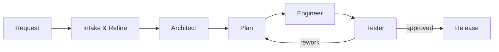

<p align="center">
  
</p>

<h1 align="center"><b>Gaia</b></h1>
<h3 align="center">full-stack apps. enterprise-grade. maintainable. customizable.</h3>
<p align="center"><i>A Claude Code plugin for spec-driven software delivery.</i></p>

---

[]()
[](https://opensource.org/licenses/MIT)
[](https://code.claude.com)

---

## What is Gaia?

Gaia is a **team of AI agents** designed to build and evolve software using **spec-driven development**.
You describe your goal; Gaia coordinates architecture, implementation, testing, documentation and so on.

---

## Install

Gaia ships as a Claude Code plugin. Install from this repo's marketplace:

```bash
claude plugin marketplace add frostaura/ai.toolkit.gaia
claude plugin install gaia@frostaura-gaia
```

For local development of Gaia itself, point Claude Code at the working tree:

```bash
claude plugin marketplace add ./
claude plugin install gaia@frostaura-gaia
```

The plugin manifest lives at `.claude-plugin/plugin.json`. Agents, skills, slash
commands, hooks, and MCP servers are auto-discovered from `agents/`, `skills/`,
`commands/`, `hooks/hooks.json`, and `.mcp.json`.

---

## How Gaia Works (Adaptive Spec-Driven SDLC)

- `docs/` is the **source of truth** for requirements and architecture.
- When a request leaves the stack unspecified, Gaia defaults to latest stable React + TypeScript + Redux Toolkit + Tailwind CSS + shadcn/ui on the frontend, and latest stable .NET + EF Core + PostgreSQL with MCP-exposed API capabilities on the backend.
- **No drift**:
  - If a spec describes a feature, it must exist in code.
  - If code changes behavior, the spec must be updated.
- New work starts with **intake-led refinement** and **solutions architecture**, not direct coding.
- Gaia adapts the SDLC to the **complexity of the task**, but always keeps architecture review, planning, QA, and release validation in the loop.
- Gaia assembles a **virtual team on the fly**: intake orchestrator, solutions architect, implementation planner, software engineer, tester, and release engineer.
- Each agent should get only the tools required for its role so read-only analysis stays read-only and delivery ownership stays clear.
- Agents may call each other directly when prerequisites are satisfied, and the plan should expose safe parallel branches instead of forcing unnecessary serialization.
- Planning happens **after architecture** so the execution tree reflects the target solution, estimates, dependencies, QA work, and CI or deployment gates.
- QA is always present in the process and can veto weak completion claims.


```mermaid
flowchart LR
    Request[Request] --> Intake[Intake & Refine]
    Intake --> Design[Architect]
    Design --> Plan[Plan]
    Plan --> Build[Engineer]
    Build --> Test[Tester]
    Test -->|rework| Plan
    Test -->|approved| Release[Release]
```

**Virtual team:**

- Intake orchestrator owns intake, refinement, complexity classification, and the initial graph.
- Solutions architect owns `docs/` and architecture decisions.
- Implementation planner creates the branch-aware execution tree in `gaia_plan.md`.
- Software engineer owns implementation and stabilization.
- Tester validates behavior, regression risk, and quality gates continuously.
- Release engineer validates CI and delivery gates.

Shared workflow policy lives in **`AGENTS.md`** so agent files can stay role-specific without repeating the entire contract.

The workflow contract lives in **`AGENTS.md`**.

---

## Using Gaia

After installing, use the bundled slash commands inside any Claude Code session:

- `/gaia-init` — kick off the Repo Explorer and produce a Repo Survey.
- `/gaia-intake <request>` — frame a new request and route it to the right Gaia role.
- `/gaia-plan` — turn the current architecture into a branch-aware plan.
- `/gaia-review` — run the Quality Gatekeeper checklist on the current branch.
- `/gaia-evolve` — review and apply Gaia evolution lessons.

Or invoke any role agent directly via `@gaia-intake-orchestrator`,
`@gaia-solutions-architect`, `@gaia-implementation-planner`,
`@gaia-software-engineer`, `@gaia-tester`, `@gaia-release-engineer`.

### Headless / non-interactive runs

For scripted workflows, use Claude Code's `-p` flag:

```bash
claude -p "Create a REST API for a blog with posts and comments"
```

Chain prompts to simulate a workflow:

```bash
claude -p "/gaia-init" && claude -p "/gaia-intake build a blog API" && claude -p "/gaia-plan"
```

---

## Disclaimers
Note that the current configuration for the usage of Gaia's MCP server, is remote. This means your data will safely live on the Gaia secure server.

*What gets stored*
- Evolution requests that Gaia automatically logs when struggling with a given problem. This helps agents continuously evolve themselves: as new "issues" with the Gaia process get logged by you fine folks, we push a new optimized version of Gaia for free to everyone. An evolved one.
- Task items for Gaia plans. This is merely a persistent tracking mechanism for your Gaia to stay anchored. All tasks are segregated by project name to ensure no overlap.
- Memory items for Gaia for the project, like the above, is securely persisted so you can access your project memories (and tasks), from remote sources and effortlessly switch between them. Even have them run in parallel to pick up different tasks.

*What doesn't get stored*
- Any user PII
- Actual project code
- System and test specs (or any documentation)

**If you prefer not to take advantage of the Gaia remote MCP, feel free to configure the MCP server (here locally) to use STDIO instead of HTTP and configure your MCP configs to point to that instead, for a completely local experience.**

---

<p align="center">
  <i>"In Greek mythology, Gaia is the personification of Earth and the ancestral mother of all life."</i>
</p>
